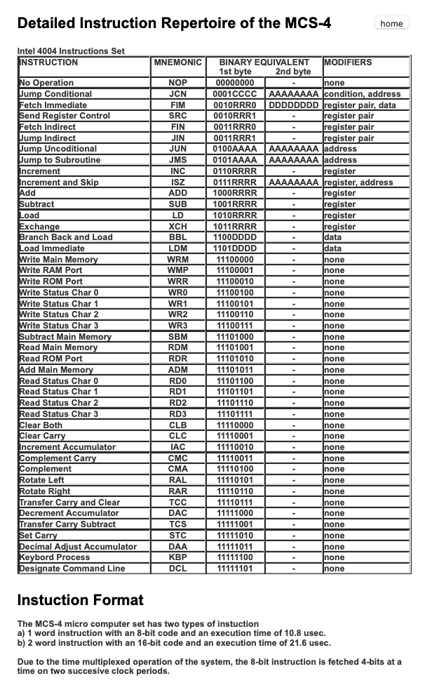

# Intel 4004

Having gotten my hands on an Intel 4004 and a means of using one (The Retroshield [Intel 4004 hardware system](https://gitlab.com/8bitforce/retroshield-hw)) I'd like to try and write some code. My plan is to look at the Busicom calculator ROM, and swap in my own code in its place.

## Resources

* [Intel 4004 fan page](https://www.4004.com)
* [Intel 4004 Wikipedia](https://en.wikipedia.org/wiki/Intel_4004)
* 

## Programming the Intel 4004

The following taken from the [Busicom ROM disassembly document](https://www.4004.com/2009/Busicom-141PF-Calculator_asm_rel-1-0-1.txt), which seems to be a comprehensive guide to the Intel 4004. [Here is another site](http://e4004.szyc.org/iset.html) that details the instruction set in detail.

### Instruction Set
```
Opcode   2nd byte 		Mnemonic CY	description

00000000		NOP	 -	No operation
0001CCCC AAAAAAAA	JCN	 -	Jump conditional
0010RRR0 DDDDDDDD	FIM      -	Fetch indirect from ROM into register pair
0010RRR1		SRC	 -	Send Register Control
0011RRR0		FIN	 -	Fetch indirect from ROM (register pair = indirect from location R0R1 of the same page)
0011RRR1		JIN	 -	Jump indirect (8 bit of program counter = register pair)
0100AAAA AAAAAAAA	JUN	 -	Jump unconditional
0101AAAA AAAAAAAA	JMS	 -	Jump to subroutine
0110RRRR		INC	 -	Increment register
0111RRRR AAAAAAAA	ISZ	 -	Increment register, and jump at nonzero result
1000RRRR		ADD	 CY	Add register and carry to accumulator (ACC=ACC+reg+CY)
1001RRRR		SUB	 CY	Subtract register and borrow from accumulator (ACC=ACC+(15-reg)+(1-CY))
1010RRRR		LD	 -	Load register into accumulator
1011RRRR		XCH	 -	Exchange register with accumulator
1100DDDD		BBL	 -	Branch back (return) and load data into accumulator
1101DDDD		LDM	 -	Load data into accumulator

11100000		WRM	 -	Write accumulator into main memory
11100001		WMP	 -	Output accumulator to RAM port
11100010		WRR	 -	Output accumulator to ROM port
11100011		WPM	 -	Write accumulator to 4008/4009 read/write program memory (not used in this application)
11100100		WR0	 -	Write accumulator into status character 0
11100101		WR1	 -	Write accumulator into status character 1
11100110		WR2	 -	Write accumulator into status character 2
11100111		WR3	 -	Write accumulator into status character 3
11101000		SBM	 CY	Subtract main memory and borrow from accumulator (ACC=ACC+(15-mem)+(1-CY))
11101001		RDM	 -	Read main memory into accumulator
11101010		RDR	 -	Input ROM port into accumulator
11101011		ADM	 CY	Add main memory and carry to accumulator (ACC=ACC+mem+CY)
11101100		RD0	 -	Read accumulator from status character 0
11101101		RD1	 -	Read accumulator from status character 1
11101110		RD2	 -	Read accumulator from status character 2
11101111		RD3	 -	Read accumulator from status character 3

11110000		CLB	 0	Clear both (accumulator and carry)
11110001		CLC	 0	Clear carry
11110010		IAC	 CY	Increment accumulator
11110011		CMC	 CY	Complement carry (CY=1-CY)
11110100		CMA	 -	Complement accumulator (ACC=15-ACC)
11110101		RAL	 CY	Rotate accumulator left through carry
11110110		RAR	 CY	Rotate accumulator right through carry
11110111		TCC	 0	Transmit carry to accumulator and clear carry (ACC=CY)
11111000		DAC	 CY	Decrement accumulator
11111001		TCS	 0	Transmit carry subtract and clear carry (ACC=9+CY)
11111010		STC	 1	Set carry
11111011		DAA	 CY	Decimal adjust accumulator (ACC=ACC+6, if CY=1 or ACC>9)
11111100		KBP	 -	Keyboard process (0->0, 1->1, 2->2, 4->3, 8->4, rest->15)
11111101		DCL	 -	Designate command line (not used in this application)
```

### Meaning of CCCC bits in the JCN instructions:
```
CCCC	hex	abbreviation	jump, when
	--------------------------------------------
0001	1	TZ		test=0
0010	2	C1		cy=1
0100	4	AZ		accumulator=0
1001	9	TN		test=1
1010	a	C0		cy=0
1100	c	AN		accumulator!=0
```

Combination of last 3 bits of CCCC would result logic "or" function with the individual conditions, however these are not used in
this application

The instruction set does not contain the very basic logical functions ("OR" and "AND"), which may be necessary in the application.
This function can be implemented in a bit level through using the carry bit and the accumulator functions. It is advantageous, if the questioned bit(s) are placed to the lowest or highest bit position(s) (bit 0 and bit 3 in the 4 bit wide registers).

E.g. if an "AND 1" would be needed for testing bit 0, the bit can be tested from the carry after the "RAR" instruction.
"OR 1" can be replaced with the sequence of "RAR", "STC" and "RAL" instructions.


## Instruction Set - alternative view



## Assembling code for the 4004

The internet is a wonderful place. Here is an online [4004 Assembler/Disassembler](http://e4004.szyc.org/asm.html) and virtual machine.

## Replacing the Busicom ROM questions

* How can I display output to the terminal?
* Can I make use of the math routines in the ROM already e.g. square root?

