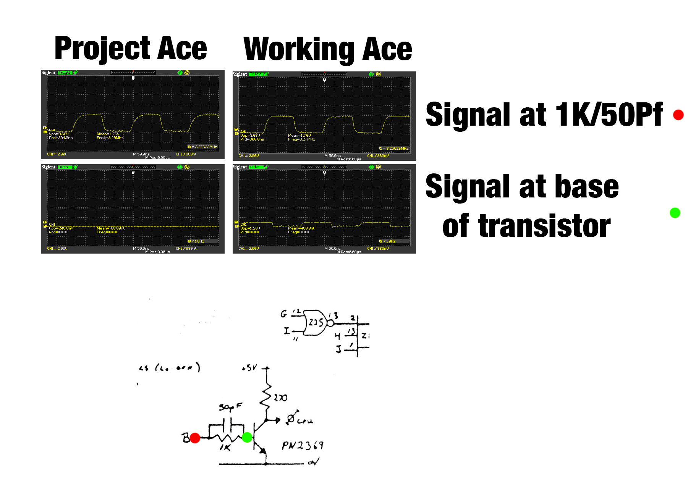
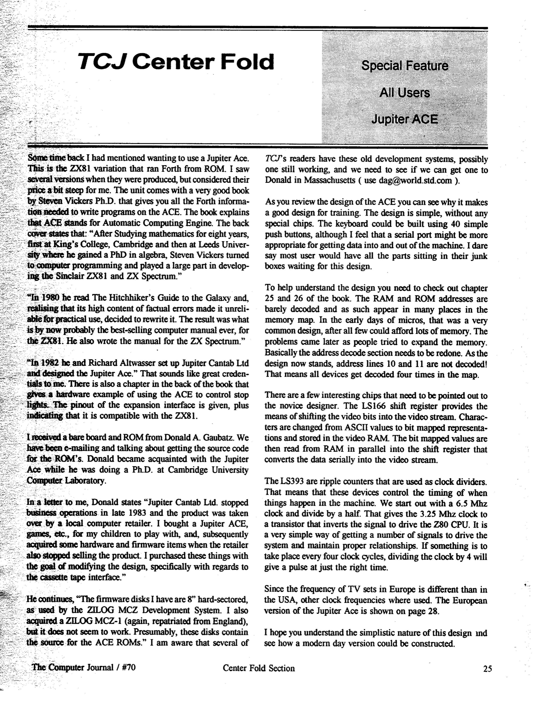
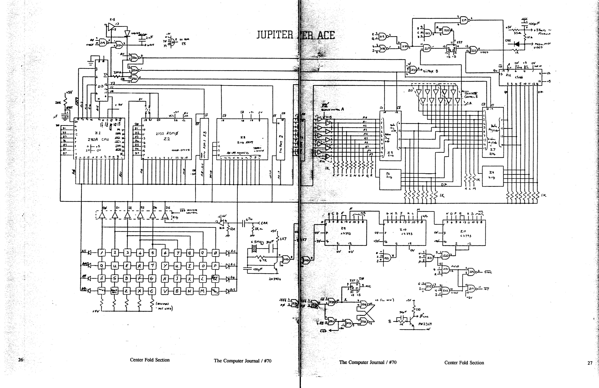
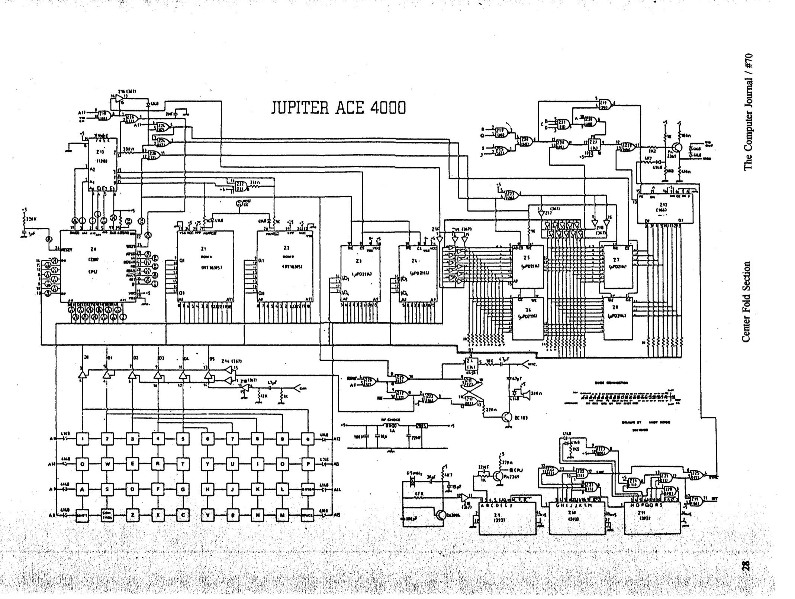
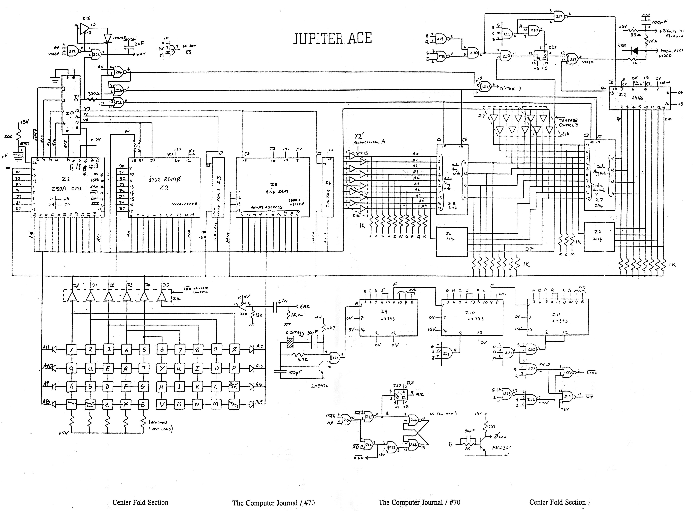

# Jupiter Ace Hardware

Back in 1984 I somehow had two Jupiter Ace RAM packs. I can't remember exactly why, but I think I was sent another Ace and RAM pack to help write some games by the company that wanted to publish some of my amazing (sic) stuff.

Anyway, I thought - wow, why don't I try and connect both RAM packs to the same computer. With a little messing with the addresses, I bet it would work. (A little knowledge is a dangerous thing). So I tried, and immediately broke the Ace. Luckily I had a second one, so just switched to using it.

But that broken Jupiter Ace has weighed heavily on me ever since. I can't find the PCB any more to try and repair it (sigh) but I do have the case and keyboard (well, they are at my mum's house). So, one day when I spotted an original Jupiter Ace unpopulated PCB on eBay, it was a total "buy now" situation. 

Since then I've been gathering all the parts to get it started. I was hoping to be visiting my mum soon to pick up the PCB but that was a year ago! so I'm going to have to get her to mail to me. I also have a ZX81 composite video adpator kit to sort out the display, and a [replacement for the 5v regulator](https://www.tindie.com/products/ddebeer/5v-1a-switch-mode-voltage-regulator/) to keep the heat down (I think I have the original heatsink metal piece but I'm not sure).

Aside from not having the PCB in front of me, I'm also blocked with the EPROMS. The Ace uses a pair of 4Kb 2532s which are odd compared to the 27c32 types I am more familiar with. For one thing, the programming requirements are different so my TL866II won't support them. They also have different pin-outs, so an adpator board would be required - which I'd like to avoid. I'm hoping someone in work can program them for me (I found some on eBay, and [according to my tester](https://store.backbit.io/product/chip-tester/) they are good.)

Ordering RAM was a pain. The Ace uses six 2114 static RAM chips. I initially thought it used three, and found and bought three on eBay. So I was half right.

The second place I tried was ABRA Electronics. Their website said they had them in stock, so I bought six to keep them all matched (there are different versions with different speeds, and matching might work but I'd like ot keep it simple - for $2 I can afford it). The postage was higher than the cost of the chips. Then I got an email saying "Sorry, we don't have them in stock. We're in Canada. And the minimum order is $50 anyway". (Their website said they did have stock, didn't mention they were Canadian - nothing wrong with that, BTW - and didn't mention the minimum order when I paid them..)

Thankfully good old [JameCo](https://www.jameco.com) had them (why didn't I check there first? No idea.) so they arrived the other day.

If you want to build your own without the original PCB, [here's the definitive guide](http://jupiter-ace.co.uk/hardware_diy_ace.html). As the Ace uses no custom chips at all, it should be "easy". 

If you want to build a new one from a kit, [ask these folks to start making the kit again](https://www.thefuturewas8bit.com/minstrel4th.html).

## May 30, 2021

My PCB arrived (thanks, Mum!) and I immediately got stuck into soldering the amassed collection of components. 

The only I had forgotten was, ironically, the easiest to get - 1K resistors. Thankfully I had time on Saturday to visit Vetco.net before it shut down for the Memorial Day break and stock up on the 30-ish that the kid required.

Finally I finished it, plugged it in and - garbage. Just random junk on the screen. And in fact, removing the Z80 or swapping in another Z80 didn't help. A check of the clock signal showed things were not great:

The trouble, as far as I can tell, is the transistor. The 2N2369 isn't easy to get hold of these days - but it's a very fast switching transistor - faster than any of the substitutes listed, and which I was using. So without a fast transistor I'm stuck until the one I found on Mouser arrives (hopefully next week).

## June 5, 2021

The replacement transistor arrived! Hurrah! I made no difference! Boo!

No, that's not true at all. The updated transistor meant that the CPU was getting a clock signal, and it was able to run - but the screen was displaying garbage still. RAM was a suspect, so I checked the RAM chips - and half were faulty! JAMECO had let me down! First time for everything, I suppose! I plugged in the first batch chips I had bought and there were enough to replace the broken ones - and there was movement! The keyboard did definitely cause the screen to update as though I were typing, but it was still nonsense. But this means the Z80 is running, the ROMs are working - but the RAM or the RAM control circuitry is broken. I don't trust any of the JAMECO RAM, so it's back to eBay, and another long wait for replacement chips.

## June 13, 2021

If you have seen circuit diagrams for the Jupiter Ace, they probably came from [this magazine article](https://github.com/bitfixer/bf-romulator).

### Diagrams

## September 8, 2021

It's been a while! But, to quote Professor Farnsworth, "Good news, everyone!"

Here's something I just wrote because I celebrate successes by writing stuff:

Have you ever had a project that almost became an obsession? Something that was broken but you felt that could you maybe, possibly fix it - and that fact was like an itch in your brain that you couldn’t scratch?

I've been trying to assemble a Jupiter Ace using an original PCB for a while now - since January of this year in fact. What’s a Jupiter Ace? It’s a British 8-bit computer from the early 1980s, which tried to differentiate itself from the crowd of other systems in the Cambrian Explosion of home computers by using FORTH rather than BASIC as its built-in language. (History lesson: in the early days of home computers, the computers plugged into your TV and when you powered them on, they loaded BASIC from ROM - there was no floppy or hard disks back then). In 1982, I had an Ace and loved it. I found it a great machine for coding games and playing with electronics.

Unfortunately my knowledge of electronics then was basic, and somehow I came into possession of not one but two 16Kb memory expansion packs, and I thought I could wire them together and make a 32Kb memory expansion. It might have worked in theory, but in practice, it broke my Ace. It probably just destroyed one of the logic chips by pulling too much current. In hindsight, it would have been an easy fix if I knew what I was doing. I didn’t, and in my shame and despair, I removed the Z80 and ROMs from the PCB and (sigh) threw it away. I did keep the case and keyboard.

Now, after all that time, I have righted the wrong and finally gotten my rebuilt Ace working. It was close to working for months, and I had tried all sorts of things including checking every single trace on the PCB (I created a Photoshop file of layers for each track on the board, and traced them with a multimeter), created new vintage EPROMS with test images, using scopes and logic probes to check for issues with the data and address buses, learning the circuit diagram inside out.. but last night I finally got it running.

Months ago I had read somewhere how a capacitor designated C8 had occasionally messed up the HALT signal timing of the Z80 CPU for some folks, leading to memory corruption. At the time, I had tried experimenting with removing C8 and using different values, but it made no difference. However, as I was doing these tests, I was unknowingly using a RAM chip that was somehow out of spec and was literally never going to work.

When I found replacement RAM chips (after multiple eBay episodes), the issues were still there, but so much was almost working. It would start up, respond to the keyboard - but display garbage. It was so close I kept thinking there was a short between some data bus lines or some of the 74LS logic chips were actually mislabeled CMOS chips and messing up switching levels. 

This weekend I was using a logic analyzer to see what was going on on the data bus, and it looked like all the lines were working independently - but it was impossible to read the exact values of what was going on through the bus without a more expensive analyzer that could also take memory read/write signals into account (look at a program called PulseView - it has a Z80 debugging module in it, that's what I was hoping to use. Did you know you can get an 8 channel logic analyser on Amazon for about $10? Amazing!). 

What I should have been paying more attention to was the various control signals around the Z80, especially as I had a secondary working Ace for comparison. I swear I did scope them both side-by-side and saw nothing out of the ordinary, but I had clearly missed it - the HALT signal.

Then, in some usual random googling ("Jupiter ace hardware design" "debugging z80 hardware" "why is my life empty and meaningless"), I came across that link to the C8 issue again. Before clicking "buy" on a 16 channel logic analyzer, I tried removing it to see what might happen. And bugger me but the screen immediately cleared to the single, little white square we know and love. I typed VLIST and the FORTH dictionary appeared. It was working!

The only thing left to do is clean up the keyboard a little, as the conductive pads are less than conductive now (there's some conductive paint coming from Amazon, and I'm hoping a little dab on the back of each key will help), and it should be good as new. Sure, there's a little crack in the yellowed case, and instead of an RF modulator, I fitted a ZX81 video mod to get a composite signal, but I think I can call this project done. Finally. After decades.