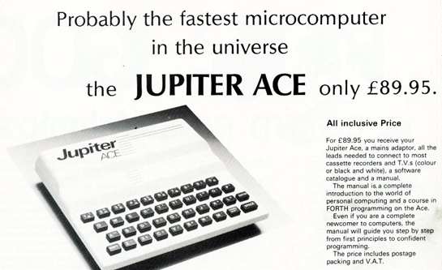
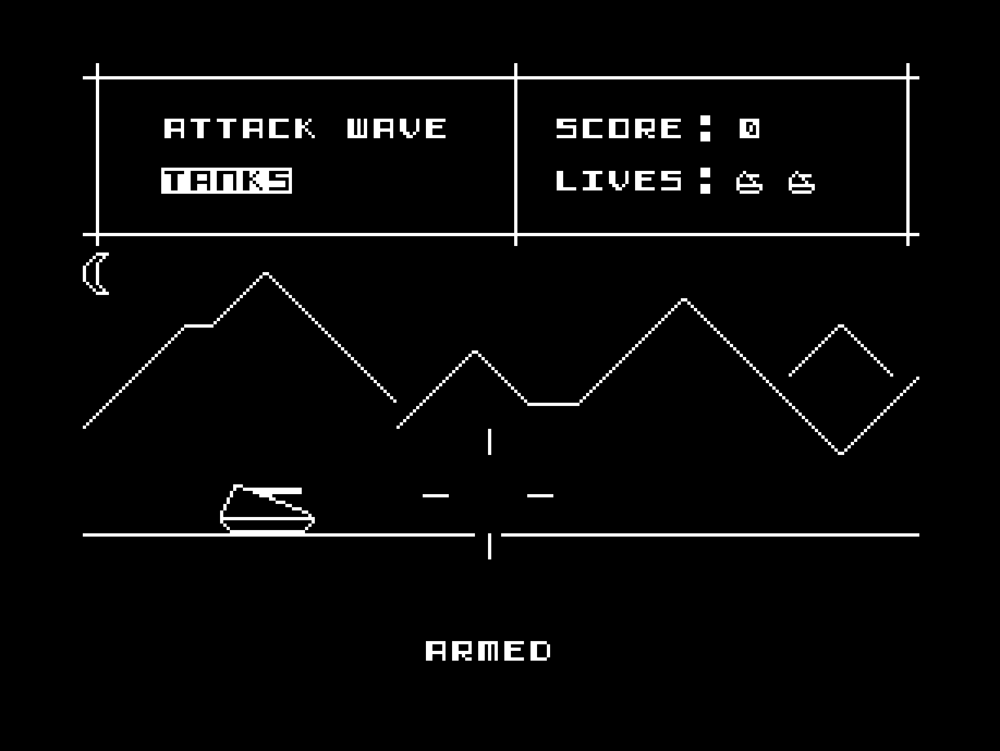
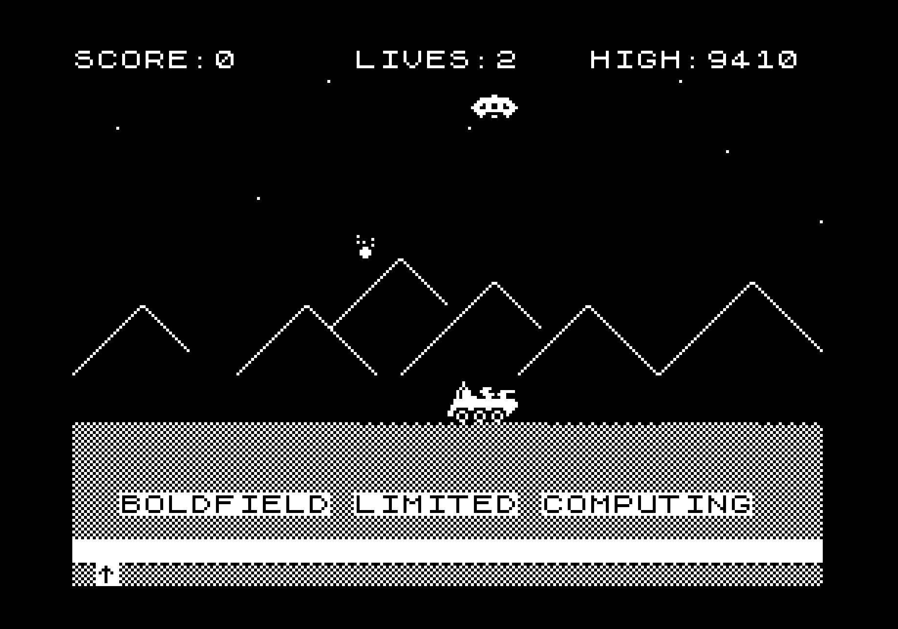
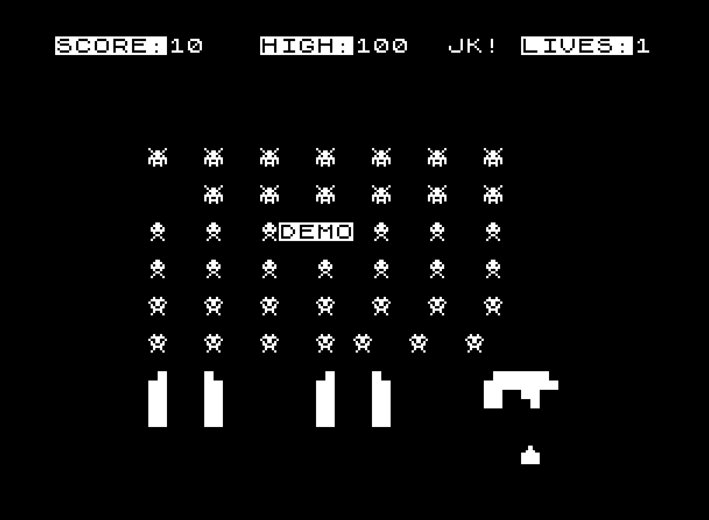
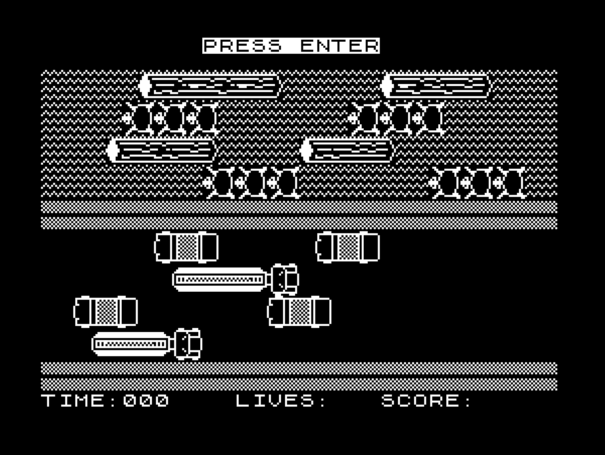

# Jupitier Ace

Some notes on Jupiter Ace software, and some [thoughts on rebuilding one](hardware.md).


## Jupiter Ace Software

Here you will find a collection of games for the [Jupiter Ace](https://jupiter-ace.co.uk/whatisanace.html) microcomputer, written by me in around 1984, when I was 16 and should have been out of my bedroom learning social skills. They are written mostly in [Forth](https://jupiter-ace.co.uk/whatisforth.html), with the occasional Z80 assembler for sound effects, or extra-fast scrolling routines.

I had planned to make my fortune by selling these games to Boldfield Limited Computer, the company that had bought the assets of Jupiter Cantab. Sadly that did not work out, so they're still all my intellectual property (I am using the term lightly :)) You will see the name "Boldfield" name appear in the games as I submitted them hoping they would be snapped up.

## Writing games for the Ace

The Jupiter Ace had a character-mapped screen, with a limited number of User Defined Graphics. This meant writing games with smooth animation was a challenge (I would say impossible, but I thought it would be impossible on the ZX81 and someone managed that!)

At one point I investigated if I could fake a kind of higher resolution by displaying the User Defined Graphics on the screen and then writing into them on the fly - hoping to get a 256 by 192 resolution display, at least in parts of the screen (there aren't enough UDG to cover the entire screen). Unfortunately writing to the UDG memory every frame quickly caused it to be become corrupt, so I had to give up that approach. I believe this to be a hardware "feature" of the original Ace and its incomplete address decoding / shared CPU and video hardware accessed RAM, but it's not something I can claim to understand.

The Ace was described as "fast", in fact "the fastest computer in the universe", and it *was* in the sense that instead of a slow BASIC, as on the ZX81 or ZX Spectrum, it came with Forth in ROM. Forth is nothing if not fast, and was perfect for writing simple games. Under the (thin plastic) hood it was still a Z80 and a handful of chips, with a cassette interface for saving and loading programs to tape. Running machine code wasn't any faster than a Spectrum, although the lower-res screen would make animation faster, and the lack of colour meant you didn't have to worry about attribute clashes :-) There was no dedicated hardware for sprites or even a sound chip - sound was made my toggling a bit on and off and feeding that into a piezo speaker, like the ZX Spectrum 16K and 48K models.



The Ace was not in production for long (the ZX Spectrum soon stole most of its potential sales, with its flashy games, better case and colour graphics), so it is seen as something of a quirky experiment. Originals turn up on eBay from time to time for silly money (I have seen ten times the original asking price - and believe me, they are NOT worth that much!), but there are also some kits:


* [Minstrel4D (Turbo)](https://www.thefuturewas8bit.com/shop/tynemouth-products/minstrel4d.html) 
* [Jupiter Ace II](http://www.a2heaven.com/webshop/index.php?rt=product/product&product_id=175)

I have built the no-longer-available [Minstel4](https://www.thefuturewas8bit.com/minstrel4th.html) and the Jupiter Ace II above, and yes, they work just like the original (with perhaps minor, minor differences due to some I/O lines floating).

Remakes of the PCBs also are avalable, although some work better than others. I would trust the work of genius [Grant Searle](http://searle.x10host.com/JupiterAce/JupiterAce.html) over others. There are no custom chips, so there are not too many surprises. 

There continues to be new hardware made (for some crazy reason). If you look on Tindie there is now an [SD card interface called the Jester Ace](https://www.tindie.com/stores/dr_ian_johnson/) to save/load software, and another to support [a USB keyboard](https://peacockmedia.software/RC2014/minstrelkb/). 

If you have an iPhone or iPad (or Apple Silicon Mac) there's an [excellent emulator](https://apps.apple.com/us/app/jupiter-ace/id1581220883) too. If you have so much as a passing interest, this will be your best introduction to the Jupiter Ace, and it's version of Forth - the first "write only programming language".

So what did I write all those years ago? Well, mostly adaptations of arcade games I had seen at the time.









## Files

The games can be downloaded in TAP format, and used on various emulators and recreations of the hardware.

Note: Some games use IN to read the keyboard port, and these won't work on anything other than the real hardware.
The reason for using IN was to test for multiple key-presses, something INKEY wouldn't to. So far I've only seen this work on original Jupiter Ace hardware. Thankfully none of my games are so engrossing or sophisticated that not supporting multiple keypresses would lessen the experience.


## Update

The Jester folder contain games which have been tweaked to run on the Jester Ace SD-Card system, with the Minstrel4th hardware. Thanks, Ian!
This also included swapping out the IN commands used to read the keyboard with INKEY, so they'll work better on emulators etc.
I've noted some games don't seem to have sound. Sometimes this was due to the machine code sound routines doing weird low-level stuff that emulators can't do.
At least in one case, it's due to the game driving an AY-8912 sound card - an expansion option that at least one person (me) had bought at the time.

## Bugs

So many bugs are coming to light now that I look at this software after ~40 years!

### General

Some games look at the IN port to detect keyboard presses. The reason for using IN is that it allows for multiple simultaneous keys to be detected - something that INKEY cannot do. Some emulators do not support this, and sometimes that means the game can't even start. FROGGER is one example where changing a single IN check to an INKEY check means the game starts.

### Robohunt

Before the player is chased, the game should make a sound to let you know you have a few seconds (depending on difficulty level) before the robots come after you. However, instead of writing 

```
10 254 OUT
```

to toggle the speaker, I wrote:

```
254 10 OUT
```

which does nothing. You can edit the word called O (that's an "oooh") to make this change, if your version of the game doesn't make sound. I will add this updated version to this archive. If you want to make the change yourself, just.. no, this is best left as a nice exercise for the reader - as a math book might say! It's worth pointing out that on some emulators the buzzing sound it makes is awful and you're better off without it (unless you're a fan of the Vectrex - a joke for those in the know.)

Side note: The 'SAM' character in this and other games was based on my math teacher at secondary school, Dr. Sam Stevenson, who sported an excellent moustache and tolerated me playing with the school computers (BBC B Micros).

## Sam and the Time Bombs

For some reason, you can't move your character over a space that you've just walked over. This means that no matter how carefully you try, each level leads to stalemate pretty quickly. I believe I didn't actually finish this game, and was just too happy to have ported a piece of music to the third party soundcard (Thanks, Soapy!)

## More updates

As I helped beta test the excellent Jupiter Ace [emulator](https://apps.apple.com/us/app/jupiter-ace/id1581220883), we found that there are discrepancies between how the original Jupiter Ace and the Minstrel4th handles using IN and OUT to read the keyboard, and drive the speaker. So, some of the comments above about bugs in software might not actually be true - at least, if you are using an original Ace. And I'm sure that means thousands and thousands of you.

Kevin, the author of the Jupiter Ace emulator, bent over backwards to make the emulator as accurate as possible. Amazing attention to detail.


## Thanks

Thanks to the [Jupiter Ace Archive Site](https://jupiter-ace.co.uk) for recovering, capturing and storing my software. Without them, they'd have been lost forever.
