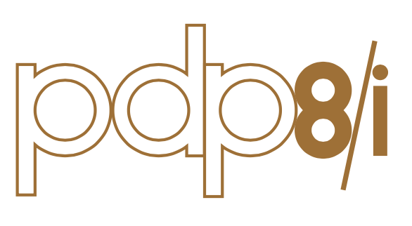

# PDP

I am fascinated by the PDP range on minicomputers, thanks to the [Seattle Living Computer Museum](https://livingcomputers.org) (now closed down) and the PiDP kits ([PiDP-11](https://obsolescence.wixsite.com/obsolescence/pidp-11) and [PiDP-8](https://obsolescence.wixsite.com/obsolescence/pidp-8)) from Oscar Vermeulen.

I like reading about the PDP era, and playing with the two systems. The assembly langauge used by both (which can be entered using the switches, but that's crazy, use an assembler!) is clearly the grandparent of 680x0 and Intel languages. The operating systems they used clearly lead to CP/M, MS-DOS and UNIX.

I enjoy collecting period books, paper-tape, punched-cards and even a DEC "flip-chip" card or two to feel a little more connected to the real hardware. I am still bummed that the Living Computers Museum closed down, as they had real PDPs you could walk up to and use (and telnet/SSH accessible ones too - which may or may not be still working when you read this).

## Downloads

I love the vintage PDP programming reference cards, and I found a PDP-11 one on eBay. I also have a [PDP-8](http://homepage.divms.uiowa.edu/~jones/pdp8/index.html) booklet, but not the PDP-8i card - I've only seen scans of that (it would be older than me I guess). I recreated the PDP-8i card in Indesign, and hope to get some printed. Here are the files:

* [My recreation of a PDP-8i card in PDF](PDP8.pdf)
* [My recreation of a PDP-8i card in Indesign format](PDP8.indd)

* [PDP-8 Pocket Reference card original](pdp8_programmingcard_1974.pdf)
* [Text of original PDP-8 card](http://homepage.divms.uiowa.edu/~jones/pdp8/refcard/74.html)

* [PDP-11 Pocket Reference card original](pdp11_programmingcard_1975)
