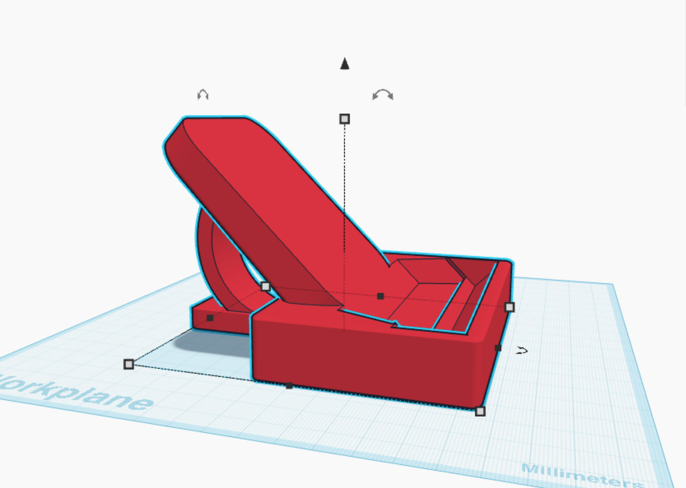
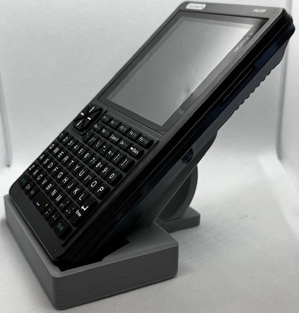
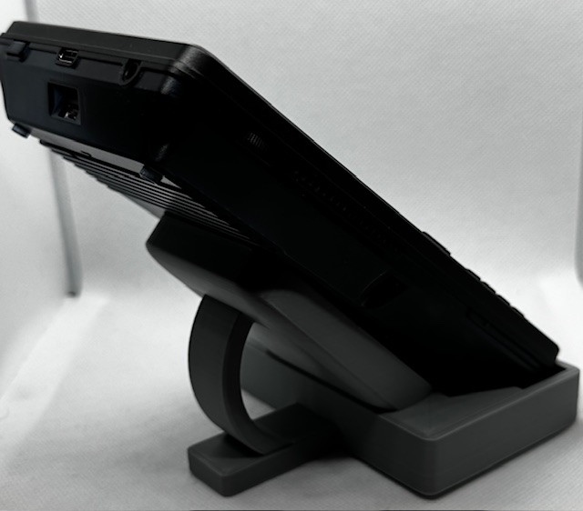
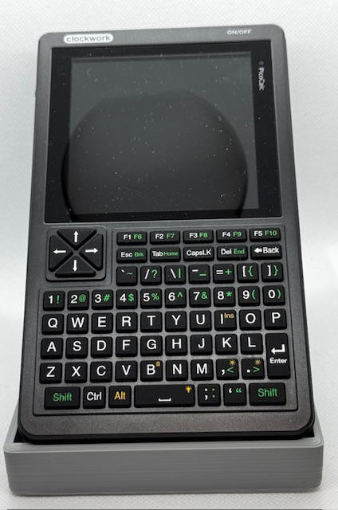

# PicoCalc

## Stand

Here's a simple stand for the PicoCalc, holding it at 45' in a quite stable way. Not perfect by any means, but it works. I printed it on a Bambu A1.

Here is a link to the [Tinkercad project](https://www.tinkercad.com/things/0lT5CVv0XYk-picocalc-stand) (please make it better!) and the STL file for printing is in this repo.

