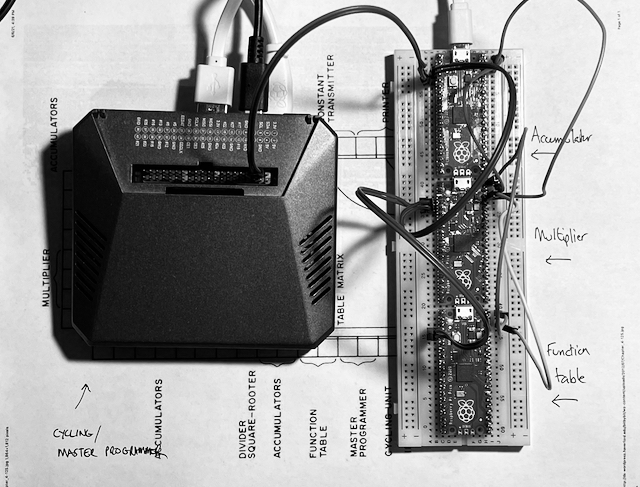
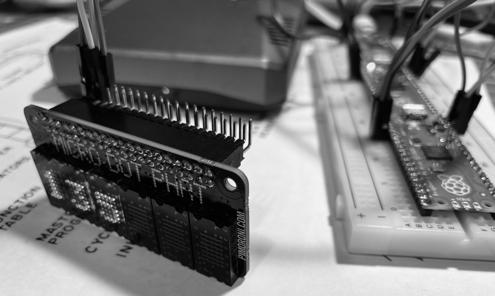

## PINICA - An ENIAC built using Raspberry Pi Picos 




### May 15, 2021

I've a crazy idea to recreate a simple version of the ENIAC using Raspbery Pi PICO boards (PINIAC) to model the individual components (accumulators, mostly). I've gathered five PICOs, and a breadboard system for mounting them, so when I've time to read the books I've collected properly I can make some progress. [Great intro video here](https://www.youtube.com/watch?v=c-5n5J4wOig).

### May 26, 2021

I have been tinkering, starting off my trying to connect two Pico devices over I2C. (The I2C system still uses the offensive and outdated naming scheme 'master' and 'slave'. I will use 'sequencer' and 'node' instead as it is more descriptive and less horrible. You will also see 'controller' and 'peripheral' being used.)

In theory, I2C is the perfect way of connecting devices - it's a fast serial connection, supporting multiple devices on a simple two cable bus. My idea was to use one Pico as the controller, sending timing signals and program data. Subsequent Pico devices would hang onto the bus, listening for their name and acting when called. 

Setting up a Pico to be a sequencer is simple, as in this MicroPython example:

```
from machine import Pin, I2C

# Set up device
i2c = I2C(0, scl=Pin(9), sda=Pin(8), freq=100000)
i2c.scan()

# Send data
i2c.writeto(0x42, b'123') # Send 123 to the node device called 0x42

```

However, it turns out that the MicroPython implementation does not yet support setting up a device as a I2C node.

Thankfully I found [this video](https://www.youtube.com/watch?v=Wh-SjhngILU), which includes sample code in C++ for setting up a Pico.

Before I can try it, [I need to install the C++ toolchain on my Mac - see chapter nine](https://datasheets.raspberrypi.org/pico/getting-started-with-pico.pdf), and right at this moment I do not have the energy to face that particular task. Next time.

## May 30, 2021

The official Raspberry Pi instructions for getting the C/C++ toolchain working on the Mac are just awful. If I get it working I'll post it here, but seriously, they're confusing, wrong and awful.

## May 31, 2021

Deep inside the pico sdk is a file that explains how to use C++ on the Pico, so I've got some C++ running on the device:

```
/*

 This is code for a Pico to set up as an i2c peripheral.
 It will eventually act as an accumulator or other device,
 sharing data with a controller node.

 For now just receive a value and then return a counter.

 Remember to update the CMakeLists.txt file:
 target_link_libraries(PINIAC pico_stdlib hardware_i2c)

*/


#include <stdio.h>
#include "pico/stdlib.h"
#include "hardware/i2c.h"

#define I2C_ADDR 0x3e			// The address of this Pico on the i2c bus
#define IC2_1 8
#define IC2_2 9


   int main() {

	// i2c setup
    i2c_init(i2c0, 10000);
    i2c_set_slave_mode(i2c0, true, I2C_ADDR);
    gpio_set_function(IC2_1, GPIO_FUNC_I2C);
    gpio_set_function(IC2_2, GPIO_FUNC_I2C);
    gpio_pull_up(IC2_1);
    gpio_pull_up(IC2_2);

	// Data for i2c

	uint8_t rxdata[4];
    uint8_t txdata[2];

	// Counter just to have something to return

	uint8_t counter = 0;

    // Set up LED for status

	const uint LED_PIN = PICO_DEFAULT_LED_PIN;
    gpio_init(LED_PIN);
    gpio_set_dir(LED_PIN, GPIO_OUT);
    uint8_t blink = 0;


	// Do some power-up blinking

	for (int i=0; i<13; i++)
	{
		gpio_put(LED_PIN, blink);
		blink++;
		if (blink>1) blink = 0;
		sleep_ms(250);
	}

	// Main loop

	while (true) {
    	
	 	// Receive data from controller
     	// 3 bytes received - byte 0 is cmd (used as lower byte) byte 2 is higher - byte 3 is 0
     	// Wait here until some data arrives
		if (i2c_get_read_available(i2c0) < 3) continue;
     	i2c_read_raw_blocking (i2c0, rxdata, 3);	
		int input_value = rxdata[0]+(rxdata[1]<<8);

		// Blink LED so we know something was received
		if (blink>1) blink = 0;
		gpio_put(LED_PIN, blink);
		blink++;
		
   		}	
   }
```

I tried getting MicroPython code running on the Pico to act as the controller, but it wasn't working well so I decided to use a Raspberry Pi 4 (for now) instread. Here's the Python from Thonny running on the 4 that sends a byte to two Picos in turn (0x3d and 0x3e) both running the same C code above.

```
# Talk to i2c devices

import smbus
import time

# I2C channel 1 is connected to the GPIO pins
channel = 1

#  pico
address1 = 0x3d
address2 = 0x3e


data = 42
msg = (data & 0xff0) >> 4
msg = [msg, (msg & 0xf) << 4]

# Initialize I2C (SMBus)
bus = smbus.SMBus(channel)

time.sleep(1)
i = 1000

while 1:

    # Sending
    
    print("Sending 1..");
    try:    
        bus.write_i2c_block_data(address1, i&0xff, [i>>8])
    except Exception as e:
        print("Write error:" + str(e))
        continue

    print("Sent")
    time.sleep(1)
    
    print("Sending 2..");
    try:    
        bus.write_i2c_block_data(address2, i&0xff, [i>>8])
    except Exception as e:
        print("Write error:" + str(e))
        continue

    print("Sent")
    time.sleep(1)


```

Next step is to get the Pico to send a message back. Initial experiments show that the devices can get confused if they are out of step with read/write, and as they are using blocking read/write that means a hang-up occurs. It's vital that the system starts from a known state - turns it off and on again before every run!

So not having much luck getting any reliable date from the Pico - everything just jams up in errors.

### June 1, 2021

I seem to have been suffering from a [Heisenbug](https://en.wikipedia.org/wiki/Heisenbug) because as soon as I added some UART code to send debug messages, everything started working. Was it the presence of the UART code? Was it moving to a different set of pins? (I needed to change the I2C pins around to make room for the UART pins.) Maybe the Pico doesn't like acting as a I2C peripheral on pins other than 2,3. Who knows? I could spend another few days getting to the bottom of it, but things seems to be working. (Embarrassing confession: it might have been the way I was powering the Pico - now I'm powering it with the USB connector.)

Anyway, here is the code for the Pico node and the Pi controller that sends and receives data between devices. It also works with two Picos on the same I2C bus, and I'll be expanding that number in the not too distant future. They come a point when I need to use pull-up resistors but so far, they're not necessary.

```
/*

 This is code for a Pico to set up as an i2c peripheral.
 It will eventually act as an accumulator or other device,
 sharing data with a controller node.

 For now just receive a value and then return a counter.

 Remember to update the CMakeLists.txt file:
 target_link_libraries(PINIAC pico_stdlib hardware_i2c)

*/

/* Pico code  now with UART code for debugging */

#include <stdio.h>
#include "pico/stdlib.h"
#include "hardware/uart.h"
#include "hardware/i2c.h"

#define I2C_ADDR 0x3d			// The address of this Pico on the i2c bus
#define IC2_1 2
#define IC2_2 3

// UART settings and pins
#define UART_ID uart1
#define BAUD_RATE 115200
#define DATA_BITS 8
#define STOP_BITS 1
#define PARITY    UART_PARITY_NONE

#define UART_TX_PIN 4
#define UART_RX_PIN 5


   int main() {

	// UAR setup

    uart_init(UART_ID, 2400);
    // Set the TX and RX pins by using the function select on the GPIO
    // Set datasheet for more information on function select
    gpio_set_function(UART_TX_PIN, GPIO_FUNC_UART);
    gpio_set_function(UART_RX_PIN, GPIO_FUNC_UART);
    int actual = uart_set_baudrate(UART_ID, BAUD_RATE);
    // Set UART flow control CTS/RTS, we don't want these, so turn them off
    uart_set_hw_flow(UART_ID, false, false);
    // Set our data format
    uart_set_format(UART_ID, DATA_BITS, STOP_BITS, PARITY);
    // Turn off FIFO's - we want to do this character by character
    uart_set_fifo_enabled(UART_ID, false);
 	char message[40];


	// i2c setup
    i2c_init(i2c1, 10000);
    i2c_set_slave_mode(i2c1, true, I2C_ADDR);
    gpio_set_function(IC2_1, GPIO_FUNC_I2C);
    gpio_set_function(IC2_2, GPIO_FUNC_I2C);


	// Data for i2c

	uint8_t rxdata[4];
    uint8_t txdata[2];

	// Counter just to have something to return

	uint8_t counter = 0;

    // Set up LED for status

	const uint LED_PIN = PICO_DEFAULT_LED_PIN;
    gpio_init(LED_PIN);
    gpio_set_dir(LED_PIN, GPIO_OUT);
    uint8_t blink = 0;

	// Do some power-up blinking

	for (int j=0; j<5; j++)
	{


	for (int i=0; i<33; i++)
	{
		gpio_put(LED_PIN, blink);
		blink++;
		if (blink>1) blink = 0;
		sleep_ms(50);
	}
	// Send a message

	sprintf (message, "Getting ready\r\n");
    uart_puts(UART_ID, message);

	}

	// Main loop

	while (true) {
    	
		sprintf (message, "Rx: READY\r\n");
        uart_puts(UART_ID, message);

	 	// Receive data from controller
     	// 3 bytes received - byte 0 is cmd (used as lower byte) byte 2 is higher - byte 3 is 0
     	// Wait here until some data arrives
		if (i2c_get_read_available(i2c1) < 3) continue;
     	i2c_read_raw_blocking (i2c1, rxdata, 3);	
		int input_value = rxdata[0]+(rxdata[1]<<8);

        sprintf (message, "Rx: %d\r\n", rxdata[0]+(rxdata[1]<<8));
        uart_puts(UART_ID, message);

		// Send back a value - this bit doesn't seem to work
		counter++;

		txdata[0] = counter & 0xFF;
        txdata[1] = counter >> 8;

 		sprintf (message, "Tx: %d %d - %d\r\n", txdata[0], txdata[1], counter);
        uart_puts(UART_ID, message);

		i2c_write_raw_blocking(i2c1, txdata, 2);

		sprintf (message, "Tx: DONE\r\n");
        uart_puts(UART_ID, message);

		// Blink LED so we know something was received
		if (blink>1) blink = 0;
		gpio_put(LED_PIN, blink);
		blink++;
		
   		}	
   }
```

```
# Talk to i2c devices

import smbus
import time

# I2C channel 1 is connected to the GPIO pins
channel = 1

#  pico
address1 = 0x3d
address2 = 0x3e


data = 42
msg = (data & 0xff0) >> 4
msg = [msg, (msg & 0xf) << 4]

# Initialize I2C (SMBus)
bus = smbus.SMBus(channel)


i = 1000

while 1:

    # Sending
    time.sleep(1)
    
    
    print("Sending 2..");
    try:    
        bus.write_i2c_block_data(address2, i&0xff, [i>>8])
    except Exception as e:
        print("Write error:" + str(e))
        continue

    print("Sent")
    #time.sleep(1)

    # Receiving
    
    read = 0
    while read == 0:
        try:
            print("Reading")
            rx_bytes = bus.read_i2c_block_data(address2,0,2)
        except Exception as e:
            print("Read error:" + str(e))
            continue
        read = 1
    print("Read: " + str(rx_bytes))
    
```


### June 6, 2021

Happy Birthday, Mum!

I had a successful day today with the PINIAC project. I finished the C code for each of the three Units I wanted to model - an Accumulator, Multiplier and Function Table. I found some useful documentation:

* [The ENIAC Then and Now, Brian L. Stuart](https://www.cs.drexel.edu/~bls96/eniac/eniac4.pdf)
* [The Electronic Numerical Integrator and Computer, Mark P Neyer](https://www.cs.xu.edu/~neyer/MachineOrg/ENIACPaper.pdf)

And this helped me cobble together an idea of how ENIAC worked and how I could simulate it (in a much, much, much simpler way). My hardware consists of a Raspberry Pi acting as the clock/master programmer unit, and three Raspberry Picos acting as the other three units. They are all connected via the I2C serial bus, which when finally working, simplifies interdevice communication a lot (although is susceptible to out-of-sync issues so isn't perfect)

The biggest issue I found was that ENIAC Units were able to communicate with each other directly, for example, the Multiplier would ask the Accumulator for the number to use in its sum. In my system, the Pi controller needs to quickly go behing everyone's back and get the Accumulator to provide a number and then send it to the Multiplier - pretending the Multiplier had asked. 




The C source code the each of the Units (in one file, use the NODE1, NODE2 or NODE3 #define to select which to use).

```
/*

 This is code for a Pico to set up as an i2c peripheral.
 Three types of unit are provided within this source code.

 For now just receive a value and then return a counter.

 Remember to update the CMakeLists.txt file:
 target_link_libraries(PINIAC pico_stdlib hardware_i2c)

*/

/*

Accumulator

1. Receive a number, add it to the number currently stored in the accumulator
2. Transmit the number
3. Transmit the -ve of the number

A "Number" is 10 digits

00000000
99999999


Multiplier

1. Find the product of two numbers - the first number is sent from an 
   accumulator or maybe a function table / constant transmitter.


Divider / Square Root

1. Find the quotient. A number is sent from an accumulator or other source


Function Table

1. Return the value corresponding to a 2 digit address
2. Return the -ve of a value corresponding to a 2 digit address


Constant Transmitter

1. Returns a number read from punched card reader. I don't have one of
   these to test it with, unfortunately.


Note: The ENIAC could transmit numbers between units directly, but
as the PINIAC uses the IC2 bus, this isn't possible - SET commands are
defined for the accumulator and multiplied , which the controller 
python program can use to 'fake it' by reading and writing values.

*/

#include <stdio.h>
#include "pico/stdlib.h"
#include "hardware/uart.h"
#include "hardware/i2c.h"

#define NODE2


// The address of this Pico on the i2c bus
#ifdef NODE1
#define I2C_ADDR 0x3d
#endif


#ifdef NODE2
#define I2C_ADDR 0x3e
#endif

#ifdef NODE3
#define I2C_ADDR 0x3f
#endif


#define IC2_1 2
#define IC2_2 3

// UART settings and pins
#define UART_ID uart1
#define BAUD_RATE 115200
#define DATA_BITS 8
#define STOP_BITS 1
#define PARITY    UART_PARITY_NONE

#define UART_TX_PIN 4
#define UART_RX_PIN 5

// Accumulator commands

#define ACCUM_CLR 		0	// Return value signal the accumulator is online
#define ACCUM_ADD 		1	// Add number to value in memory
#define ACCUM_GET		2	// Return number in memory
#define ACCUM_GET_NEG 	3	// Return -ve of number on memory
#define ACCUM_SET	 	4	// Set memory value 


// Mutiplier commands

#define MULT_CLR 		0	// Return value signal the multiplier is online
#define MULT_PRODUCT 	1	// Multiply number to value in memory
#define MULT_GET		2	// Return number in memory
#define MULT_GET_NEG 	3	// Return -ve of number on memory
#define MULT_SET	 	4	// Set memory value


// Function Table commands

#define FUNC_CLR 		0	// Return value signal the func table is online
#define FUNC_GET 		1	// Return number indexed by value2


   int main() {

	// UAR setup

    uart_init(UART_ID, 2400);
    // Set the TX and RX pins by using the function select on the GPIO
    // Set datasheet for more information on function select
    gpio_set_function(UART_TX_PIN, GPIO_FUNC_UART);
    gpio_set_function(UART_RX_PIN, GPIO_FUNC_UART);
    int actual = uart_set_baudrate(UART_ID, BAUD_RATE);
    // Set UART flow control CTS/RTS, we don't want these, so turn them off
    uart_set_hw_flow(UART_ID, false, false);
    // Set our data format
    uart_set_format(UART_ID, DATA_BITS, STOP_BITS, PARITY);
    // Turn off FIFO's - we want to do this character by character
    uart_set_fifo_enabled(UART_ID, false);
 	char message[40];


	// i2c setup
    i2c_init(i2c1, 10000);
    i2c_set_slave_mode(i2c1, true, I2C_ADDR);
    gpio_set_function(IC2_1, GPIO_FUNC_I2C);
    gpio_set_function(IC2_2, GPIO_FUNC_I2C);


	// Data for i2c

	uint8_t rxdata[4];
    uint8_t txdata[2];

	// Node memory

	uint8_t memory = 0;
	uint8_t result = 0;

	// Counter just to have something to return

	uint8_t counter = 0;

    // Set up LED for status

	const uint LED_PIN = PICO_DEFAULT_LED_PIN;
    gpio_init(LED_PIN);
    gpio_set_dir(LED_PIN, GPIO_OUT);
    uint8_t blink = 0;

	// Do some power-up blinking

	for (int j=0; j<5; j++)
	{


	for (int i=0; i<33; i++)
	{
		gpio_put(LED_PIN, blink);
		blink++;
		if (blink>1) blink = 0;
		sleep_ms(50);
	}
	// Send a message

	sprintf (message, "Getting ready\r\n");
    uart_puts(UART_ID, message);

	}

	

	// Main loop

	while (true) {
    	
		sprintf (message, "Rx: READY\r\n");
        uart_puts(UART_ID, message);

	 	// Receive data from controller
     	// 3 bytes received - byte 0 is cmd (used as lower byte) byte 2 is higher - byte 3 is 0
     	// Wait here until some data arrives
		if (i2c_get_read_available(i2c1) < 3) continue;
     	i2c_read_raw_blocking (i2c1, rxdata, 3);	

		uint8_t value1 = rxdata[0];
		uint8_t value2 = rxdata[1];

        sprintf (message, "Rx: %d\r\n", rxdata[0]+(rxdata[1]<<8));
        uart_puts(UART_ID, message);

#ifdef NODE1 // Accumulator

if (value1 == ACCUM_CLR ) // Say hi, clear memory and echo back 0
{
	memory = 0;
	result = memory;	
}

if (value1 == ACCUM_ADD ) // Add value to accumulator echo back result
{
	memory = memory + value2;
	result = memory;	
}

if (value1 == ACCUM_GET ) // Add value to accumulator echo back result
{
	result = memory;	
}

if (value1 == ACCUM_GET_NEG ) // Add value to accumulator echo back result
{
	result = -memory;	
}

if (value1 == ACCUM_SET ) // Set memory contents
{
	memory = value2;
	result = memory;	
}

#endif

#ifdef NODE2 // Multiplier 
{

if (value1 == MULT_CLR ) // Say hi, clear memory and echo back 0
{
	memory = 0;
	result = memory;	
}

if (value1 == MULT_PRODUCT ) // Add value to accumulator echo back result
{
	memory = memory * value2;
	result = memory;	
}

if (value1 == MULT_GET ) // Add value to accumulator echo back result
{
	result = memory;	
}

if (value1 == MULT_GET_NEG ) // Add value to accumulator echo back result
{
	result = -memory;	
}

if (value1 == MULT_SET ) // Set memory contents
{
	memory = value2;
	result = memory;	
}


}


#endif


#ifdef NODE3 // Function table 
{
	if (value1 == FUNC_CLR ) // Say hi, clear memory and echo back 0
	{
		memory = 0;
		result = memory;	
	}

	if (value1 == FUNC_GET ) // Add value to accumulator echo back result
	{
		switch (value2) {
		case 0 : memory = 0; break;
		case 1 : memory = 10; break;
		case 2 : memory = 20; break;
		case 3 : memory = 30; break;
		case 4 : memory = 40; break;
		default : ;
		}

		result = memory;
	}
	
}
#endif


		// Send value back
	
		txdata[0] = result; //& 0xFF;
        txdata[1] = result; //>> 8;

 		sprintf (message, "Tx: %d %d - %d\r\n", txdata[0], txdata[1], result);
        uart_puts(UART_ID, message);

		i2c_write_raw_blocking(i2c1, txdata, 2);

		sprintf (message, "Tx: DONE\r\n");
        uart_puts(UART_ID, message);

		// Blink LED so we know something was received
		if (blink>1) blink = 0;
		gpio_put(LED_PIN, blink);
		blink++;
		
   		}	
   }
```


The Python code for the master programmer. There are just a few extra lines for driving a Pimoroni Micro Dot Phat LED display just for laughs - easy to ignore.

```
# PINIAC
# Controller / Sequencer


import smbus
import time
from microdotphat import write_string, scroll, clear, show

# I2C channel 1 is connected to the GPIO pins
channel = 1

#  pico
address1 = 0x3d # Accumulator
address2 = 0x3e # Multiplier
address3 = 0x3f # Function table

# Limitation

# THe ENIAC units could pass numbers between themselves, but because of the
# nature of the I2C bus used, this isn't possible without using the controller
# as an inbetween. So this code includes a function to do that but hide it.


data = 42
msg = (data & 0xff0) >> 4
msg = [msg, (msg & 0xf) << 4]

# Initialize I2C (SMBus)
bus = smbus.SMBus(channel)

# LED display
clear()
show()
write_string('HELLO', kerning=False)
show()

# Functions

def Accumulator(command, value):
    print("Talking to accumulator")
    try:    
        bus.write_i2c_block_data(address1, command&0xff, [value&0xff])
    except Exception as e:
        print("Write error:" + str(e))
    #    continue
    # print("Sent")
   

    # Receiving
    read = 0
    while read == 0:
        try:
            # print("Reading")
            rx_bytes = bus.read_i2c_block_data(address1,0,2)
        except Exception as e:
            print("Read error:" + str(e))
            continue
        read = 1
    # print("Read: " + str(rx_bytes))
    print(rx_bytes[0], rx_bytes[1])
    time.sleep(1)
    return rx_bytes[1]
    
def Multiplier(command, value):
    # print("Talking to multiplier")
    try:    
        bus.write_i2c_block_data(address2, command&0xff, [value&0xff])
    except Exception as e:
        print("Write error:" + str(e))
    #    continue
    # print("Sent")
   

    # Receiving
    read = 0
    while read == 0:
        try:
            # print("Reading")
            rx_bytes = bus.read_i2c_block_data(address2,0,2)
        except Exception as e:
            print("Read error:" + str(e))
            continue
        read = 1
    # print("Read: " + str(rx_bytes))
    print(rx_bytes[0], rx_bytes[1])
    time.sleep(1)
    return rx_bytes[0]
  
def FunctionTable(command, value):
    print("Talking to function table")
    try:    
        bus.write_i2c_block_data(address3, command&0xff, [value&0xff])
    except Exception as e:
        print("Write error:" + str(e))
    #    continue
    # print("Sent")
   

    # Receiving
    read = 0
    while read == 0:
        try:
            # print("Reading")
            rx_bytes = bus.read_i2c_block_data(address3,0,2)
        except Exception as e:
            print("Read error:" + str(e))
            continue
        read = 1
    # print("Read: " + str(rx_bytes))
    print(rx_bytes[0], rx_bytes[1])
    time.sleep(1)
    return rx_bytes[1]
  
def MultiplyAccumulatorByValue(multiplier):
     # Get a value from the accumulator and send it to
     # multiplier unit, and then perform the multiplication
     # The ENIAC multipler will directly load a number from
     # the accumulator
     
     a = Accumulator(2,0)
     Multiplier(4,a)
     product = Multiplier(1, multiplier)
     return product
    
def LoadAccumulatorFromFunctionTable(index):
     # Get a value from the function table and send it to
     # the accumulator
     
     a = FunctionTable(1,index)
     Accumulator(4,a)
    
     return a
    
    
  

i = 1000

while 1:
    
    time.sleep(1)
    
    # Reset all units
    
    print("Reset Accumulator")
    Accumulator(0, 0)
    
    print("Reset Multiplier")
    Multiplier(0, 0)
   
    print("Reset Function Table")
    FunctionTable(0, 0)
    
    
    # Program:
    # Read value from Function Table
    # Adding 5 to it
    # Multiply it by 3
    
    print("#####     Load accumulator from function table")
    LoadAccumulatorFromFunctionTable(4)
   
    
    Accumulator(1,5)            # Add 5 to it
    print("#####     Add 5")
    
    result = MultiplyAccumulatorByValue(3)
    
    
    write_string(str(result), kerning=False)
    show()
    
    print("#####     The sum 40 + 5 * 3 = ", result)
    
    time.sleep(10)


```


## Resources

* [ENIAC in Action: Making and Remaking the Modern Computer ](https://www.amazon.com/ENIAC-Action-Remaking-Computer-Computing/dp/0262033984) <- great book, only $5 in hard back for some reason
* [Eniac: The Triumphs and Tragedies of the World's First Computer](https://www.amazon.com/Eniac-Triumphs-Tragedies-Worlds-Computer/dp/0802713483)