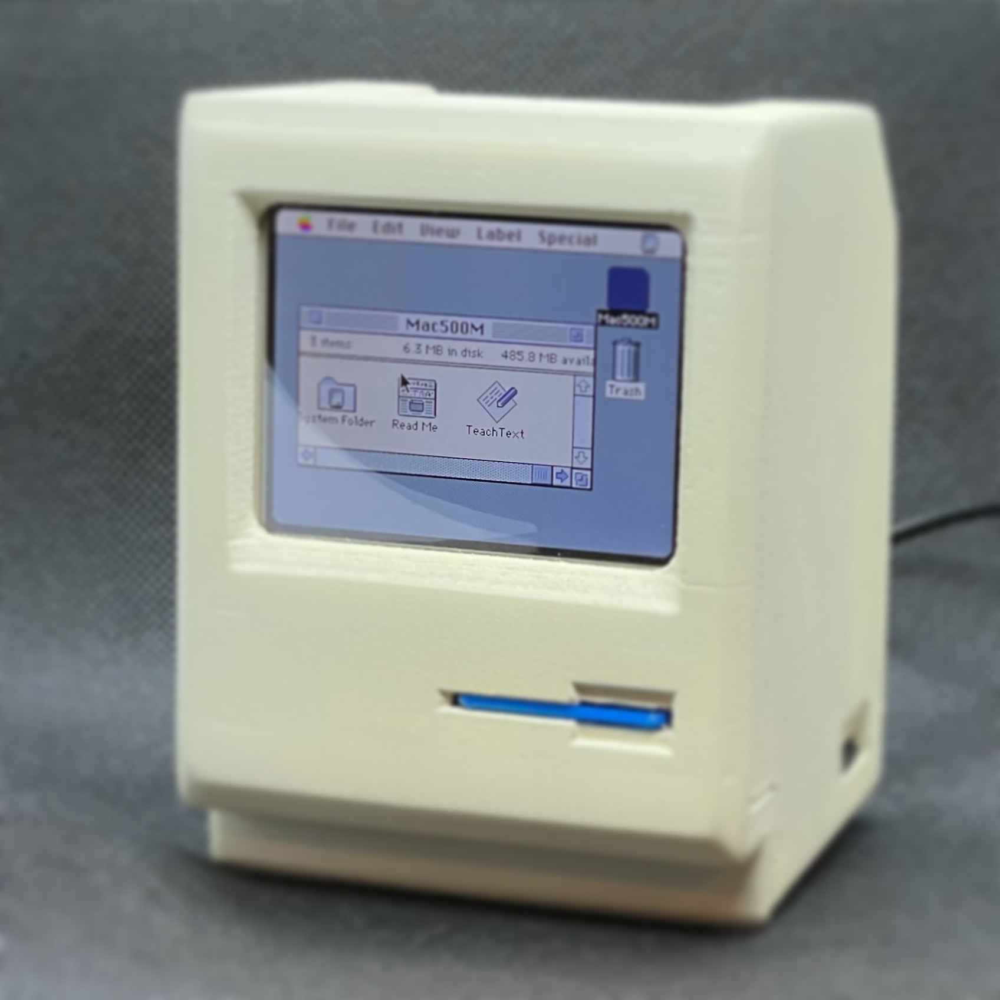
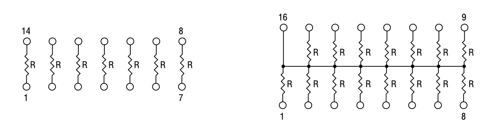
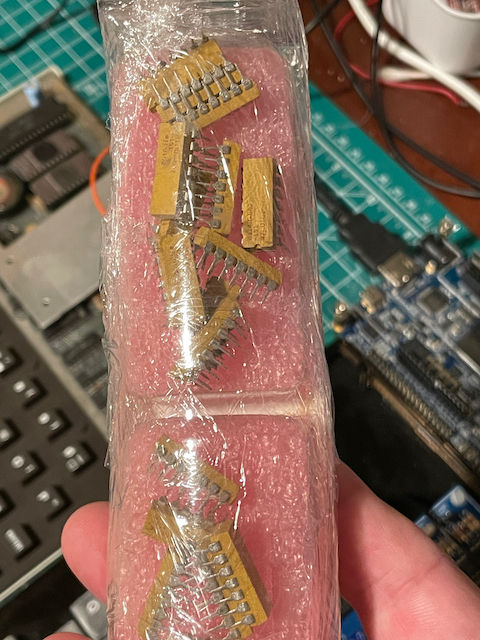
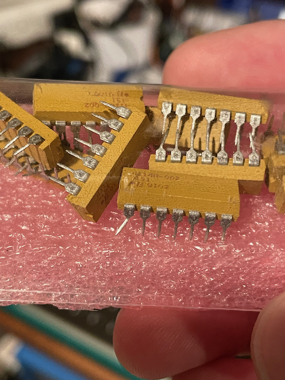
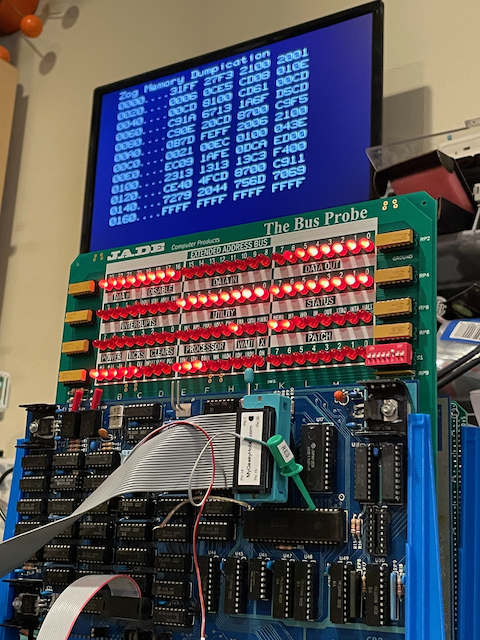
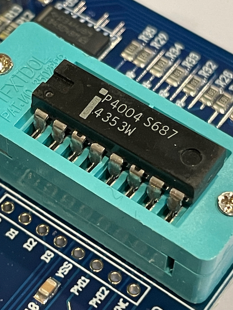
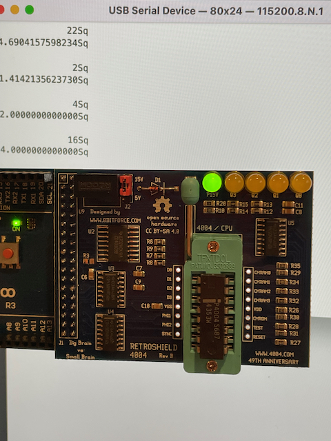

# Projects


## Callisto 2 Terminal

### May 15, 2021

One of the reasons I recently bought an Ender 3 printer to replace my MonoPrice model was to build a retro styled terminal. Something like a ADM31 terminal, but a little smaller. [These guys](https://www.thingiverse.com/thing:4846997) went and saved me a lot of time by designing a better one already, so I've started gathering the parts.

Printing it will not be quick. Each part is telling me about 18 hours(!) and I've only started with the hatch component (printing right now). I printed some yesterday evening, but then hit pause before bed. This morning I restarted it, and the darn thing started reprinting 1cm higher than it should. This printer seems to do that if I starts from power off - just forgets were it is. I am hoping that next time I restart I remember to do an Autohome and maybe that will fix it. The Ender is definitely a better printer than the MonoPrice but it's also a lot more fiddly to get it working.

So far I've found that carbon fiber filament and it don't get on. I've also found that I need to put the bed to 50 and nozzle to 210 (up from 40 and 200) to get the larger print to even begin sticking to the mat. I've not even tried the glass bed after a few initial experiments.

### May 23, 2021

The past week has been non-stop 3D printing. These guys, er, [Kevin](https://www.youtube.com/watch?v=dTUpQzp1J1A) at [Solar Computers](https://www.solarhardwarecomputers.com), did a great job of an ADM-31 style terminal, and shared the details. Finally that Ender 3 I picked up as an upgrade to my MonoPrice was going to earn its keep. After literally a week of printing, here's the end result:


### June 20, 2021

I finally found the specific USB power supply and USB dock that the Callisto was designed to work with, got a nice short micro-USB to HDMI plug, and housed the Raspberry Pi 4 in a case with a heatsink and quiet fan (it got hot in there, running Cool Reto Term). In other words, the project is complete for now. With a USB-to-Serial dongle attached the hub, it makes a great terminal for my S-100 Altair and other systems.

Now it's time to think of a slightly more modern terminal, such as this one - the [Dec Mini](https://decmini.com/).


## SCAMP

### May 15, 2021

The [SCAMP](https://www.tindie.com/products/johncatsoulis/scamp/) is a microcomputer board that runs a version of Forth, [FlashForth](https://flashforth.com), by default. It has a USB port so when you connect it, it's just a serial terminal away from writing Forth. There are quirks compared to, say, the beloved Jupiter Ace. No DO/LOOP for one, because the author of FlashForth didn't like them. Well, ok, it's their project. Obviously it should be possible to implement them. So that's a good first project. Second project will be to try and connect it to the i2c LED display I have. Larger goal - Forth would be a great language for programming a robot. I still have the telepresence robot idea on the back burner.


## Mini Mac

### June 6, 2021

I spent the weekend building this:



I was following [these instructions](https://www.instructables.com/Making-a-Tiny-Mac-From-a-Raspberry-Pi-Zero/). Gosh it's cute! From a distance my poor craftmanship is hardly noticeable! And that isn't a simulated image, it's a small screen with a Raspberry Pi Zero running a Mac OS 7 emulator. 

### June 21, 2021

After watching the [Macintosh Librarian](https://youtu.be/dP-2JRLjxUA) remix the this project to build a Mac SE/30, I've fired up the printer again (this time with a better colour filament) to see how it works out.

## PiTrex

### May 15, 2021

Such a cool project for the Vectrex, running code on a Raspberry Pi and displaying it using the vectors display. I need to find a goal. So far I've been trying to print a case for the expanded cartridge, and I'm very close - [fifth time's the charm](https://www.tinkercad.com/things/3Arb0Gx2arq-daring-fyyran-allis/edit)!


## Forth

### May 23, 2021

I've returned to the idea of writing my own Forth, and I've started gathering references:

* [Forth on Arduino](https://weblambdazero.blogspot.com/2016/)
* [ASE: Writing a forth interpreter from scratch](https://sifflez.org/lectures/ASE/C3.pdf)
* [PyForth](https://www.openbookproject.net/py4fun/forth/forth.py)
* [J1 Forth in Verilog](https://excamera.com/sphinx/fpga-j1.html)
* [Moving Forth: a series on writing Forth kernels](http://www.bradrodriguez.com/papers/)
* [Public Domain Forths](http://www.forth.org/eforth.html)
* [Let’s Design the Simplest Possible Forth](http://pygmy.utoh.org/3ins4th.html)
* [larsbrinkhoff / nybbleForth](https://github.com/larsbrinkhoff/nybbleForth)
* [tehologist / forthkit](https://github.com/tehologist/forthkit)
* [FlashForth](https://authorzilla.com/y5nbe/flashforth-5-tutorial-guide.html)


## Jade S-100 Bus Probe

### June 6, 2021


I had [bought this PCB](http://s100computers.com/Hardware%20Folder/Jade/Bus%20Probe/Bus_Probe.htm) last year, but finally got it sent over from the UK. It would be helpful in working out what Zog the Z80 pile of parts was actally doing - but also it would look amazing. Blinkenlights!

I soldered it up very neatly - and then discovered two things in quick succession: 

* Firstly, I had forgotten to order a 74LS30 which is a pivotal chip that controls the ENABLE line for almost everything. Amazon is sending some asap.

* Secondly, I had soldered in every single bloody LED the wrong way round. I blame the instructions which clearly stated the wrong orientation (or rather, stated a confusing self-contradictory description). In the old days, was other OTHER leg on LEDs actually the longer? It makes no sense. My fingertips are still numb from the burns.

Anyway, I had to unsolder all 96 LEDs and resolder them. I'll know when the 74LS30 chip arrives if I broke a lot of them in the process, and if the the board actually works - I am not certain all is well with it, as trying to bypass the '30 didn't achieve much. I don't want to have to test all the ICs on the board and learn that JAMECO let me down again. Fingers crossed it'll be fine.

### June 10, 2021

D'oh. The reason bypassing the 74LS30 didn't do much is that the resistor packages (multiple resistors in a single IC-like DIP case) I bought were the wrong sort. Turns out there are different types and I picked the wrong one. 



The ones I actually need (on the right) are difficult to find in stock - but a company called Master Electronics seems to have some.

### June 13, 2021

I cannot recommend Master Electronics.

Me: I would like to buy 8 of this component please. 

Company: Sorry, minimum order is 25. 

Me: Well, ok. They aren’t very expensive and I can’t find them anywhere else. Ok. 

Company: Sorry we only have 23. 

Me: Er. Ok. I will take 23 then. 

Company: That’ll be (large amount) because we gouge you on shipping. 

Me: Ouch. Well Ok I guess. 

Company: Thanks for the money. BTW we counted wrong we only have 22. 

Me: That’s OK as I only wanted 8. 

Company: We just charged you an extra (large amount) to pay to ship you (at gouging rates) the extra one on back order. 

Me: What? That’s crazy. I don’t want it. I told you that. 

Company: Oh. Well this is awkward. Now you have to fill in an RMA and maybe we will give you a refund. Or most likely credit. 

Me: Are you kidding me?

### June 18, 2021

The resistors arrived (very badly packaged! I will NOT be using this company again). They did agree to cancel the order for the remaining resistor (which I seriously doubt they would ever be able to fulfill anyway). The ones they sent are a fabulous retro yellow/brown/tan colour. And they work fine (once I straightened out the legs). I was worried than 150 Ohms would be too low a resistance, and the LEDs would be too bright, but it turns out the LEDs I had bought from JAMECO were not particularly modern and/or low current, so they were just right.




The Bus Probe looks amazing with the LEDs all blinking, and I need to spend some time learning exactly what they are telling me! Also, I need to straighten some of them out after their soldering ordeal.



### June 20, 2021

The Probe worked in both the Zog system and Altair, and was sort of useful (but mostly cool) when I was [writing some code](https://github.com/GrantMeStrength/retro/blob/gh-pages/zog/zog.md).

## LISP

### June 12, 2021

LISP seems to be a fundamental language that I've never actually gotten around to learning properly. I'd like to know the fundamental trick of LISP that makes it interesting. 

So far the cleanest LISP installation for Mac seems to be CLISP, which is easy to install from the command line using BREW. Here are the [installation and getting started instructions](https://opensource.com/article/21/5/learn-lisp) I've found.

I didn't realize LISP gave us the concept of a [REPL](https://en.wikipedia.org/wiki/Read–eval–print_loop)!

```
(defun hello ()
           (format t "Hello, World!~%"))

(hello)

Hello, World!

```


### Resources

* [LISP on Wikipedia](https://en.wikipedia.org/wiki/Lisp_(programming_language)) <- best intro
* [The Common LISP cookbook](https://lispcookbook.github.io/cl-cookbook/)
* [Installation and getting started](https://opensource.com/article/21/5/learn-lisp)
* [On LISP](https://archive.org/details/ost-computer-science-onlisp/page/n3/mode/2up)
* [MakerLisp](https://www.makerlisp.com) <- cool, stand-alone modern LISP machine


## Intel 4004

### June 12, 2021

In time for its 50th (!) anniversary I have a real [Intel](http://www.intel.com/museum/archives/4004.htm) [4004](https://www.4004.com) microprocessor, and what's more thanks to [8bitForce](http://www.8bitforce.com/projects/4004/) I have it actually running. Erturk designed a special board that uses an Arduino to provide the support hardware and ROM data for the 4004 to run its original application: an early [electronic calculator](http://www.vintagecalculators.com/html/busicom_141-pf_and_intel_4004.html). 

The history is fascinating, and the timeline leads directly to both the Intel 80x86 architecture we're using today, AND the creation of the Z80 and CP/M branch of the computing tree that made home computers an actual thing in the 1980s.





### June 20, 2021

Moving the Intel 4004 project to a [dedicated page](https://github.com/GrantMeStrength/retro/blob/gh-pages/4004/4004.md).