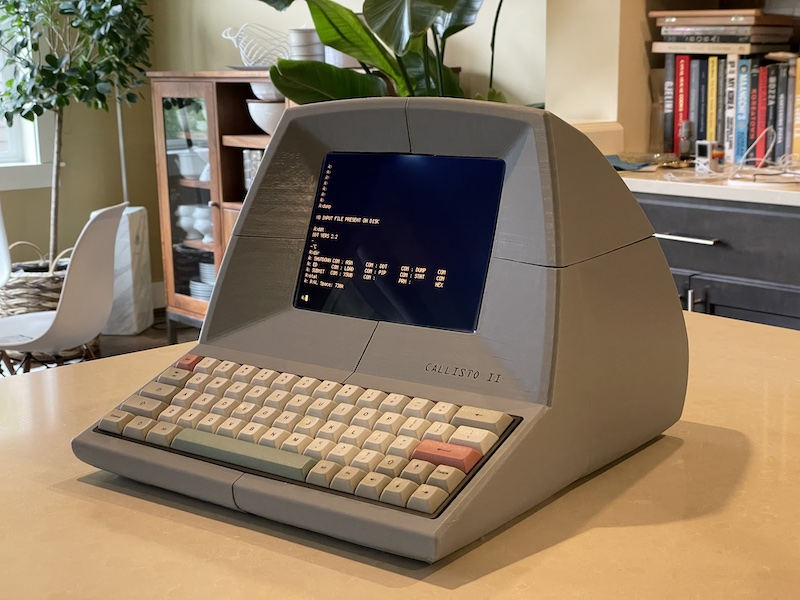

# Projects

Other project notes.

## Callisto 2 Terminal

### May 15, 2021

One of the reasons I recently bought an Ender 3 printer to replace my MonoPrice model was to build a retro styled terminal. Something like a ADM31 terminal, but a little smaller. [These guys](https://www.thingiverse.com/thing:4846997) went and saved me a lot of time by designing a better one already, so I've started gathering the parts.

Printing it will not be quick. Each part is telling me about 18 hours(!) and I've only started with the hatch component (printing right now). I printed some yesterday evening, but then hit pause before bed. This morning I restarted it, and the darn thing started reprinting 1cm higher than it should. This printer seems to do that if I starts from power off - just forgets were it is. I am hoping that next time I restart I remember to do an Autohome and maybe that will fix it. The Ender is definitely a better printer than the MonoPrice but it's also a lot more fiddly to get it working.

So far I've found that carbon fiber filament and it don't get on. I've also found that I need to put the bed to 50 and nozzle to 210 (up from 40 and 200) to get the larger print to even begin sticking to the mat. I've not even tried the glass bed after a few initial experiments.

### May 23, 2021

The past week has been non-stop 3D printing. These guys, er, [Kevin](https://www.youtube.com/watch?v=dTUpQzp1J1A) at [Solar Computers](https://www.solarhardwarecomputers.com), did a great job of an ADM-31 style terminal, and shared the details. Finally that Ender 3 I picked up as an upgrade to my MonoPrice was going to earn its keep. After literally a week of printing, here's the end result:

## SCAMP

### May 15, 2021

The [SCAMP](https://www.tindie.com/products/johncatsoulis/scamp/) is a microcomputer board that runs a version of Forth, [FlashForth](https://flashforth.com), by default. It has a USB port so when you connect it, it's just a serial terminal away from writing Forth. There are quirks compared to, say, the beloved Jupiter Ace. No DO/LOOP for one, because the author of FlashForth didn't like them. Well, ok, it's their project. Obviously it should be possible to implement them. So that's a good first project. Second project will be to try and connect it to the i2c LED display I have. Larger goal - Forth would be a great language for programming a robot. I still have the telepresence robot idea on the back burner.

## ENIAC 

### May 15, 2021

I've a crazy idea to recreate a simple version of the ENIAC using Raspbery Pi PICO boards to model the individual components (accumulators mostly). I've gather five PICOs, and a breadboard system for mounting them, so when I've time to read the books I've collected properly I can make some progress. [Great intro video here](https://www.youtube.com/watch?v=c-5n5J4wOig).

## PiTrex

### May 15, 2021

Such a cool project for the Vectrex, running code on a Raspberry Pi and displaying it using the vectors display. I need to find a goal. So far I've been trying to print a case for the expanded cartridge, and I'm very close - [fifth time's the charm](https://www.tinkercad.com/things/3Arb0Gx2arq-daring-fyyran-allis/edit)!

## Forth

### May 23, 2021

I've returned to the idea of writing my own Forth, and I've started gathering references:

* [Forth on Arduino](https://weblambdazero.blogspot.com/2016/)
* [ASE: Writing a forth interpreter from scratch](https://sifflez.org/lectures/ASE/C3.pdf)
* [PyForth](https://www.openbookproject.net/py4fun/forth/forth.py)
* [J1 Forth in Verilog](https://excamera.com/sphinx/fpga-j1.html)
* [Moving Forth: a series on writing Forth kernels](http://www.bradrodriguez.com/papers/)
* [Public Domain Forths](http://www.forth.org/eforth.html)
* [Let’s Design the Simplest Possible Forth](http://pygmy.utoh.org/3ins4th.html)
* [larsbrinkhoff / nybbleForth](https://github.com/larsbrinkhoff/nybbleForth)
* [tehologist / forthkit](https://github.com/tehologist/forthkit)
* [FlashForth](https://authorzilla.com/y5nbe/flashforth-5-tutorial-guide.html)
