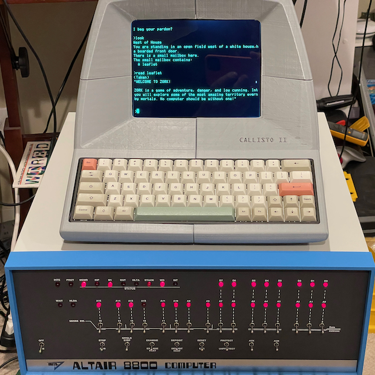

## Hello!

For a full list of current and past experiments, please see the [Index](index.md).

## What's "New"

**Using a Raspberry Pi Pico with an Apple IIe keyboard**

An in-progress project to give an Apple IIe keyboard a USB interface. Details on the [Apple Keyboard](https://github.com/GrantMeStrength/retro/blob/gh-pages/applekeyboard/applekeyboard.md) page.

**Mini Vectrex, and updated Virtual KIM-1 app and manual, June 27th 2021**

* [A 3D printed Vectrex](https://github.com/GrantMeStrength/retro/blob/gh-pages/Projects/index.md)
* [An update to the KIM-1 app for iOS in TestFlight](https://github.com/grantmestrength/kim1)

**The Altair 8800 Clone Configuration, June 2021**

[A real 8080 based computer! Also some Z80 code and setting up the toolchain.](zog/zog.md)

**KIM/PAL Audio files, June 2021**

[Some audio files for setting up and testing the PAL-1 cassette interface.](https://github.com/grantmestrength/kim1)

**Intel 4004, June 2021**

[A real Intel 4004 running real software.](https://github.com/GrantMeStrength/retro/blob/gh-pages/Projects/index.md)

**PAL-1 Case, June 2021**

[A lid and keys for the PAL-1 clone of the KIM-1.](https://github.com/grantmestrength/kim1)