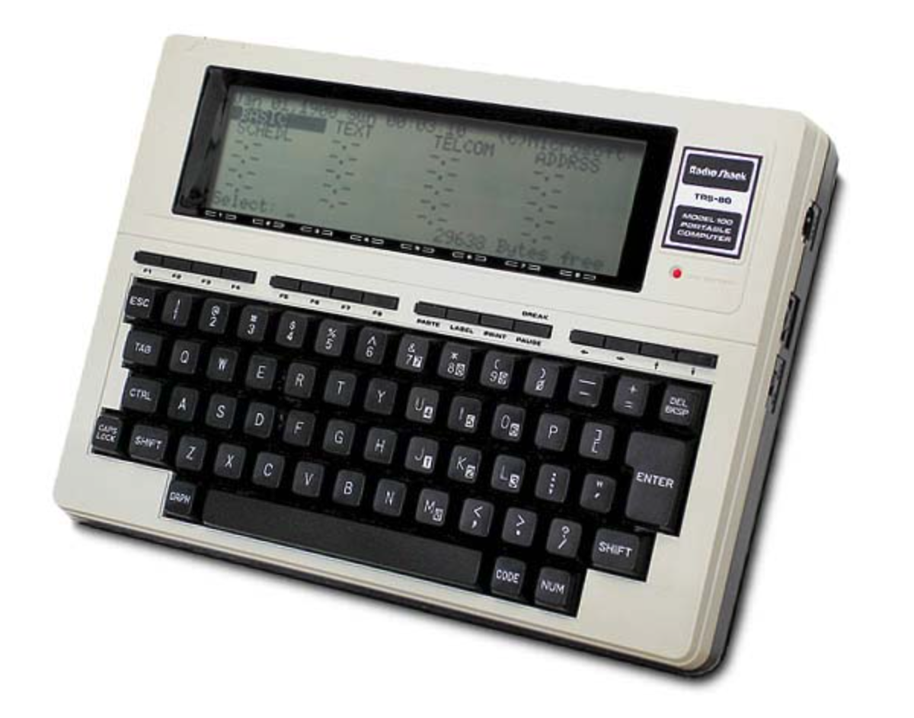
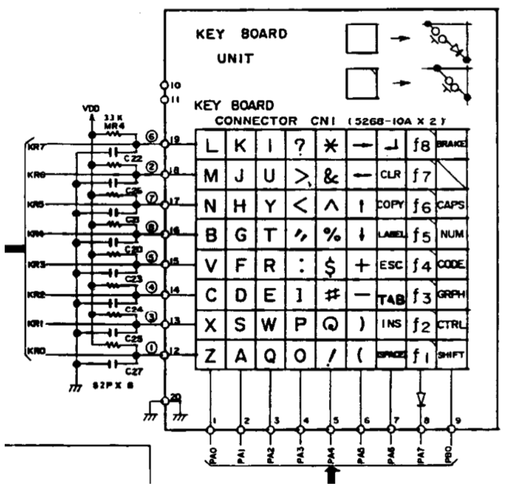
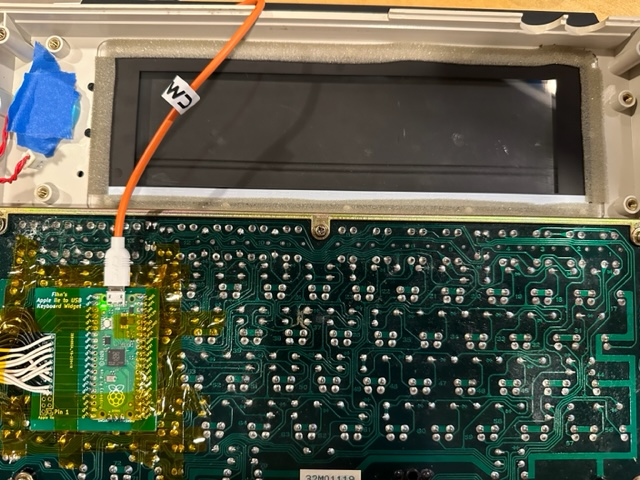

# Tandy TRS-80 Model 100 Retro-refit

The Tandy M100 is a classic 80's computer familar to many. In a time before today's ubquitous laptops, it was popular with journalists (and nerds) because of its keyboard, modem, battery life and built-in software including BASIC, word processor, and terminal emulator. The popular story is that it's the last software project that Bill Gates worked on personally. I'll have to ask him next time we're chatting.



I have a working M100, and yeah, it's nice. Working on it within the limitations of its period hardware is enjoyable in that retro-way. There's a strong community keeping them going, and a good software library.

There is even a modern homage to the M100 called the [DevTerm](https://www.clockworkpi.com/devterm), and it retains the same colour scheme and aesthetics but with a choice of modern processors: RISC-V, Pi CM4, A6 ARM.. It is very clever and has a beautiful design with trackball, USB ports and battery management - but the extreme cuteness comes at the cost of the keyboard, which is simply too small to type on.

BTW for other a minimal systems, check out: the [FreeWrite](https://getfreewrite.com), this [Keyboard-with-a-screen](https://www.amazon.com/Portable-Mechanical-Multifunctional-Touchscreen-Expansion/dp/B09QGN6NS5), and the [CrowPi](https://www.elecrow.com/crowpi.html). 

## Retrofitting the M100 with a Pi

This is not original idea, and many people have already done it and done it better than I could do. But since they aren't selling any, if I want a notebook in this form factor, I'm going to have to make one myself.

I found an M100 for sale on eBay with a malfunctioning screen, so that was all the excuse I needed to strip it down. The PCB will be kept as spares for my working M100. And yes, the battery needs to come off that ASAP as those little buggers leak and damage everything.

That leaves a shell with the a keyboard. And my goodness it was *horribly* dirty so that took a few days to clean up properly. 

The first question is how to interface the keyboard to the Pi that's going to be the new brains? Luckily I've been here before, so I was able to repurpose the [Apple IIe keyboard adpator](https://github.com/GrantMeStrength/retro/blob/gh-pages/applekeyboard/applekeyboard.md) I built using the Raspberry Pi Pico to create a stand-alone USB interface. The software needed to be rewritten to work with the different keyboard layout, but luckily all the GPIO pins required on the Pico were available on my PCD, so I could connect the two ribbon cables from the Tandy keyboard without any extra hardware.

With some trial and error I wrote this code (look at the AppleIIe link above for more details on the hardware) for the Pico. I was able to add a few usability improvements (such as using WASD for the cursor keys, the ability to enter { } ~ ` | and so on) and if you're going to try it, it should be obious where that code can be tweaked.

This image from the Tandy service guide was invaluable.




```
# Raspberry Pi PICO Tandy M100 Keyboard. 
# John Kennedy, September 2022
#
# Currently capslock is like holding down shift, so symbols do not work as expected.
# There are some special cases as the keyboard lacks standard keys (by today's standards)
# Use CODE and WASD for cursor keys
# Use shift and code on [ ] to get curly braces
# Use shift and code (and both) to get ` ~ and |
# Other shortcuts and special case can be added to the mail loop as you need.


import time
import board
import digitalio
import usb_hid
from adafruit_hid.keyboard import Keyboard
from adafruit_hid.keycode import Keycode
from array import *

print("Initialization")
capslock = False
led = digitalio.DigitalInOut(board.LED)
led.direction = digitalio.Direction.OUTPUT
led.value = True
#optional delay before creating the HID for maximum compatibility
time.sleep(0.5)
led.value = False
time.sleep(0.5)
led.value = True

#create the HID
kbd = Keyboard(usb_hid.devices)
print("Keyboard ready. Keypresses will be sent to connected USB device.")

#set up the inputs, outputs
rows = [] #  - WHITE LEADS aka ROW are OUTPUTS on the PICO, pushing H&L into matrix
row_pins =  [board.GP4, board.GP5, board.GP6, board.GP7, board.GP8, board.GP9, board.GP11, board.GP12] 
for row in row_pins:
    row_key = digitalio.DigitalInOut(row)
    row_key.direction = digitalio.Direction.OUTPUT
    row_key.value = False
    rows.append(row_key)

columns = [] # BLACK LEADS aka COLUMNS in INPUTS changes the place in the matrix row
column_pins = [board.GP20, board.GP21, board.GP22, board.GP26, board.GP27, board.GP28, board.GP0, board.GP1, board.GP2] 
for column in column_pins:
    column_key = digitalio.DigitalInOut(column)
    column_key.direction = digitalio.Direction.INPUT
    column_key.pull = digitalio.Pull.DOWN
    columns.append(column_key)


keymap_matrix = [
    [Keycode.L, Keycode.K, Keycode.I, Keycode.FORWARD_SLASH, Keycode.EIGHT, Keycode.RIGHT_ARROW, Keycode.RETURN, Keycode.F8,Keycode.ESCAPE ],
    [Keycode.M, Keycode.J, Keycode.U, Keycode.COMMA, Keycode.SEVEN, Keycode.LEFT_ARROW, Keycode.ESCAPE, Keycode.F7,Keycode.ESCAPE ],
    [Keycode.N, Keycode.H, Keycode.Y, Keycode.PERIOD, Keycode.SIX, Keycode.UP_ARROW, Keycode.ESCAPE, Keycode.F6,Keycode.CAPS_LOCK ],
    [Keycode.B, Keycode.G, Keycode.T, Keycode.QUOTE, Keycode.FIVE, Keycode.DOWN_ARROW, Keycode.GUI , Keycode.F5,Keycode.LEFT_ALT ],
    [Keycode.V, Keycode.F, Keycode.R, Keycode.SEMICOLON, Keycode.FOUR, Keycode.EQUALS, Keycode.ESCAPE, Keycode.F4,Keycode.RIGHT_ALT ],
    [Keycode.C, Keycode.D, Keycode.E, Keycode.LEFT_BRACKET, Keycode.THREE, Keycode.MINUS, Keycode.TAB, Keycode.F3,Keycode.RIGHT_SHIFT ],
    [Keycode.X, Keycode.S, Keycode.W, Keycode.P, Keycode.TWO, Keycode.ZERO, Keycode.BACKSPACE, Keycode.F2,Keycode.CONTROL ],
    [Keycode.Z, Keycode.A, Keycode.Q, Keycode.O, Keycode.ONE, Keycode.NINE, Keycode.SPACE, Keycode.F1,Keycode.LEFT_SHIFT ],
    ]


# Main keyboard scanning loop.

matrix = {}
keypress = 0
ready = 0

while True:

    #print("\x1b[H\x1b[2J")     clear terminal screen - very handy      

    for r in rows: #for each row in turn, check the columns
        r.value = True
        for c in columns: #and then for each column read status
            matrix[rows.index(r), columns.index(c)] = c.value
        r.value = False

    # Check for modifiers first - all in one column which is nice.
    # Reset them in the matrix to simplify the subsequent logic

    # Caps lock = 4
    # Num lock = 8
    # Code = 16
    # Graph = 32
    # CTRL = 64
    # Shift = 128

    modifier_shift = False
    modifier_control = False
    modifier_code = False

    modifier = 0
    for x in range(len(rows)):
        if matrix[x,8]:
            modifier = modifier + 2**x
            matrix[x,8] = False
    
    if modifier & 128 or modifier & 4 :
        modifier_shift = True

    if modifier & 64 :
        modifier_control = True

    if modifier & 16 :
        modifier_code = True

    xi = 99
    yi = 99

    for y in range(len(columns)) :
        for x in range(len(rows)):
            if yi == 99 and matrix[x,y] :
                yi = y
                break

    if not yi == 99:

        for x in range(len(rows)) :
            if xi == 99 and matrix[x,yi] :
                xi = x
                break

    key = xi*9 + yi
    
    modifier_skip = False

    if ready > 0:
        if  key < 300: # A high value happens when no key is pressed

            #print(keypress)

            keypress = keymap_matrix[xi][yi]

            # Cursor control hack

            if modifier_code and keypress == Keycode.A :
                kbd.press(Keycode.LEFT_ARROW)
                modifier_skip = True

            if modifier_code and keypress == Keycode.W :
                kbd.press(Keycode.UP_ARROW)
                modifier_skip = True

            if modifier_code and keypress == Keycode.D :
                kbd.press(Keycode.RIGHT_ARROW)
                modifier_skip = True

            if modifier_code and keypress == Keycode.S :
                kbd.press(Keycode.DOWN_ARROW)
                modifier_skip = True

            # Extra symbols & tweaks e.g. [ ] { } 

            if modifier_shift and not modifier_code and keypress == Keycode.LEFT_BRACKET :
                kbd.press(Keycode.RIGHT_BRACKET)
                modifer_skip = True
                keypress = 0

            if modifier_code and not modifier_shift and keypress == Keycode.LEFT_BRACKET :
                kbd.press(Keycode.SHIFT)
                kbd.press(Keycode.LEFT_BRACKET)
                modifer_skip = True
                keypress = 0

            if modifier_code and modifier_shift and keypress == Keycode.LEFT_BRACKET :
                kbd.press(Keycode.SHIFT)
                kbd.press(Keycode.RIGHT_BRACKET)
                modifer_skip = True
                keypress = 0

            if modifier_code and keypress == Keycode.FORWARD_SLASH :
                kbd.press(Keycode.BACKSLASH)
                modifer_skip = True
                keypress = 0

            if modifier_code and not modifier_shift and keypress == Keycode.ESCAPE :
                kbd.press(Keycode.GRAVE_ACCENT)
                modifer_skip = True
                keypress = 0

            if not modifier_code and modifier_shift and keypress == Keycode.ESCAPE :
                kbd.press(Keycode.SHIFT)
                kbd.press(Keycode.GRAVE_ACCENT)
                modifer_skip = True
                keypress = 0

            if modifier_code and modifier_shift and keypress == Keycode.ESCAPE :
                kbd.press(Keycode.SHIFT)
                kbd.press(Keycode.BACKSLASH)
                modifer_skip = True
                keypress = 0


            # Standard keys

            if not modifier_skip :

                if modifier_shift :
                    kbd.press(Keycode.SHIFT)

                if modifier_control :
                    kbd.press(Keycode.CONTROL)

                if not keypress == 0:
                    kbd.press(keypress)


            kbd.release_all()

            ready = 0

    else: # Debounce
        if key == 990:
            ready = ready + 1


```

With the wires soldered up, here's where things are right now:




Next up: mounting the screen and Raspberry Pi.

Am I going to use the original LCD screen? Hint: No. I am not.


## Resources


* [TRS-80 Model 100](http://oldcomputers.net/trs100.html)
* [TRS80 Model 100 + Raspberry Pi](https://trmm.net/TRS80_Model_100/)
* [Hackaday](https://hackaday.com/tag/trs-80-model-100/)
* [Converting a TRS-80 Model 100 keyboard to USB](https://www.seanet.com/~karllunt/M100_usb_keyboard.html)
* [GPIO Based Keyboard in Python](https://fadsihave.wordpress.com/2021/01/02/gpio-based-keyboard-on-pine-a64/)
* [Surfing the Internet… from my TRS-80 Model 100](https://arstechnica.com/information-technology/2015/08/surfing-the-internet-from-my-trs-80-model-100/)
* [Adafruit keyboard library](https://docs.circuitpython.org/projects/hid/en/latest/_modules/adafruit_hid/keycode.html)