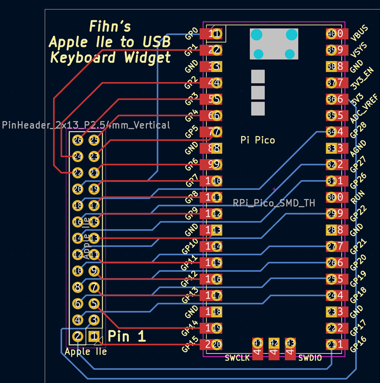

# Connecting an Apple II keyboard to other systems via USB


The Apple IIe keyboard is a passive matrix of switches. This means it should be relatively easy to connect to some other systems, by means of a microcontroller.
For example, it could be used in a real Apple II but connected to, say, a Raspberry Pi running an emulator - thus replacing broken, missing or just tired Apple original electronics.
It would also be an option for connecting to other random systems, such as [Zog](https://github.com/GrantMeStrength/retro/blob/gh-pages/zog/zog.md).


## Microcontroller choice

It appears that while Arduinos are my usual go-to, a Teensy is better as it can act as a USB keyboard very easily. The problem is that Teensy's are hard to find at the moment. 

I briefly considered the Pi Pico (as I have several) and then thought "ah, the Pico is 3.3v and the Apple keyboard needs 5v."

Then I realized: the Apple IIe keyboard is passive. It doesn't care if it's 5v, 3.3v or 12 volts - it's just switches. Ok, the little light needs 5v, but so? It'll work fine with 3.3v from the Pico.

So my plan was to write software using the Pico to decode the keyboard, because like the Teensy, it can act as a keyboard HID and it also has plenty of pins. And I have some Picos in my parts drawer.

The Apple IIe keyboard has been ordered from eBay. (I then discovered that [MacEffects sell a brand new one](https://maceffects.com/products/apple-iie-mechanical-keyboard)!)

## Progress

The Pico I had, the Apple IIe keyboard took a little longer to get here, but it did. The circuit I had soldered together on strip board seems to work fine. The software for the Pico is written in Circuit Python, as this works with the Adafruit Keyboard HID library and also makes a super-convenient development platform - just save the source code from your editor (VS Code in this case) and the Pico automatically reboots and runs it. Really nice!

The first version worked, but the Control and Shift keys did not. I checked the keyboard schematic and realized that the Open / Close Apple keys were connected to 5v and the other modifier keys were connected to Ground.

After making the changes to the software, I found Caps Lock didn't work. Really I should I have expected it - it wasn't magically going to do a Shift. This is something the driver software needs to track on this keyboard. The Caps Lock button is a locking physical switch, and its state is read like other modifiers - but it needs tracked separately. I've adjusted the code to support it. 

## Circuit

The only electronics required is the Pico. It can be connected directly to the ribbon cable from the Apple IIe keyboard, as the keyboard is passive and has no electronics of its own. I built a circuit on stripboard, and then got a PCB made.




You can download the Gerber files from this repo to get some made yourself.


## Step by Step - Hardware

1. Get a Raspberry Pi Pico.
2. Attach the GPIO pins to the ribbon cable from the keyboard.
3. That's it really.

If you like you can use the PCB I designed, and then the pins in the software listing below will be correct. You can then use a connector for the Apple ribbon cable, and solder the Pico directly to the PCB to make a svelt little board.


## Step by Step - Software

1. Go to [Circuit Python for Pico](https://circuitpython.org/board/raspberry_pi_pico/) page and download the stable release, and copy the .UF2 file to the Pico. To make the Pico appear on your computer as a USB device, hold down the BOOTSEL button as you plug it into the USB port. The BOOTSEL button is the only button on a typical Pico.

2. Go to the [Adafruit HID Library](https://docs.circuitpython.org/projects/hid/en/latest/index.html) page to read about the Adafruit HID Library. Then go to the Git page and download [adafruit-circuit-[ython-hid-xx-mpy-xx.zip](https://github.com/adafruit/Adafruit_CircuitPython_HID/releases/tag/5.2.2). Unarchive it.

3. Copy the folder  **adafruit_hid** to the **libs** folder on the Pico's root directory. The Pico will have unmounted itself, and re-appeared as a device called **CIRCUITPY**.

4. You can test things by connecting to the Pico with a terminal program (I use Serial on the Mac), which will bring up the interactive Python prompt. If you can enter this without errors, it's all good:

```
import time
import board
import digitalio
import usb_hid
from adafruit_hid.keyboard import Keyboard
from adafruit_hid.keycode import Keycode

```

Now find the file called **code.py** on the Pico's root directory and open it in your favourite code editor. Use the following program to replace everything in this file, including the "hello world" code. The program **code.py** is executed every time the Pico is reset.


## My Python code for driving the Pico

```python

# Apple IIe Keyboard to USB Interface using a Raspberry Pi Pico
# John Kennedy, April 2022
#
# Based in part on CircuitPython/Raspberry Pi Pico'firmware' for The Smallest Keyboard
# https://hackaday.io/project/178204-the-smallest-keyboard
#
# The keymapping depends on the wiring of the Apple IIe keyboard connector to the 
# Raspberry Pi Pico. This code therefore matches a specific writing diagram included
# in the github repo at https://github.com/GrantMeStrength/retro/blob/gh-pages/applekeyboard/applekeyboard.md
#

import time
import board
import digitalio
import usb_hid
from adafruit_hid.keyboard import Keyboard
from adafruit_hid.keycode import Keycode

capslock = False
led = digitalio.DigitalInOut(board.LED)
led.direction = digitalio.Direction.OUTPUT
led.value = True
#optional delay before creating the HID for maximum compatibility
time.sleep(0.5)
led.value = False
time.sleep(0.5)
led.value = True

#create the HID
kbd = Keyboard(usb_hid.devices)

#set up the row, column, and modifier arrays
rows = [] #  - ROW is OUTPUTS - Y in the Apple diagrams
row_pins = [board.GP15, board.GP16, board.GP18, board.GP19, board.GP20, board.GP21, board.GP5, board.GP4, board.GP22, board.GP1]
for row in row_pins:
    row_key = digitalio.DigitalInOut(row)
    row_key.direction = digitalio.Direction.OUTPUT
    rows.append(row_key)

columns = [] # COLUMNS in INPUTS - X in the Apple diagrams
column_pins = [board.GP26, board.GP28, board.GP10, board.GP0, board.GP6, board.GP7, board.GP3, board.GP8]
for column in column_pins:
    column_key = digitalio.DigitalInOut(column)
    column_key.direction = digitalio.Direction.INPUT
    column_key.pull = digitalio.Pull.DOWN
    columns.append(column_key)

# The open/close Apple modifiers short to +5, the shift/control/caps short to ground
# so the code needs to be slightly different for each

# Apple Keys
modifiers1 = []
modifier_pins1 = [board.GP14, board.GP13]
for mod_pin in modifier_pins1:
    mod_key = digitalio.DigitalInOut(mod_pin)
    mod_key.direction = digitalio.Direction.INPUT
    #mod_key.pull = digitalio.Pull.DOWN # Don't need to specify
    modifiers1.append(mod_key)
mod_keymap1 = [Keycode.RIGHT_ALT, Keycode.LEFT_ALT]

# Control Shift
modifiers2 = []
modifier_pins2 = [board.GP11, board.GP2]
for mod_pin in modifier_pins2:
    mod_key = digitalio.DigitalInOut(mod_pin)
    mod_key.direction = digitalio.Direction.INPUT
    mod_key.pull = digitalio.Pull.UP
    modifiers2.append(mod_key)
mod_keymap2 = [Keycode.CONTROL, Keycode.SHIFT]

#Caps lock
caps_mod_key = digitalio.DigitalInOut(board.GP12)
caps_mod_key.direction = digitalio.Direction.INPUT
caps_mod_key.pull = digitalio.Pull.UP
capslock = not caps_mod_key.value
if capslock == True :
    # Started with Caps On
    kbd.press(Keycode.CAPS_LOCK)
    time.sleep(0.25)
capslock = not capslock

#array of keycodes; if you want to remap see: https://circuitpython.readthedocs.io/projects/hid/en/latest/api.html#adafruit-hid-keycode-keycode /'None' values have no physical connection

keymap = [Keycode.ESCAPE,Keycode.TAB,Keycode.A,Keycode.Z,Keycode.FORWARD_SLASH,Keycode.RIGHT_BRACKET,Keycode.KEYPAD_ASTERISK,Keycode.ESCAPE,
	Keycode.ONE, Keycode.Q, Keycode.D, Keycode.X, Keycode.DOWN_ARROW, Keycode.UP_ARROW, Keycode.LEFT_ARROW, Keycode.RIGHT_ARROW,
	Keycode.TWO, Keycode.W ,Keycode.S, Keycode.C ,Keycode.ZERO, Keycode.FOUR,Keycode.EIGHT,Keycode.LEFT_BRACKET,
	Keycode.THREE, Keycode.E, Keycode.H, Keycode.V, Keycode.ONE, Keycode.FIVE,Keycode.NINE,Keycode.KEYPAD_MINUS,
	Keycode.FOUR, Keycode.R, Keycode.F, Keycode.B, Keycode.TWO, Keycode.SIX, Keycode.PERIOD, Keycode.RETURN,
	Keycode.SIX, Keycode.Y, Keycode.G, Keycode.N, Keycode.THREE, Keycode.SEVEN, Keycode.EQUALS, Keycode.COMMA,
	Keycode.FIVE, Keycode.T, Keycode.J, Keycode.M, Keycode.BACKSLASH, Keycode.GRAVE_ACCENT, Keycode.RETURN, Keycode.DELETE,
	Keycode.SEVEN, Keycode.U, Keycode.K, Keycode.COMMA, Keycode.EQUALS, Keycode.P, Keycode.UP_ARROW, Keycode.DOWN_ARROW,
	Keycode.EIGHT, Keycode.I, Keycode.SEMICOLON, Keycode.PERIOD, Keycode.ZERO, Keycode.LEFT_BRACKET, Keycode.SPACE, Keycode.LEFT_ARROW,
	Keycode.NINE, Keycode.O, Keycode.L, Keycode.FORWARD_SLASH, Keycode.MINUS, Keycode.RIGHT_BRACKET, Keycode.QUOTE, Keycode.RIGHT_ARROW]

#main loop

while True:

    # check the status of the caps-lock key
    if capslock != caps_mod_key.value :
         #print("Toggle caps to ",capslock)
         capslock = caps_mod_key.value
         kbd.press(Keycode.CAPS_LOCK)
         led.value = not capslock
         time.sleep(0.10)
             

    for r in rows: #for each row
        r.value=1 #set row r to high
        for c in columns: #and then for each column
            if c.value: #if a keypress is detected (high row output --> switch closing circuit --> high column input)
                while c.value: #wait until the key is released, which avoids sending duplicate keypresses
                    time.sleep(0.05) #sleep briefly before checking back
                key = rows.index(r) * 8 + columns.index(c) #identify the key pressed via the index of the current row (r) and column (c)         
                print(key)
                for m in modifiers1: #check each Apple Key modifier to see if it is pressed
                    if m.value: #if pressed
                        m_key = modifiers1.index(m) #identify which modifier
                        kbd.press((mod_keymap1[m_key])) #and press (and hold) it
                for m in modifiers2: #check Shift, Control Caps modifier to see if it is pressed
                    if not m.value: #if pressed
                        m_key = modifiers2.index(m) #identify which modifier
                        kbd.press((mod_keymap2[m_key])) #and press (and hold) it
                kbd.press((keymap[key])) #press the (non-modifier) key
                kbd.release_all() #then release all keys pressed
        r.value=0 #return the row to a low state, in preparation for the next row in the loop


```

Copied from here: http://apple2.info/wiki/index.php?title=Pinouts#Apple_.2F.2Fe_Motherboard_keyboard_connector

```
J16 (Numeric Pad)         J17 (Keyboard)
11      X5                X6      26 25   Y7
10      X6                SHFT*   24 23   Y6
9       X4                Y9      22 21   X4
8       X7                X3      20 19   X5
7       n/c               X1      18 17   X7
6       Y5                X2      16 15   RESET*
5       Y2                XO      14 13   GND
4       Y4                Y8      12 11   CNTL*
3       Y3                Y5      10 9    CAPLOCK*
2       Y1                Y4      8  7    SW0/OAPL
1       Y0                Y3      6  5    SW1/CAPL
                          Y2      4  3    +5V
                          Y1      2  1    Y0

        Main Keyboard   Numeric Keypad
        XO      X1      X2      X3  |   X4      X5      X6      X7
------------------------------------+--------------------------------
YO      ESC     TAB     A       Z   |   /       )       *       ESC
                                    |
Y1      1!      Q       D       X   |   DOWN    UP      LEFT    RIGHT
                                    |
Y2      20      W       S       C   |   0       4       8       (
                                    |
Y3      34      E       H       V   |   1       5       9       -
                                    |
Y4      4$      R       F       B   |   2       6       .       RETURN
                                    |
Y5      6"      Y       G       N   |   3       7       +       ,
                                    +----------------------------------
Y6      5%      T       J       M       \|      `~      RETURN  DELETE

Y7      7&      U       K       ,<      +=       P      UP       DOWN

Y8      8*      I       ;:      .>      0)       [{     SPACE   LEFT

Y9      9(      O       L       /?      -_       ]}      '"      RIGHT


Notes:
1)      This is the US layout
2)      Early //e keyboard ROMs had ? LEFT ESC RIGHT SPACE replacing
        the ESC DOWN UP LEFT RIGHT in the numeric keypad section of the 
        above diagram
3)      If you want more details such as the influence of the Control and
        CAPS LOCK keys or the DVORAK layout see pages 7-16 and 7-17 
        of Jim Sather's Understanding the Apple IIe.
4)      Unlike the ][ & ][+, the //e keyboard is completely passive with
        the decoder chip located on the motherboard.
5)      The +5v connection is to run the power light and the Open/Closed
        Apple switches.
6)      The SHIFT, CONTROL, CAPSLOCK and RESET switches simply ground the
        appropriate pin of the connector (RESET via the CTRL line if the 
        jumpers are in the standard setting).

```

## References


### Keyboard Circuit Diagram

* [Apple IIe keyboard schematic](https://www.applefritter.com/node/7257)
* [Apple IIe schematic - Look for J17](https://www.apple.asimov.net/documentation/hardware/schematics/Schematic%20Diagram%20of%20the%20Apple%20IIe.pdf)
* [Keyboard pinout](https://gist.github.com/papodaca/5d854b296a5f7943e245)


### Software

* [Pico as a keyboard](https://learn.adafruit.com/diy-pico-mechanical-keyboard-with-fritzing-circuitpython/code-the-pico-keyboard)
* [RetroConnector](https://github.com/option8/RetroConnector/tree/master/IIe-USB)
* [Apple IIe Keyboard USB](https://github.com/xunker/apple_iie_keyboard_usb)
* [Keyduino](https://github.com/afiler/keyduino)
* [Arduino USB HID Keyboard](https://mitchtech.net/arduino-usb-hid-keyboard/)
* [Using USB Keyboard](https://www.pjrc.com/teensy/td_keyboard.html)

### Using a Pico to scan a keyboard

* [Circuitpython Raspberry Pi Pico USB HID Keyboard (the smallest keyboard, part 2)](https://youtu.be/V2ivH2PEoiA)
* [Adafruit HID Keyboard library](https://docs.circuitpython.org/projects/hid/en/latest/_modules/adafruit_hid/keycode.html)
