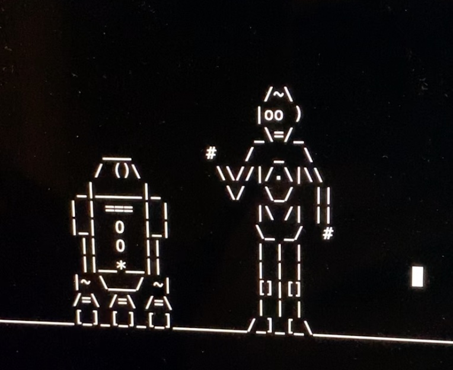
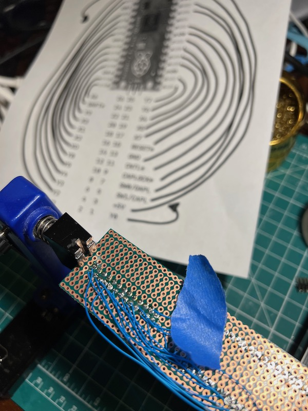
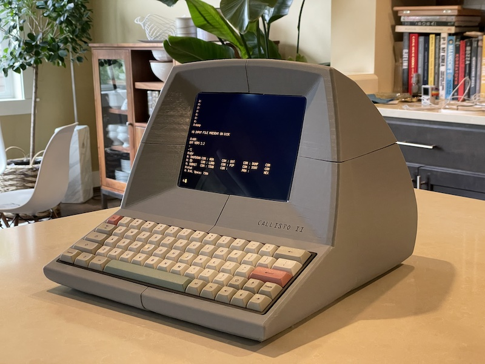
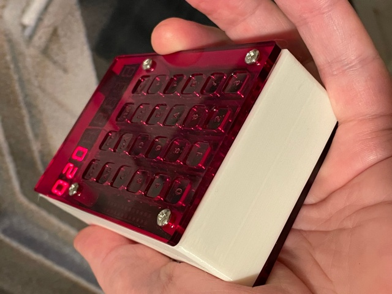
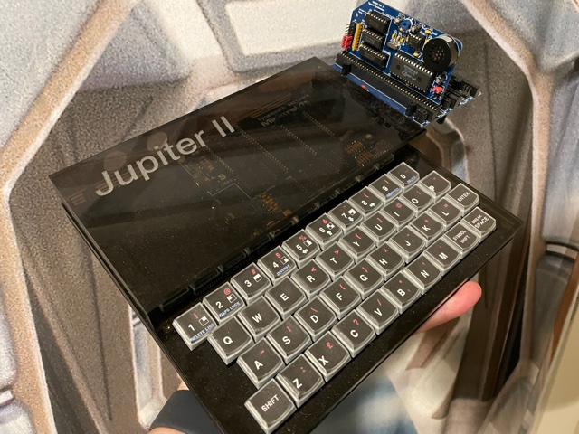
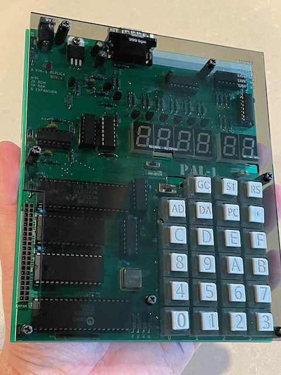

## Retro Man

My collection of pandemic-started retrocomputing projects and other stuff. Some of this information is purely for my benefit as my memory isn't great and is tested by hopping between multiple 8 bit CPUs and other retro systems, so don't expect a lot of exposition here. I hope there are at least some useful links and ideas.

I'm always interested in new (old) #retrocomputer projects. You'll find me talking about the latest shiny thing to catch my attention on Twitter or Instagram.

## In this repo

* [Pico](pico/readme.md) - Some notes about developing on the Raspberry Pi Pico
* [PDP Minicomputers](PDP/pdp.md) - Information related to the Digital Equipment Corp minicomputers
* [Zog](zog/zog.md) - Experiments with a Z80-based collection of parts called Zog
* [Jupiter Ace stuff](Ace/index.md) - Programs and hardware
* [Projects](Projects/index.md) - Some notes to work-in-progress projects and experiments
* [PINIAC](Projects/PINIAC/readme.md) - Notes on trying to model the ENIAC using Raspbery Pi Picos.
* [Robot](https://github.com/GrantMeStrength/retro/blob/gh-pages/robot/robot.md) - Updating a 1980's Tomy Omnibot with some Machine Learning

## Other repos

* [RetroComputer Instruction Manual](https://github.com/GrantMeStrength/RetroComputerInstructionManual) - Altair and IMSAI reference
* [KIM-1](https://github.com/GrantMeStrength/KIM1) - Collection of code and hardware related to KIM-1 and modern clones
* [fModem](https://github.com/GrantMeStrength/fMODEM) - Software for a fake retro modem that can connect to WiFi
* [FizzTerm](https://github.com/GrantMeStrength/FizzTerm) - Arduino system to catch and store data from a serial terminal
* [FT1](https://github.com/GrantMeStrength/FT1) - Hardware plans for a retro styled terminal
* [Core8080](https://github.com/GrantMeStrength/core8080) - iOS app to assemble Intel 8080 mnemonics 
* [FORTH](https://github.com/GrantMeStrength/Forth) - Forth projects related to Juptier Ace / Minstrel 4th
* [Electronics](https://github.com/GrantMeStrength/Electronics) - Some PCB layouts
* [TRS-80 GoTek](https://github.com/GrantMeStrength/TRS80gotek) - Configuring a GoTek floppy emulator for the TRS-80
* [External Terminal](https://github.com/GrantMeStrength/ExternalTerminal) - Connecting an external terminal to a Mac

### Currently private

* [Virtual K](https://github.com/GrantMeStrength/VirtualKim)
* [Virtual KB](https://github.com/GrantMeStrength/VirtualKenbak)

## Little bit related

* [PicoArm](https://github.com/GrantMeStrength/PicoArm/blob/main/index.md) - Learning ARM. Learning about the Raspberry Pi Pico.
* [Apple 1 Software](https://github.com/GrantMeStrength/Apple1-Software) - An archive of Apple 1 software
* [MazeGame](https://github.com/GrantMeStrength/MazeGame) - A retrogame for Windows 10 what I wrote.
* [FrogGame](https://github.com/GrantMeStrength/FrogGame) - A 'frogger' game for iOS using SpriteKit what I wrote.
* [Taxi](https://github.com/GrantMeStrength/taxi) - another maze chase game for iOS what I wrote.

## Retrocomputing Kits

A list of some of my favourite kits you might be interested in building, if you're obsessed like I am.

*Note: The combination of the global COVID19 pandemic and Brexit means that some of these kids are currently not available.*

* [Alair-Duino](https://adwaterandstir.com/altair/) - Arduino based Altair8800 in case
* [IMSAI8080esp](https://thehighnibble.com/imsai8080/) - Realistic IMSAI8080 kit
* [Cromemco Z1](https://thehighnibble.com/cromemcoZ1/) - Closely related to the above, but distinct. The Cromemco Z1 kit.
* [Altair Clone](https://altairclone.com) - Replica of the Altair 8800 computer.
* [PiDP-8](https://obsolescence.wixsite.com/obsolescence/pidp-8) - Raspberry Pi based PDP-8i minicomputer
* [PiDP-11](https://obsolescence.wixsite.com/obsolescence/pidp-11) - Raspberry Pi based PDP-11/70 minicomputer
* [Kim Uno](https://obsolescence.wixsite.com/obsolescence/kim-uno-summary-c1uuh) - Arduino based KIM-1 clone
* [PAL-1](https://www.tindie.com/products/tkoak/pal-1-a-mos-6502-powered-computer-kit/) - 6502 based KIM-1 clone
* [KIM Clone](https://www.corshamtech.com/product/kim-clone/) - KIM-1 clone
* [Minstrel 3](https://www.thefuturewas8bit.com/minstrel3.html) - A ZX81 kit. A ZX80 kit is also listed.
* [RC2014](https://rc2014.co.uk) - Z80 based barebones 
* [VT132](https://thehighnibble.com/vt132/) - Standalone terminal card
* [Gigatron TTL computer](https://gigatron.io) - TTL based computer
* [Minstrel4th](https://www.thefuturewas8bit.com/minstrel4th.html) - Recreation of the Jupiter Ace
* [KENBAK-1](https://adwaterandstir.com/kenbak/) - Arduino based KENBAK-1, the first personal computer
* [Mini PET](https://www.thefuturewas8bit.com/minipet-b.html) - A Commdore PET kit
* [COSMAC Elf membership card](http://www.retrotechnology.com/memship/memship.html) - The RCA1802 based computer
* [RC6502](https://github.com/tebl/RC6502-Apple-1-Replica) - Build a 6502 system that can run as an Apple 1
* [DigiRule](https://www.tindie.com/products/bradsprojects/digirule-the-interactive-binary-ruler/) - computer AND measuring tool in one
* [Retroshields](https://www.tindie.com/stores/8bitforce/) - Host real old CPUs on an Arduino
* [Core memory shield](https://www.tindie.com/products/kilpelaj/core-memory-shield-for-arduino/) - Add 32 bits (bits!) of magnetic core memory (!) to your Arduino
* [Tindie](https://www.tindie.com/browse/vintagecomputing/) - Retrocomputing projects of all kinds
* [Ben Eater's Breadboard computers](eater.net) - Scared of soldering? Love wires? Build a computer.
* [Hackaday Sol-20](https://hackaday.io/project/181676-sol-20-reproduction/details) - building a version of the blue computer with the wooden sides

## Other links

* [Instagram](https://www.instagram.com/ourpocketuniverse/)
* [Twitter](https://twitter.com/johnkennedymsft)

An in-progress project to give an Apple IIe keyboard a USB interface. Details on the [Apple Keyboard](https://github.com/GrantMeStrength/retro/blob/gh-pages/applekeyboard/applekeyboard.md) page.

A 3D printed old-school terminal, with a Raspberry Pi running Cool-Retro-Term. Details on the [Projects](Projects/index.md) page.

A home-made case for the [Kim Uno](https://obsolescence.wixsite.com/obsolescence/kim-uno-summary-c1uuh). The plans are in [this repo](https://github.com/GrantMeStrength/KIM1).

Another DIY case, this one for the [Minstrel4th](https://www.thefuturewas8bit.com/minstrel4th.html). The plans are in [this repo](https://github.com/GrantMeStrength/Forth).

A lid and keycaps for the [PAL-1](https://www.tindie.com/products/tkoak/pal-1-a-mos-6502-powered-computer-kit/) clone of the KIM-1. Details on the [KIM-1](https://github.com/GrantMeStrength/KIM1) page.

