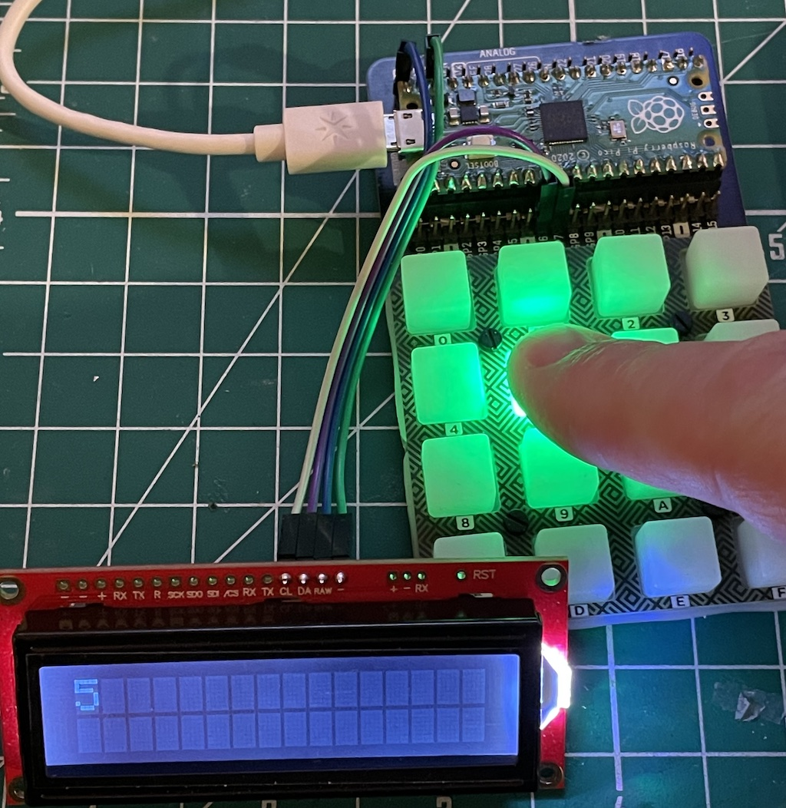
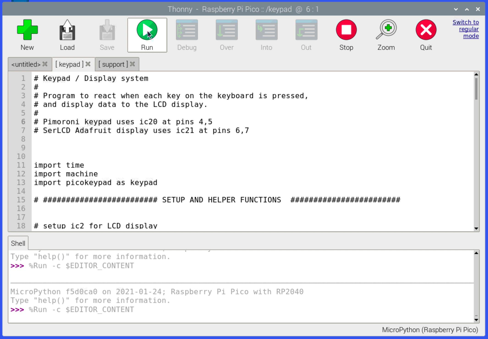

# Pico Coding

I've been playing with the Raspberry Pi Pico, and trying to construct a minimal little platform for experiments. 

For me, this requires some input (a hex keypad) and output (an LCD display). I've played with both the MicroPython and C development systems, and while neither is perfect, I've made most progress with MicroPython. Most of the offcial code samples I see focus on making an LED blink, or insist on bundling lots of examples into one directory and building each through some scripts - this doesn't help me understand the actual process for bulding and compiling. (The C compilation process in particular is mystifying to me, coming from Visual Studio and Xcode).



Anyway, enough moaning! It's early days with this platorm. My current development environment is the Thonny Python IDE, running on a [Raspberry Pi 400](https://www.raspberrypi.org/products/raspberry-pi-400/). It can execute code directly on the Pico, which is very convenient. For day-to-day development I use a Mac, and using VNC Viewer and VSCode I can log into the Pi remotely which makes things a lot more enjoyable for me. If you live in the Pi environment, you obviously won't need to do this. You can install the toolchain on other computers, but I like to keep things compartmentalised as much as possible these days!



## Building the hexpad/display system.

### List of hardware

1. [Raspberry Pi Pico](https://www.raspberrypi.org/blog/raspberry-pi-silicon-pico-now-on-sale/)
2. [Pimoroni Hex keypad](https://shop.pimoroni.com/products/pico-rgb-keypad-base)
3. [Sparkfun SerLCD display](https://www.sparkfun.com/products/16397)
4. Some wires

## Connections

The Pico needs to have some header pins soldered, and then it just slots into the hex keypad board. Remember to stick the little feet onto the botton of the board, as there are some tiny components on the back that you could accidentally mash on your desktop if you press too hard.

The keypad looks lovely, with a bright LED under each key totally under software control. The entire thing is driven over the Pico's [I2C](https://learn.sparkfun.com/tutorials/i2c/all) and [SPI](https://learn.sparkfun.com/tutorials/serial-peripheral-interface-spi/all) interfaces, so uses only a couple of pins (physical pins 5,6,7,25,24,11 for IC20 and SPI interfaces - two of the most common ways of connecting sensors and devices to a Pi or other embedded controller). 

Connecting the SerLCD planel only takes four wires - power / gnd, and another I2C connection. The LCD likes 5v, so it connects to pin 40 VBUS on the Pico, but the logic is definitely 3.3v only which is fine as the Pico only does 3.3v logic.

*Note: One annoying thing about embedded computing systems at the moment (Arduninos, ESPs, Pis etc.) is the differing logic voltages in use. A 5v logic signal is a relic from the TTL logic chips of the 80s and 90s, and modern systems use 3.3v instead. Needless to say, shoving 5v into a 3.3v logic input can result in sadness. If you need to connect 5v and 3.3v systems, there are cheap voltage adapters, but increasingly 3.3v is the standard and unless you're interfacing with some old retro-electonics, 3.3v is fine and dandy. Just be aware and check!*

I found the SerLCD worked when connected to physical pins 9 and 10, aka GPIO pins 6 and 7. This kept the two I2C channels separate.

## Ickyness

The Pico is cool in that to connect it to the host system for programming, you hold down the BOOT SELECT button as you plug it in, and it appears as a Flash Drive. Now, on my Raspberry Pi dev system, this causes Thonny to offer to send the latest MicroPython boot code to it - every time. Which is, ok, I guess. However, the Pimoroni hex keypad must have its own firmware installed or the modules required to drive it won't be present. I cannot find a way of installing those libraries - or *any* seconary files - to the Pico at this time. It appears as if any external code libraries MUST be present in the firmware image on the Pico. *Note: this is my understanding and I can't find any information to confirm or deny it.*

Therefore, the development process goes like this:

1. Hold down BOOT SELECT and plug the Pico into my Raspberry Pi dev machine.
2. Let go of BOOT SELECT. The Pi asks if I'd like to open a File Explorer for the new flash drive that has just appeared. I say yes.
3. If I were to go to the Thonny IDE, it would offer to send the MicroPython firmware, but this messes things up by removing the Pimoroni libraries, so I don't go to Thonny just yet.
4. Drag the [Pimoroni firmware file 'pimoroni-pico-micropython.uf2'](https://github.com/pimoroni/pimoroni-pico/releases/tag/v0.0.8) to the Pico's file explorer. It copies over, and reboots the Pico and unmounts it. This stops Thonny from wanting to install anything, and means we're ready to go!
5. Open Thonny and start writing (or re-load) my MicroPython code. Deploying to the Pico is just a matter of pressing RUN, no need to unplug anything. Super convenient.
6. Write code, RUN, test, debug, goto step 6.

## The code

I based my MicroPython code on parts taken from the [Pimoroni Pico](https://github.com/pimoroni/pimoroni-pico) samples, and the [Pico SDK samples](https://raspberrypi.github.io/pico-sdk-doxygen/examples_page.html), but rewritten so I can actually understand it. All it does it wait for a keypress, makes the key blink, and reports the activity on the LCD display.

```
# Keypad / Display system
#
# Program to react when each key on the keyboard is pressed, 
# and display data to the LCD display.
#
# Pimoroni keypad uses ic20 at pins 4,5
# SerLCD Adafruit display uses ic21 at pins 6,7


import time
import machine
import picokeypad as keypad

# ######################### SETUP AND HELPER FUNCTIONS  ########################


# setup ic2 for LCD display
sda = machine.Pin(6)
scl = machine.Pin(7)
i2c = machine.I2C(1, sda=sda, scl=scl, freq=400000)


def printLCD(message) :
    i2c.writeto(114, str(message))
    
def clsLCD():
    i2c.writeto(114, '\x7C')
    i2c.writeto(114, '\x2D')
    
# ic2 settings for SerLCD display
def initLCD() :
   
    deviceID = i2c.scan()
    if deviceID[0]!=114:
        print("LCD not Found")
        while True:
            pass
    clsLCD()

# Keypad stuff

Number_of_buttons = keypad.get_num_pads()

# ######################### START OF PROGRAM ##################################


# Configure the LCD display

initLCD()
printLCD("Hello World")

# Configure the LED keypad

keypad.init()
keypad.set_brightness(1.0)

# Variables to store the state of the keypad
last_button_states = 0
last_key = 0

# Functions for the keypresses

def button_pressed(button_number) : # Display the key number and blink on
    clsLCD()
    printLCD(button_number)
    keypad.illuminate(bit, 0x00, 0x80, 0x00)
           
def button_released(button_number) : # Display no key number and blink off
    clsLCD()
    printLCD("Off")
    # Bug: if you press and hold a key, and press another, multiple LEDs will stay on.
    # Solution is to monitor when each button has been turned on, and check for them
    # turning off again. i.e. last_key is an array rather than a single value.
    keypad.illuminate(last_key, 0x00, 0x00, 0x00)
  
  
# This code waits until a button is pressed, and then
# calls the functions above with the key number.


while True:
    button_states = keypad.get_button_states()
    
    if last_button_states != button_states: # something has changed
        last_button_states = button_states # remember state for next time
        
        if button_states > 0: # at least one button pressed
        
            # Determine which button pressed by looking at the bit value returned
            # by the get_button_states function.
            # keypad.get_button_states()
            # It returns 0 if nothing is pressed
            # It returns binary 1,2,4,8 etc for each key, and we need to map that to
            # 1, 2, 3, 4, 5 .. 16 so we use some << shifting and and'ing magic.
            
            for bit in range (0, 16) :
                if button_states & (1 << bit) == (1 << bit) :
                    # Pressed
                    last_key = bit
                    button_pressed(bit)
                    
        else : # Button released
            button_released(last_key)
            
    keypad.update()  # Required to make the color of the Button LED change
    time.sleep(0.1)	 # The keypad needs a tiny rest to recover.

```

## Next

Well obviously I am thinking about the retrocomputer I could implement with this system.. 

Oh, almost forgot. If you name your MicroPython file "main.py" it gets executed when the Pico gets power, even standalone. So it's perfect for making a dedicated system (and of course, the fact the Pico is just a few dollars means you can probably afford to have more than one.)