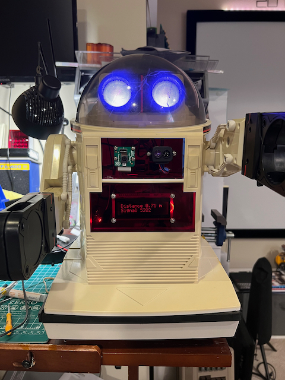
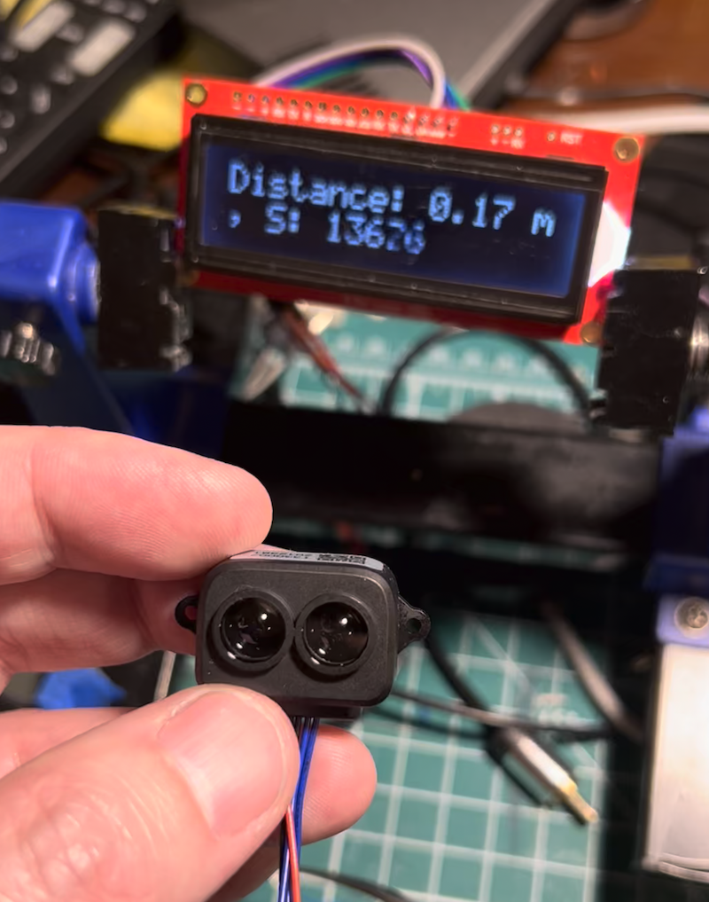
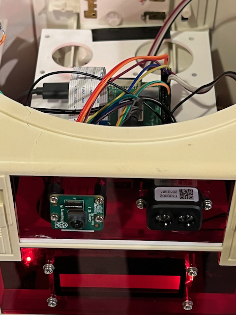
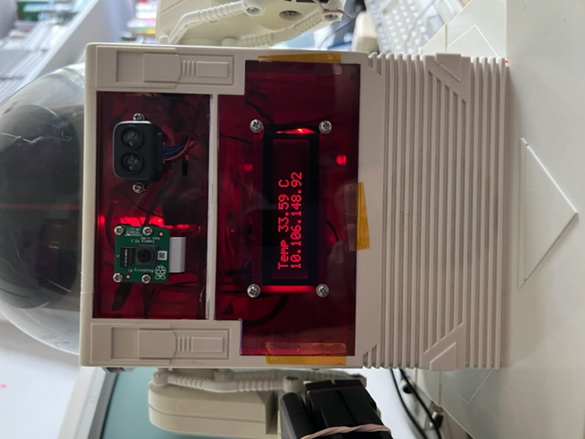
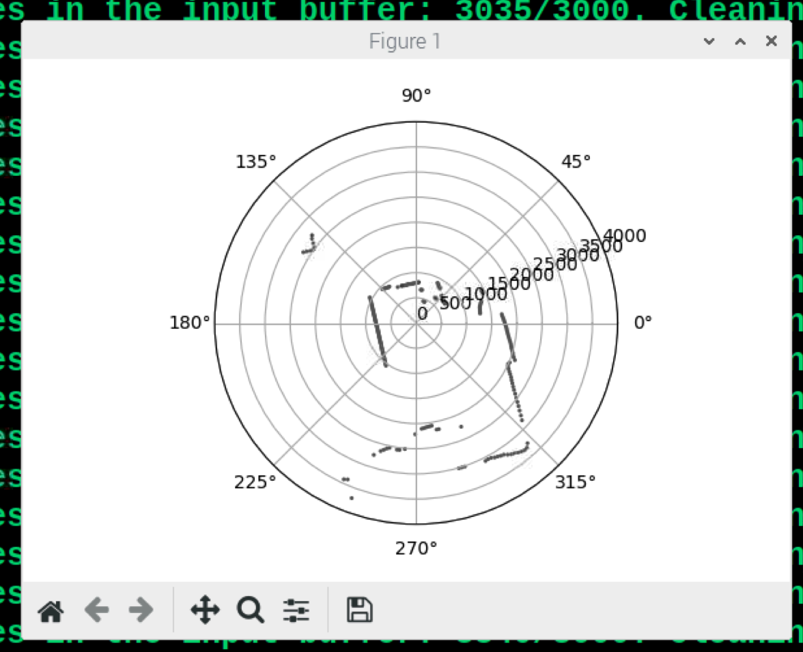
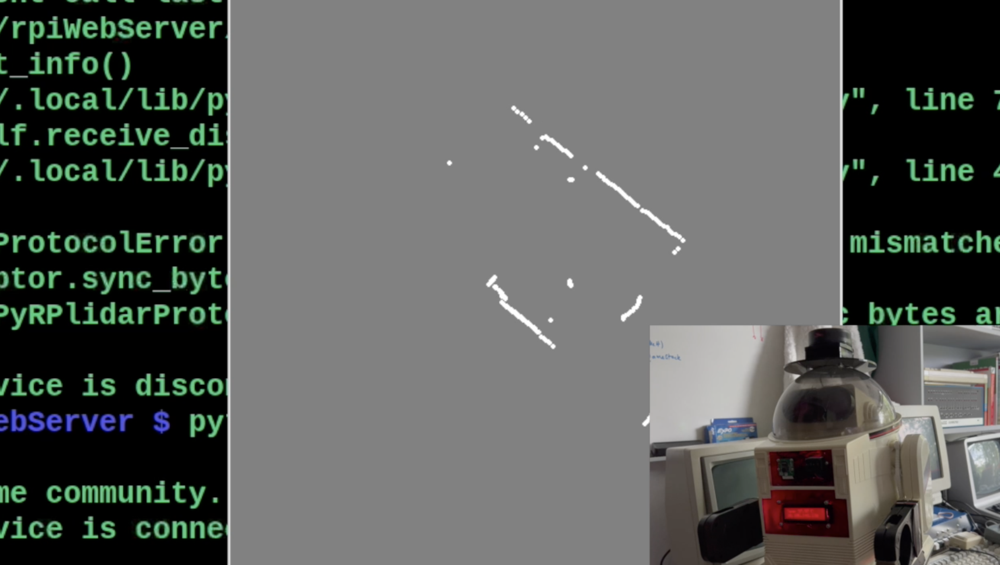

# Robot Project: Omnibot 25



## Goals

1. A moving robot that can autonomously navigate the corridors at work to go from one office to another, with the target office not in line of sight.
Sensors can avoid collisions, and a camera and machine learning model can detect corners / doors / singage / people, and work with an internal map to find the destination. Humans along the way will be greated.

2. A simple telepresence device, allowing remote colleagues to explore the office via a web interface.


## Robot body & motors

Buggy designs are great and everything, and yes, they are practical. But are they cool? Will they look good navigating a corridor in work? No. They will not. Also, they're often small and the motors are not great on carpet. So why not build on the hard work of pioneering robot designer - like Japanese toy maker Tomy? In the 1980s Tomy made several robots toys (under the brand [Omnibot](http://www.theoldrobots.com/omnibot.html)) which not only have a fanatical following among middle-aged nerds to this day, even starring in the TV show [How I met your mother](https://how-i-met-your-mother.fandom.com/wiki/The_Robot), but also appear on eBay in various states of decay. If you get lucky you can pick up a nice example (usually missing the remote control) for cheap and either play with it or replace the "brain" with a Raspberry Pi.

(Believe it or not, you can also purchase brand new wheel tread and hand gripper rubber to replace the originals, as they often fall apart or turn into gloop. See [Daboo Designs](https://daboodesigns.com/collections/all/tomy-omnibot)) for spares.

For this project, I am using an Omnibot 5402 model, given a serious overhaul including retrobrighting, cracked plastic gluing and a deep, deep cleaning.

## Sensors

The robot has been outfitted with the following sensors:

### Raspberry Pi camera

The standard Pi camera is mounted on the front of the robot. I hope to use it with a Machine Learning system to recognize objects and help with navigation.

### LIDAR module



[This LiDAR range finder](https://www.amazon.com/dp/B088NVX2L7?psc=1&ref=ppx_yo2ov_dt_b_product_details) works really well - and is much easier to interface with the Raspberry Pi compared to the sonar devices. The disadvantage is that it's harder to use more than one device at a time, so the robot will have to rotate to look around it. It should stop the robot crashing into things. It does have a very tight viewing angle, so I may have mounted it in the wrong place.

[Software for the LiDAR](https://makersportal.com/blog/distance-detection-with-the-tf-luna-lidar-and-raspberry-pi).

### IMU

No plans for an IMU yet. Looking through the collection of robot books I've found in second-hand bookshops, it's clear that "dead reckoning" was a really hard problem to solve up until 10 years ago - and then came affordable, fast, machine vision using deep learning models. Almost all the examples of navigation I've seen in these books have been rendered totally obsolete by a cheap webcam and tensorflow light running on a Raspberry Pi.

## Accuators / Output

In order to *do stuff*, the robot has:

### Motors

The Omnibot has two 6v DC motors. Nothing fancy, but they're good motors and can go forward, backwards or rotate. To drive them from a Raspberry Pi you will need a small board that accepts 3.3v logic and applies an external power source for the motors. The **L298N Dual H Bridge DC Stepper Motor Driver Controller Board** which is cheap and readily available. 

### LEDs

The Omnibot has a pair of LEDs which are controlled by the robot's original circuit board. As these are 1980's LEDs, the 3.3v from a Raspberry Pi output pin can't drive them, so I swapped them for 2000's LEDs which are nice and bright. 

I further updated the LEDs to tri-colour ones. These are LEDs with four pins, and they can display Red, Green, Blue or various combinations. It does require three GPIO pins to control them, but its worth it just for the light show.


### Sound

The Pi's headphone jack can be amplified or connected to a speaker/amp combo to replay sounds - it just takes a simple command like this to replay a sound sample:

```
aplay sound-file.wav
```

or from within Python:

```
import os
os.system('aplay sound-file.wav')
```

However, it's a little more fun to use a speech synthesizer. I was going to use one of my classic old 1980's speech chips, but then I found that - of course - it's all possible in software now. A program for the Pi called [Festival](https://learn.adafruit.com/speech-synthesis-on-the-raspberry-pi/installing-the-festival-speech-package) does it all, and even sounds like a 1980's chip. I'm sure there are better quality Text To Speech systems, but this is exactly what I was looking for.

**Install Festival**

```
sudo apt-get install -y libasound2-plugins festival
```

**Use Festival in Python**

```
import os
os.system('echo "Destroy all humans!" | festival --tts')
```


### Display

A SparkFun SerLCD board provides 2 lines of 16 characters: it is reakky just to have some visual clue of what is happening with the robot, and is useful for debugging. The board was originally designed for use with Arduino, but works well on the Pi - if you can find the drivers.

Someone kindly made some: [CircuitPython library for the Sparkfun SerLCD displays](https://github.com/fourstix/Sparkfun_CircuitPython_SerLCD). I did find that about 1 time in 50 the driver crashes, so I needed to wrap all the Python code that displays text in a try/except clause.


### Imports

For the robot to use the above list of sensors and stuff, a list of additional libraries are required.

```
sudo apt-get install python3-flask
sudo apt-get install -y libasound2-plugins festival
sudo pip3 install adafruit-blinka
pip3 install RPI.GPIO
pip3 install sparkfun-circuitpython-serlcd
```

### Plans



I laser-cut replacement front panels for the Omnibot, and a base for the Raspberry Pi and motor driver to go on. Plans included in the repo.

### Streaming video

Streaming live video from the webcam:

https://github.com/EbenKouao/pi-camera-stream-flask

and then 

https://www.pythonpool.com/solved-importerror-numpy-core-multiarray-failed-to-import/

```
pip install -U numpy 
```

and then

https://github.com/HackerShackOfficial/Smart-Security-Camera/issues/20

and making sure debug message is False, rather than True

Video streaming seems to cause the Raspberry Pi's temperature to jump a lot, and so it's a good idea to fit a heatsink and fan. There's plenty of room inside the Omnibot for this. Without the fan, the Pi was getting up to 60' C and crashing / throttling. With a fan and headsink, it stays in the 40' C range.

### Ajax

The standard Python Flask examples use a button, causing a jump to a specific URL providing an argument as it does so. The specific URL is, of course, the same page that the button is on.

However, although nice and simple, this means the web page refreshes itself which is slow and annoying, and tends to cause the live video streaming some issues. Much better to use an slightly more modern approach, such as Ajax.

I found a [nice example here](https://stackoverflow.com/questions/17745836/jquery-button-click-to-send-ajax-request-with-flask-and-python) which uses jQuery to do the hard work, making it possible to have a much nice experience.

### Machine learning

Now things can get interesting. The Pi camera is working and streaming - and that definitely required the fan to stop the poor Raspberry Pi getting too hot and bothered. What about feeding the camera into a ML model to use it to help navigation?

Hurray for people way smarter than me who publish notes on how to do this kind of thing! [How to Set Up and Run TensorFlow Lite Object Detection Models on the Raspberry Pi](https://github.com/EdjeElectronics/TensorFlow-Lite-Object-Detection-on-Android-and-Raspberry-Pi/blob/master/Raspberry_Pi_Guide.md) is one very useful example. Shame that the Coral hardware is unavailable these days, but it is still working at 4 to 5 frames per second which is fine.

### Power and disaster

Over the past week I've upgraded the power supply from a pack of AA batteries to a lithium ion recharagable battery pack. The improved current/voltage from the pack (about 7.2 volts, not sure how many amps but not a *huge* ammount) really made the motors work a lot better.

I also added two infrared proximity sensors to the front of the case to try and avoid bumping into walls as it drives down corridors. Unfortunately the range of these are not great, so angling them at 45' from the front edge isn't working. If they were placed more on the sides, they might be more useful. It's an encouragement to create a better Machine Model for navigation, as adding more and more sensors feels like a never-ending list of dealing-with-corner-cases.

Unfortunately the robot had a bit of a disaster today. When I was debugging some software, I accidentally triggered the motors and it jumped off a desk. The ancient plastics didn't take kindly to the fall, so there's now quite a lot of epoxy resin holding the top part together.


### Some practical Python

The little Omnibot has been moving offices a lot, and that means swapping between wireless networks. And in general, accessing the Raspberry Pi can be a little tricky, as the IP address can change every time it starts up, and without a monitor connected, it gets frustrating. So here's my approach.



1. Use [VNC from my laptop to log into the Raspberry Pi](https://www.pitunnel.com/doc/access-vnc-remote-desktop-raspberry-pi-over-internet).
2. Use [Visual Studio Code's wonderful remote access](https://cloudbytes.dev/snippets/develop-remotely-on-raspberry-pi-using-vscode-remote-ssh) to write Python on the Pi.
3. Use an "dummy" [HDMI dongle](https://www.amazon.com/Headless-Display-Emulator-Headless-1920x1080-Generation/dp/B06XT1Z9TF) to make sure the Pi boots up into a desktop that can be used with VNC.
4. Use a script that launches at startup, and which displays the current IP on the LCD.

I found [this posting](https://www.instructables.com/Raspberry-Pi-Launch-Python-script-on-startup/) very useful at getting a Python script to start at power-up.

### Updated speech synth

Although I like the Festival speech synth, I found one that sounds even better (and has a hint of English accent!)

```
sudo apt-get install espeak
espeak "Hello, world!"
```

### Remote access

It's not trivial to let other users access the Omnibot. Heck, it's hard enough for me to control it ;-)

In order to allow external users to log into the robot to play will require some experiments with the network on which the device is running. It might be simplest, believe it or not, to write a plug-in for Teams, the communications platform we use. However, I wonder if "digital twins" is something that would work here, since this is a real "IOT on the Edge" project. More investigation required!

### Current issues

* The sound and speech output doesn't work when launched from a Python script which is run under Sudo. When the commands are used from a non-Sudo user, they work fine.

* Accessing the robot from outside the local WiFi will be a challenge.

* I need to train a new model to help the navigation process. I can stop the robot from crashing to walls, but making it autonomous (e.g. go visit the kitchen) is a longs way off.

* Should I be using [ROS](https://www.ros.org)?

* The motors are currently either on or off.  Using [PWM](https://www.electronicwings.com/raspberry-pi/raspberry-pi-pwm-generation-using-python-and-c) would give a lot more control over speed and allow smoother movement.


### Motor driving updates


The **L298N Dual H Bridge DC Stepper Motor Driver Controller Board** I was using to control the pair of DC motors was working very well, especially when I started using a better power source for the motors. In fact, it was working *too* well, as the robot was spinning left and right just a little too fast. I needed a little more finesse.

The usual way for controlling the speed of motors is not to simply drop the voltage/current, but to use Pulse Width Modulation. This allows the power supplied to the motors to be controlled in a digital way. The Raspberry Pi has two sets of pins for sending PWM signals, and the L298N board has suitable inputs (by default these are jumpered, so the motors are just ON or OFF). For a little more detail, you can see this [Instructables](https://www.instructables.com/member/tronixlabs/) topic. For me, it meant adding two more wires from the Pi to the L298N board and then tweaking my Python. As a result, the motors now can be speed adjusted from 0 to 100%, although in practice it takes at least 50% to start moving.

### Improved LiDAR

The infrared LiDAR sensor I had on the front of the robot was a good idea, but in the real world it didn't do too much to prevent collisions or help with navigation. The "beam" of light that it used was extremely narrow, and it was very easy for Omnibot to crash into a wall before it registered.

The only real alternative (alternative to adding more sensors in many angles anyway) was to add a fancy spinning LiDAR, which can produce a full 360 degree set of range values. The basic models are not ludicrously expensive ($99 US on Amazon), and connect via USB: perfect for the Raspberry Pi. There are drivers and tutorials from [Adafruit](https://www.adafruit.com/product/4010) but the device I receieved from Amazon had a different firmware version which means these didn't work. However, other drivers exist - such as [RPLidar](https://github.com/Roboticia/RPLidar).



##### Screenshot showing one of the LiDAR code samples looking around the room.

Programming the Omnibot to use the LiDAR data is not trivial, and there are lots and lots of papers and GitHub projects covering SLAM (simultaneous location and mapping) techniques, so this is a rich area of investigation. I'm hoping that I can start by using the LiDAR data to keep the Omnibot in the center of a corridor without drifting too far off course, and combine this with the tensorflow image recognition to find waypoints or other distinguishing features to aid with navigation.



##### Updated code using pygame to plot obstacles in real-time.

I found a slightly better Python library for working with the LiDAR device I have - PyRPlidar - and it meant I was able to use it with Pygame to plot some real-time images. Here's the code that I wrote:

```
from pyrplidar import PyRPlidar
from math import cos,sin,trunc, radians, pi, floor
import time
import pygame


lidar = PyRPlidar()

lidar.connect(port="/dev/ttyUSB0", baudrate=115200, timeout=3)
# Linux   : "/dev/ttyUSB0"
# MacOS   : "/dev/cu.SLAB_USBtoUART"
# Windows : "COM5"

pygame.init()
display_surface = pygame.display.set_mode((512, 512 ))
pygame.display.set_caption('LiDAR')
display_surface.fill((128,128,128))
pygame.display.update() 


print()
print("*"*40)
print()

info = lidar.get_info()
print("info :", info)

#health = lidar.get_health()
#print("health :", health)

#samplerate = lidar.get_samplerate()
#print("samplerate :", samplerate)


#scan_modes = lidar.get_scan_modes()
#print("scan modes :")
#for scan_mode in scan_modes:
#print(scan_mode)

lidar.set_motor_pwm(500)
time.sleep(0.25)
    
scan_generator = lidar.force_scan()
    
while True:    
    display_surface.fill((128,128,128))
    for i, scan in enumerate(scan_generator()):
        a = scan.angle
        d = scan.distance
        
        if d > 0:
            x = cos(radians(a))*d/20
            y = sin(radians(a))*d/20
            pygame.draw.circle(display_surface,(255,255,255), (256+trunc(x), 256+trunc(y)), 2, 0)
    
        
        if i == 360: break    
    pygame.display.update()

lidar.stop()
lidar.set_motor_pwm(0)
lidar.disconnect()

```


<hr>


### Some random code until I tidy it all up

```
# WebRobot2
# Using modular approach

import RPi.GPIO as gpio
import time
import os
from time import sleep
from datetime import datetime
import board
import serial
import numpy as np
from sparkfun_serlcd import Sparkfun_SerLCD_I2C
from flask import Flask, render_template, Response, request, send_from_directory
from camera import VideoCamera
from gpiozero import CPUTemperature
from threading import Timer


from RobotMotorControl import *
from RobotSound import *
from RobotLCDDisplay import *
from RobotLidar import getData


RobotMotorControl.blinkOn()

RobotSound.play("sound101.wav")

RobotMotorControl.blinkOff()

def update_data(interval):
    Timer(interval, update_data, [interval]).start()
    distance,strength,temperature = getData() # read values
    RobotLCDDisplay.displayData(distance, strength)

# This is pretty cool - could be used to poll lidar and 
# check for emergency stops as well as this temp stuff
update_data(1)

# RobotLidar.py

import serial

class RobotLidar:

    initialized = False
    ser : serial.Serial()


def init():
    if RobotLidar.initialized == False :
        RobotLidar.initialized = True
        RobotLidar.ser = serial.Serial("/dev/serial0", 115200,timeout=0) # mini UART serial device
        if RobotLidar.ser.isOpen() == False:
            RobotLidar.ser.open() # open serial port if not open

        
def getData():

    if RobotLidar.initialized == False:
        init()

    while True:
        counter = RobotLidar.ser.in_waiting # count the number of bytes of the serial port
        if counter > 8:
            bytes_serial = RobotLidar.ser.read(9) # read 9 bytes
            RobotLidar.ser.reset_input_buffer() # reset buffer

            if bytes_serial[0] == 0x59 and bytes_serial[1] == 0x59: # check first two bytes
                distance = bytes_serial[2] + bytes_serial[3]*256 # distance in next two bytes
                strength = bytes_serial[4] + bytes_serial[5]*256 # signal strength in next two bytes
                temperature = bytes_serial[6] + bytes_serial[7]*256 # temp in next two bytes
                temperature = (temperature/8.0) - 256.0 # temp scaling and offset
                return distance/100.0,strength,temperature

# LED text display

from gpiozero import CPUTemperature
import board

# Enable I2C communication
from sparkfun_serlcd import Sparkfun_SerLCD_I2C

class RobotLCDDisplay:

    initialized = False
    serlcd : Sparkfun_SerLCD_I2C

    def __init__(self):
        print("hello i don't think i exist")
        RobotLCDDisplay.initialized = False
        i2c = board.I2C()
        RobotLCDDisplay.serlcd = Sparkfun_SerLCD_I2C(i2c)
        RobotLCDDisplay.initialized = True

    def init() :
        if RobotLCDDisplay.initialized == False :
            i2c = board.I2C()
            RobotLCDDisplay.serlcd = Sparkfun_SerLCD_I2C(i2c)
            RobotLCDDisplay.initialized = True
    

    def displayTemp():
        RobotLCDDisplay.init()
        temp = CPUTemperature().temperature
        RobotLCDDisplay.serlcd.set_cursor(0, 0)
        RobotLCDDisplay.serlcd.write('Temp {0:2.2f} C '. format(temp))


    def displayData(range, strength):
        RobotLCDDisplay.init()
        temp = CPUTemperature().temperature
        RobotLCDDisplay.serlcd.set_cursor(0, 0)
        RobotLCDDisplay.serlcd.write('Temp {0:2.2f} C '. format(temp))
        RobotLCDDisplay.serlcd.set_cursor(0, 1)
        RobotLCDDisplay.serlcd.write('R {0:2.2f} m S {0:2.0f}'. format(range, strength))
# Sound and speech
# Functions for making bleeps and TTS

import os
import sys 

from RobotMotorControl import *

class RobotSound :

    def play(sound):
	    os.system('aplay ' + sound)

    def speak(text):
	    blinkOn()
	    os.system('echo "' + text + '" | festival --tts')
	    blinkOff()


# Robot-Motor-Control
# Functions for controlling motors and lights

import RPi.GPIO as gpio
import time
import random

class RobotMotorControl:

    # Class properties

    __pi_pwm1 = None # Use 'None' if you don't know the type yet
    __pi_pwm2 = None

    def __init__(self):
        """ Robot Motor Control Class Initializer """
        gpio.setmode(gpio.BCM)
        
        # PWM Mode
        gpio.setup(19, gpio.OUT)
        gpio.setup(13, gpio.OUT)
        self.__pi_pwm1 = gpio.PWM(19,1000) # Use self. to access the class-wide variable
        self.__pi_pwm2 = gpio.PWM(13,1000)
        
        # Direction control
        gpio.setup(6, gpio.OUT)
        gpio.setup(5, gpio.OUT)
        gpio.setup(12, gpio.OUT)
        gpio.setup(26, gpio.OUT)
        
        #LED
        gpio.setup(24, gpio.OUT)
        gpio.setup(23, gpio.OUT)
        gpio.setup(25, gpio.OUT)

    def stop(self):
        gpio.output(6, False)
        gpio.output(5, False)
        gpio.output(12, False)
        gpio.output(26, False)
        self.__pi_pwm1.stop()
        self.__pi_pwm2.stop()       # Remember to use self.

    def backward(self):
        self.__pi_pwm1.start(50)
        self.__pi_pwm2.start(50)
        gpio.output(6, False)
        gpio.output(5, True)
        gpio.output(12, True)
        gpio.output(26, False)

    def forward(self):
        self.__pi_pwm1.start(100)
        self.__pi_pwm2.start(100)
        gpio.output(6, True)
        gpio.output(5, False)
        gpio.output(12, False)
        gpio.output(26, True)

    def forward_slow(self):
        self.__pi_pwm1.start(50)
        self.__pi_pwm2.start(50)
        gpio.output(6, True)
        gpio.output(5, False)
        gpio.output(12, False)
        gpio.output(26, True)

    def left_turn(self):
        self.__pi_pwm1.start(75)
        self.__pi_pwm2.start(50)
        gpio.output(6, True)
        gpio.output(5, False)
        gpio.output(12, True)
        gpio.output(26, False)

    def left_turn_pulse(self):
        self.__pi_pwm1.start(0)
        self.__pi_pwm2.start(0)
        gpio.output(6, True)
        gpio.output(5, False)
        gpio.output(12, True)
        gpio.output(26, False)  
        for dc in range(4,7):
            self.__pi_pwm1.start(dc*10)
            self.__pi_pwm2.start(dc*10)
            time.sleep(0.06)
        for dc in range(7,4,-1):
            self.__pi_pwm1.start(dc*10)
            self.__pi_pwm2.start(dc*10)
            time.sleep(0.06)
    
        self.__pi_pwm1.start(0)
        self.__pi_pwm2.start(0)
        self.stop()

    def right_turn_pulse(self):
        self.__pi_pwm1.start(0)
        self.__pi_pwm2.start(0)
        gpio.output(6, False)
        gpio.output(5, True)
        gpio.output(12, False)
        gpio.output(26, True)  
        for dc in range(4,7):
            self.__pi_pwm1.start(dc*10)
            self.__pi_pwm2.start(dc*10)
            time.sleep(0.06)
        for dc in range(7,4,-1):
            self.__pi_pwm1.start(dc*10)
            self.__pi_pwm2.start(dc*10)
            time.sleep(0.06)
    
        self.__pi_pwm1.start(0)
        self.__pi_pwm2.start(0)
        self.stop()

    def right_turn(self):
        self.__pi_pwm1.start(50)
        self.__pi_pwm2.start(50)
        gpio.output(6, False)
        gpio.output(5, True)
        gpio.output(12, False)
        gpio.output(26, True)

    def blinkOff(self):
        gpio.output(23, False)
        gpio.output(24, False)
        gpio.output(25, False)

    def blinkOn(self):
        a = random.randint(0,1)
        b = random.randint(0,1)
        c = random.randint(0,1)
        self.blinkOff()
        if a == 1:
            gpio.output(24, True)
        if b == 1:	
            gpio.output(23, True)
        if c == 1:
            gpio.output(25, True)
        if (a + b + c) == 0 :
            gpio.output(25, True)

    

    def blinkGreen(self):
        gpio.output(23, True)
        gpio.output(24, False)
        gpio.output(25, False)

    def blinkBlue(self):
        gpio.output(23, False)
        gpio.output(24, True)
        gpio.output(25, False)

    def blinkRed(self):
        gpio.output(23, False)
        gpio.output(24, False)
        gpio.output(25, True)
        
    def proximity_left(self) :
        if gpio.input(20) != 1 :
            return True
        else :
            return False
                      
    def proximity_right(self) :
        if gpio.input(21) != 1 :
            return True
        else :
            return False
                      
# Webrobot

import RPi.GPIO as gpio
import time
import os
from time import sleep
from datetime import datetime
import board
import serial
import numpy as np
from sparkfun_serlcd import Sparkfun_SerLCD_I2C
from flask import Flask, render_template, Response, request, send_from_directory
from camera import VideoCamera
from gpiozero import CPUTemperature
from threading import Timer
from RobotMotorControl import *
from RobotLidar import *
import socket
import random

try :
    pi_camera = VideoCamera(flip=False) # flip pi camera if upside down.
except :
    print("Could not set up camera. Is script still running in background?")


# Enable I2C communication
from sparkfun_serlcd import Sparkfun_SerLCD_I2C

i2c = board.I2C()
serlcd = Sparkfun_SerLCD_I2C(i2c)
ser = serial.Serial("/dev/serial0", 115200,timeout=0) # mini UART serial device

if ser.isOpen() == False:
    ser.open() # open serial port if not open


# Start Motor Control
RMC = RobotMotorControl()


RobotMoving = False


def play(sound):
	#print('Current user is ' + os.system('whoami'))
	#print("Playing sound: " + sound)
	#os.system('sudo -u robot aplay ' + sound)
	os.system('aplay ' + sound)

def speak(text):
	print("Speaking text: " + text)
	os.system('echo "' + text + '" | festival --tts')


def read_tfluna_data():
    while True:
        counter = ser.in_waiting # count the number of bytes of the serial port
        if counter > 8:
            bytes_serial = ser.read(9) # read 9 bytes
            ser.reset_input_buffer() # reset buffer

            if bytes_serial[0] == 0x59 and bytes_serial[1] == 0x59: # check first two bytes
                distance = bytes_serial[2] + bytes_serial[3]*256 # distance in next two bytes
                strength = bytes_serial[4] + bytes_serial[5]*256 # signal strength in next two bytes
                temperature = bytes_serial[6] + bytes_serial[7]*256 # temp in next two bytes
                temperature = (temperature/8.0) - 256.0 # temp scaling and offset
                return distance/100.0,strength,temperature


if ser.isOpen() == False:
    ser.open() # open serial port if not open

def displayIP():
	hostname = socket.gethostname()  
	hostaddr = socket.gethostbyname(hostname + ".local")
	try :
		serlcd.set_cursor(0, 1)
		serlcd.write(hostaddr)
	except :
		print("*")


def displayTemp():
	temp = CPUTemperature().temperature
	try :
		serlcd.set_cursor(0, 0)
		serlcd.write('Temp {0:2.2f} C   '. format(temp))
	except :
		print("*")

# Heart beat - update data AND check for collisions
def update_data(interval):
	global RobotMoving
	Timer(interval, update_data, [interval]).start()
	displayTemp()
	displayIP()
"""
	if RobotMoving :
		distance,strength,temperature = getData() # read values
		#RobotLCDDisplay.displayData(distance, strength)
		if strength > 1000 and distance < 0.50 :
			print("STOP!!")
			RobotMoving = False
			RobotMotorControl.stop()
		if RobotMotorControl.proximity_left() :
			print("Boop! Left")
			RobotMoving = False
			RobotMotorControl.stop()
			RobotMotorControl.backward()
			RobotMoving = False
			time.sleep(0.5)
			RobotMotorControl.right_turn()
			RobotMoving = False
			time.sleep(0.25)
			RobotMotorControl.forward()
			RobotMoving = True
			
		if RobotMotorControl.proximity_right() :
			print("Boop! Right")
			RobotMoving = False
			RobotMotorControl.stop()
			RobotMotorControl.backward()
			RobotMoving = False
			time.sleep(0.5)
			RobotMotorControl.left_turn()
			RobotMoving = False
			time.sleep(0.25)
			RobotMotorControl.forward()
			RobotMoving = True
            """

# This is pretty cool - could be used to poll lidar and 
# check for emergency stops as well as this temp stuff
update_data(0.5)


from flask import Flask, render_template
app = Flask(__name__)

@app.route("/", methods=['GET', 'POST'])
def index():
	print(request.method)
	# Read Lidar
	distance,strength,temperature = read_tfluna_data() # read values
	temp = CPUTemperature().temperature
	print(distance, strength, temp)
	templateData = {
      'title' : 'Omnibot 25',
      'lidar_distance'  : distance,
      'lidar_strength'  : strength,
	  'pi_temp'  : temp
      }
	return render_template('index.html', **templateData)

def gen(camera):
    #get camera frame
    while True:
        frame = camera.get_frame()
        yield (b'--frame\r\n'
               b'Content-Type: image/jpeg\r\n\r\n' + frame + b'\r\n\r\n')

@app.route('/video_feed')
def video_feed():
	#return nothing
	return Response(gen(pi_camera),
                    mimetype='multipart/x-mixed-replace; boundary=frame')

#background process happening without any refreshing thanks to jQuery which is awesome
@app.route('/background_process_test_blinkon')
def background_process_test_blinkon():
	#init()
	RMC.blinkOn()
	return "nothing"

@app.route('/background_process_test_blinkoff')
def background_process_test_blinkoff():
	#init()
	RMC.blinkOff()
	return "nothing"

@app.route('/background_process_test_stop')
def background_process_test_stop():
	#init()
	RMC.stop()
	return "nothing"

@app.route('/background_process_test_sound')
def background_process_test_sound():
	play("sound101.wav")
	return "nothing"

@app.route('/background_process_test_forward')
def background_process_test_forward():
	#init()
	RMC.forward()
	return "nothing"

@app.route('/background_process_test_forward_slow')
def background_process_test_forward_slow():
	RMC.forward_slow()
	return "nothing"

@app.route('/background_process_test_reverse')
def background_process_test_reverse():
	#init()
	RMC.backward()
	return "nothing"

@app.route('/background_process_test_left')
def background_process_test_leftf():
	#init()
	RMC.left_turn()
	return "nothing"

@app.route('/background_process_test_right')
def background_process_test_right():
	#init()
	RMC.right_turn()
	return "nothing"

@app.route('/background_process_test_left_pulse')
def background_process_test_left_pulse():
	#init()
	RMC.left_turn_pulse()
	return "nothing"

@app.route('/background_process_test_right_pulse')
def background_process_test_right_pulse():
	#init()
	RMC.right_turn_pulse()
	return "nothing"


@app.route('/background_process_test_talk')
def background_process_test_talk():
	speak("Hello human.")
	return "nothing"


@app.route("/<deviceName>/<action>")
def action(deviceName, action):
	# Read Lidar
	distance,strength,temperature = read_tfluna_data() # read values
	temp = CPUTemperature().temperature
	print(distance, strength, temp)
	templateData = {
      'title' : 'Lidar Status',
      'lidar_distance'  : distance,
      'lidar_strength'  : strength,
	  'pi_temp'  : temp
      }
	#init() # raspistill -o Desktop/image.jpg
	print(deviceName, action)
	if deviceName == 'forward' and  action == "on" :
		#RMC.forward(1.0)
		stop()
	if deviceName == 'backward' and  action == "on" :
		#RMC.backward(1.0)	
		stop()
	if deviceName == 'left' and  action == "on" :
		RMC.left_turn_pulse()	
		stop()
	if deviceName == 'right' and  action == "on" :
		RMC.right_turn_pulse()
		stop()
	if deviceName == 'camera':
		os.system('raspistill -o ../static/robot.jpg')
	if deviceName == 'speak':
		os.system('echo "' + action + '" | festival --tts')
	if deviceName == 'sound':
		play("sound101.wav")
	if deviceName == 'blink':   
		if action == "on":
			blinkOn()
		if action == "off":
			blinkOff()
		        
	return render_template('index.html', **templateData)
if __name__ == "__main__":
   app.run(host='robot4.local', port=80, debug=False) # Set to False in order to stream
                      

```