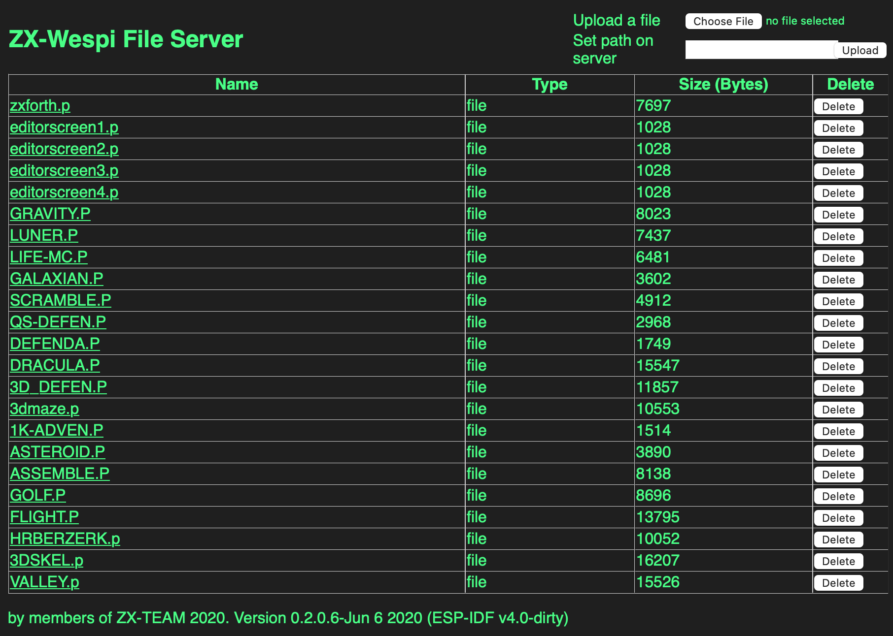
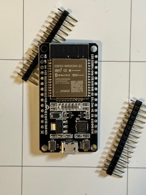
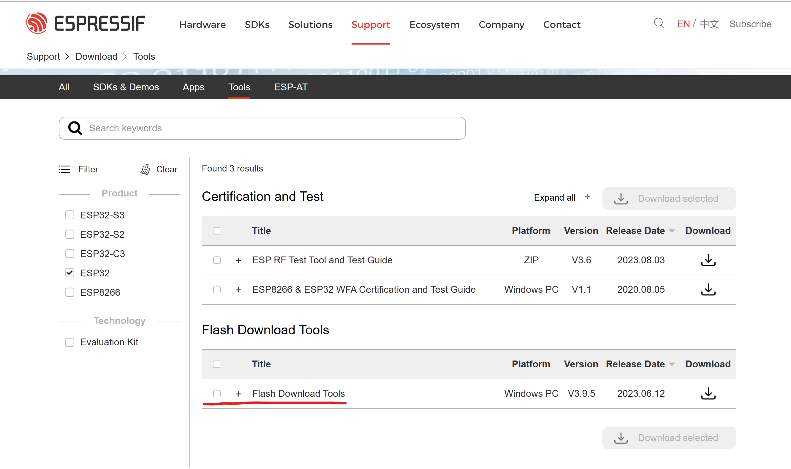
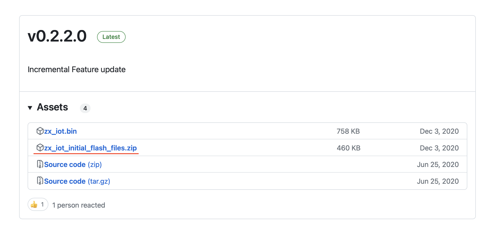
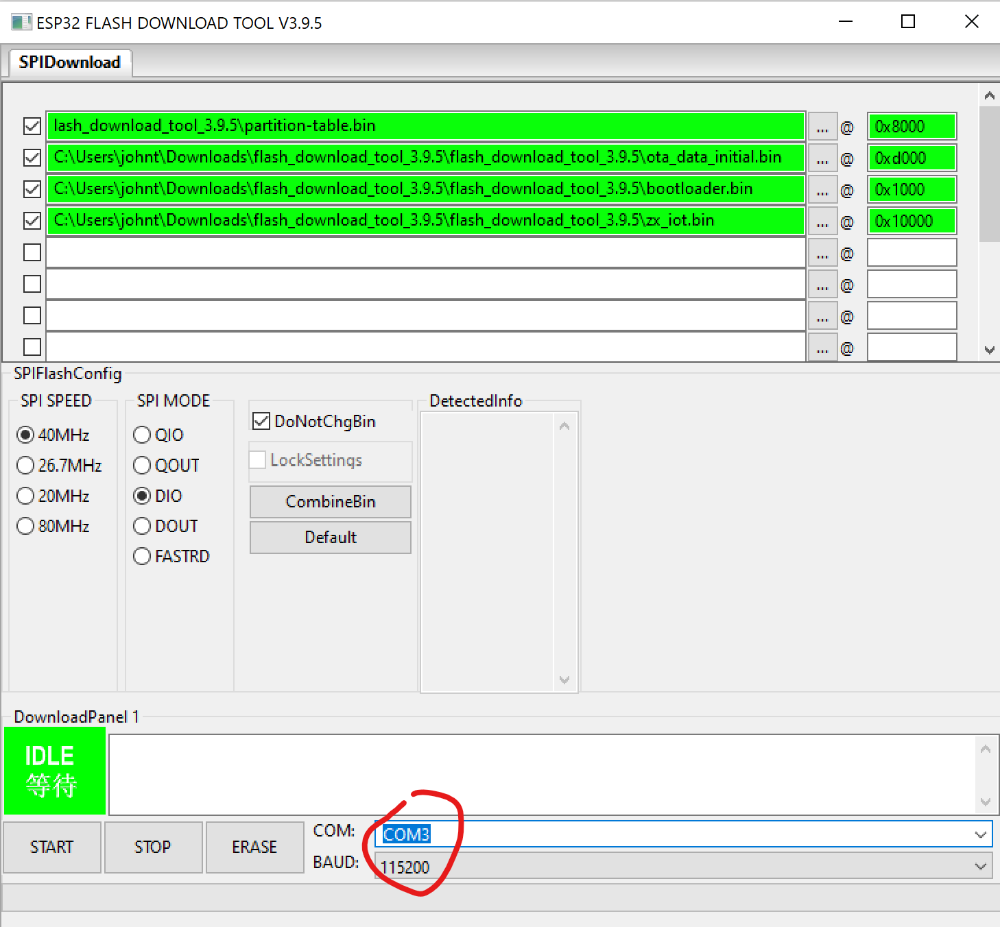
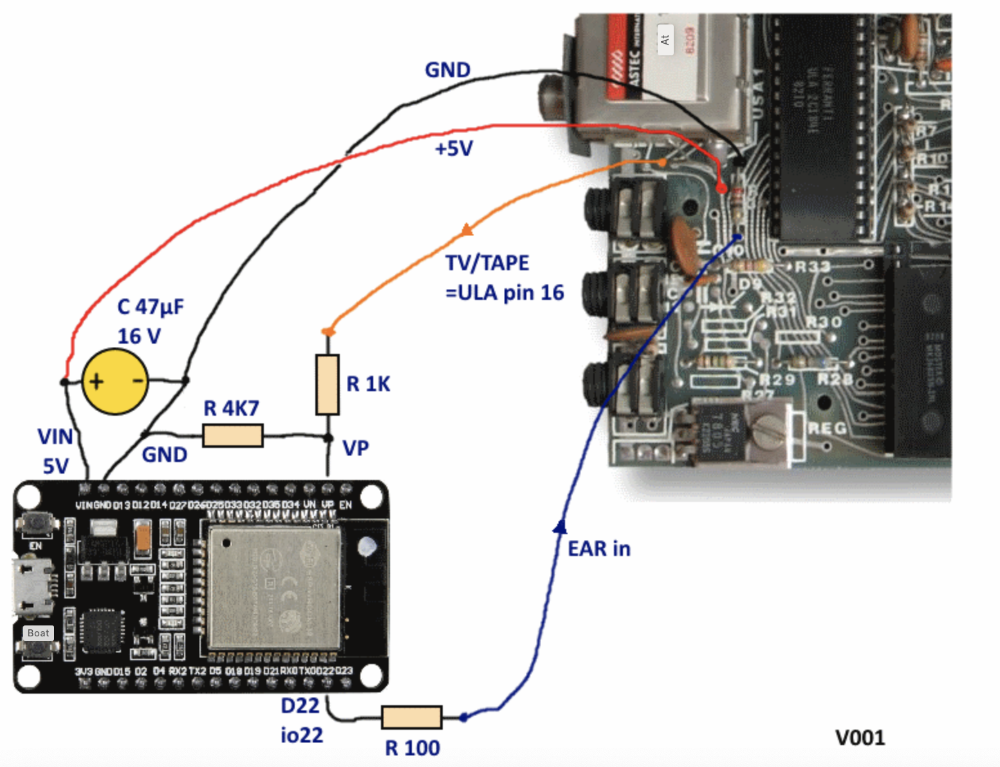

# ZX-WESPI
## An easy hardware update to load and save files to the ZX81/TS1000.

How would you like to visit a webpage like this, upload some .p files and then be able to launch them from your ZX81 with a keypress? That's what ZX-WESPI does for you.

Running on a cheap ESP32 microcontroller that installs inside your ZX81, ZX-WESPI couldn't be easier to use as it will automatically intercept the **LOAD** command. Simply entering **LOAD ""** will bring up the now built-in ZX-WESPI menu app, where you can then select one of the files in your catalog and load them incredibly quickly. Yes, quickly: one of the tricks ZX-WESPI does is speed up loading to near-instant speeds. (Saving happens at standard speeds, but it  works, and the saved file appears in the File Server).

The total cost for this inguitity will be about $20. The ESP32 costs about half of that amount, and you'll also need three resistors, a capacitor, and some basic soldering skills.

## Installation

First, buy the right ESP32. There are many variations, so find one that looks like this one: 

It needs to have WiFi, and the WiFi chip shouldn't dangle off the circuit board. It needs to have no pins soldered to it (so it can fit) or you need the ability to remove them. I found this ESP32 ESP-WROOM-32 ESP-32S on Amazon and it works perfectly. It has no pins pre-soldered in place. [Amazon link, not an affiliated link](https://www.amazon.com/dp/B09FX24PJ4)

Second, prepare the ESP32 by flashing it with the correct files. Start by downloading the ESP32 tools from the [espressif site](https://www-espressif-com.translate.goog/en/support/download/other-tools). This is a Windows app, there does not appear to be a Mac version, although I seem to recall some python scripts that might do it.

Then download the [ZX-WESPI binaries from GitHub](https://github.com/holmatic/zx-iot-mi). These will be used to flash the ESP32.

Program the ESP32 using the instructions in the GitHub files readme file. 

**Remember to select the correct ESP device from the flashing program's options or you'll see SYNC FAIL warnings and it won't work.** 

The flashing tool will need to look like this, with the various files loaded into specific locations:

Remember to set the COM (yes, this seems to be a Windows-only tool, BTW). When it's flashed correctly, the *blue* LED will blink every three seconds.

Solder the resistors and capacitor to the ESP32, and then install it into the ZX81. There will be plenty of room inside the case. You only need four wires to +5v, Ground, the ULA and the Ear connector. Suggested locations are in the diagram. I've used those, and on a different motherboard, others that were easier to reach. Mount the board with the case with double-sided tape or hot-glue.

With everything powered up, typing **LOAD ""** will bring up the menu. Your first task is to press **W** and configure your WiFi connection. When that is complete, go back to your computer and visit the website it has created (note that it's *http:* and not *https:*) and then upload some ZX81 files in .p format. You can then load them from the menu. 

For a lot more information, the [original forum posts](https://forum-tlienhard-com.translate.goog/phpBB3/viewtopic.php?f=2&t=3360&_x_tr_sl=de&_x_tr_tl=en&_x_tr_hl=en-US) can be found here. They're originally in German but Google translate does an admirable job of converting them to English.

