# Zog

Zog is a Z80 based collection of parts that I've been playing with. It consists of a vintage S-100 card called the [Solid State Music SSM CB2 Z80 CPU S-100](http://www.s100computers.com/Hardware%20Folder/SSM/Z80%20CPU%20Board/Z80%20CPU.htm) that I was lucky enough to find on ebay for a pittance, and it still works! It sits in a 4 slot S-100 backplane with a single regulated 6v / 5Amp switched-mode supply driving it.

I originally bought it to bring Z80 support to the [Altair8800c](https://deramp.com/altair_8800c.html) kit that I built, but I found another card - more barebones but Altair friendly - on ebay, and used that in the Altair8800c instead. This Z80 card lets me mess around with other S-100 cards and DIY projects. In many ways I really should stick to the [RC2014](https://rc2014.co.uk) system which is Z80 based, and because it has *always* been Z80 based, it doesn't have the weird Intel 8080-compatible I/O stuff or power requirements that the S-100 bus uses, and is therefore a lot simpler. But there is something about the size of these big old cards that I enjoy.

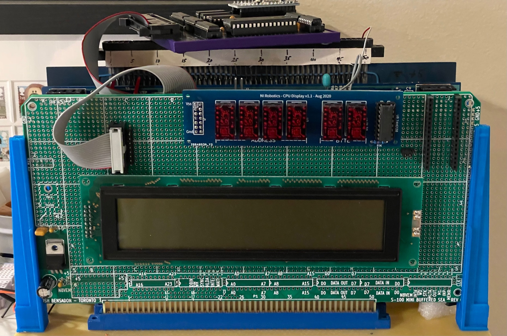

The SSM Z80 card card has two sockets for memory on it: in my case, the first holds a ROM at address 0x0000 and the second a 2Kb RAM chip at address 0x2000. The SSM card has an 8-bit I/O port which I use to connect to random things, including a set of original [TIL311](https://www.hackster.io/news/build-a-replica-til311-with-22-leds-and-an-atmega328p-e2fac423b974) LEDs on a [board](https://github.com/GrantMeStrength/Electronics/tree/master/TIL%20Display) I built and an Arduino Nano which drives an LCD panel over a crude DIY serial protocol.

I've recently been using the [EPROM-EMU](https://www.tindie.com/products/mygeekyhobby/eprom-emulator-diy-arduino/) to speed up development, and can send Z80 binary code to it without issue. However, I'm currently unable to get [z88dk](https://z88dk.org/site/) to compile C for it, and that's what I am hoping to use a development platform to write a simple OS.

**Feb 2021 Status** 

Blocked until I can get Z88dk working. I have a [S-100 bus card](https://deramp.com/downloads/mfe_archive/010-S100%20Computers%20and%20Boards/01-Jade/10-Jade%20S100%20Boards/Jade%20Bus%20Probes/Jade%20S100%20Bus%20Probe%20card.pdf) to build which might help diagnose which is going on, but I suspect the non-RC2014 memory map of the SSM card is the issue and if I add 32Kb of RAM at 0xC000 it might work. Or there is some interupt stuff going on in which case who knows.

## Video

I found a video card on eBay - the [SSM VB1B](https://wiki.theretrowagon.com/wiki/SSM_VB1B). I've had luck with SSM cards, and this one was cheap, so... Even came with the [manual](http://www.s100computers.com/Hardware%20Manuals/SSM/SSM%20VDB-1.pdf). I see one on eBay today for ten times the price I paid, so I guess I lucked out. I was getting ready to try it when someone spotted it was missing one of the voltage regulators. Oops! Luckily 7805 regulators is something I've got in my parts drawer, so I swapped out the existing regulator and replaced the missing one. I removed the Character Generator ROM and some other odd look chips (hard to find a replacement maybe?) and tested the voltages - all good. So I put it all back together, added a video cable and dropped it into the Altair 8800c clone and after some fiddling with various video leads and monitors.. it works! Mostly. It could do with some adjusting or maybe replacing some tired chips, but hey - not bad! 

The (super cheap) composite to HDMI adaptor I have produces rolling junk on an LCD display, but the Apple IIc mono monitor worked.. and so did the LCD monitor when I connected the composite lead directly. Need to check the video signal with the 'scope and see if there are obvious issues.

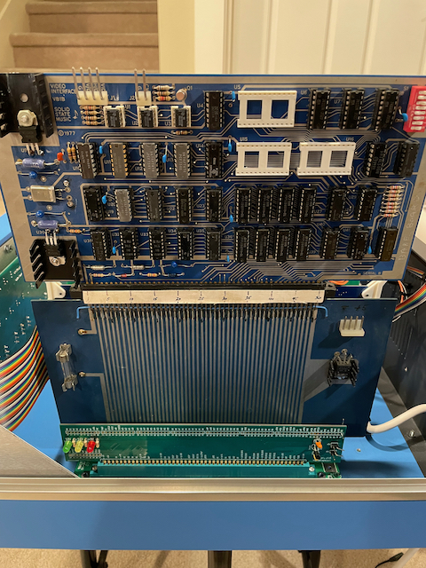

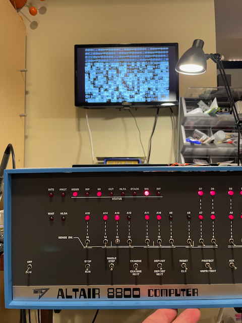

To display something, the card just needs something poked into memory between $EC00 to $EFFF. The front panel wasn't doing it (the front panel is picky about what it can write to, and this card has some special magic to allow both the S-100 bus and the video generator to see the on-board RAM) but a small Z80 test program that I toggled in made the text update away. Success! The character set is actually considerably better than the ZX81 from 4 years later.. Lowercase, symbols and graphics. Not bad.

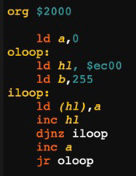

I can't move this card into Zog yet, as the Zog only has a 5 volt supply and this card requires a few milliamps at 12 and -3 volts for that character ROM. However, DigiKey is mailing me a [small unit](https://www.digikey.com/en/products/detail/mornsun-america-llc/A0512S-1WR3/13168378) that can take +5 and provide +/- 12v which should be ideal. 

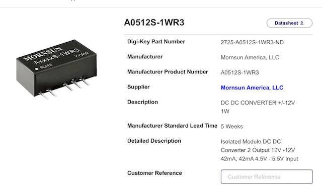

**Mar 2021 Status** 

## Video Card Update

I got the magical DC-DC convertor from DigiKey, and soldered it to the S-100 Prototyping board I use for various experiments. I fed it the 5v out of the prototype board's regulator, and took its 12 and -12 v outputs and connected them to the 16/-16 slots on the card. This fed 12/-12 into the S-100 bus. Bad? Hopefully not, as no other card I'm currently using requires 12/-12 and there is no power supply feeding those rails.

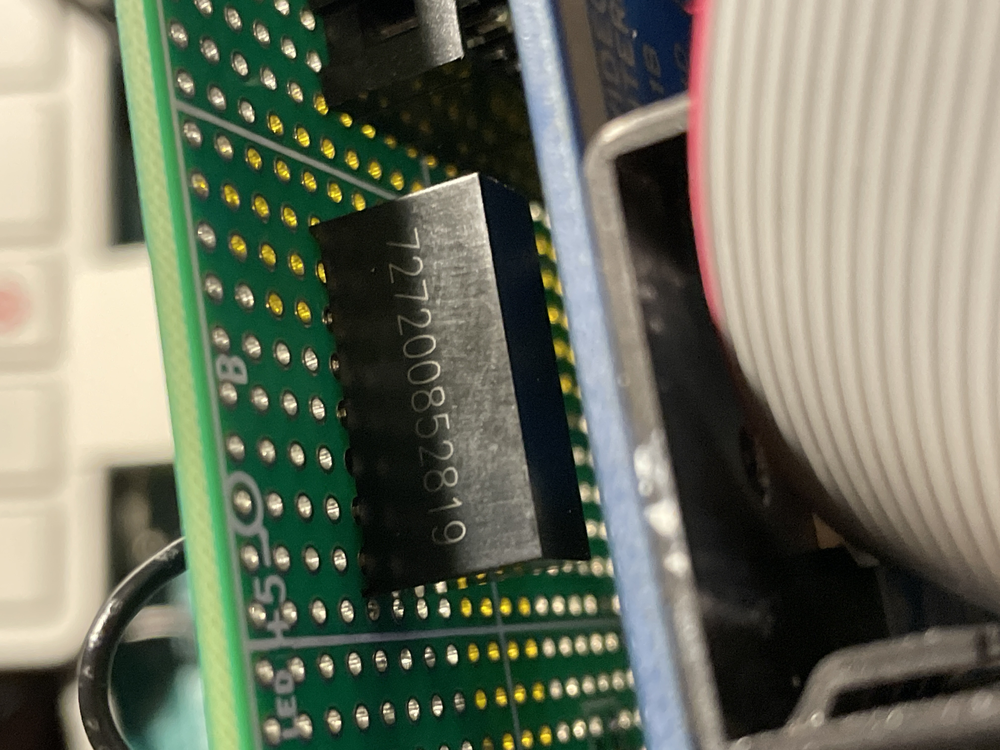

I plugged in the video card, and it took the 12/-12 volts and did what it needed to do. The V1VB doesn't have regulators for the S-100 16v -> 12v conversion, as it only needs a tiny current and so a zenor diode is all it uses. The 12/-12 on the rails seems to work just fine and passes through perfectly. The only component on the video board that needs these voltages is the character generating ROM, and it seems happy.

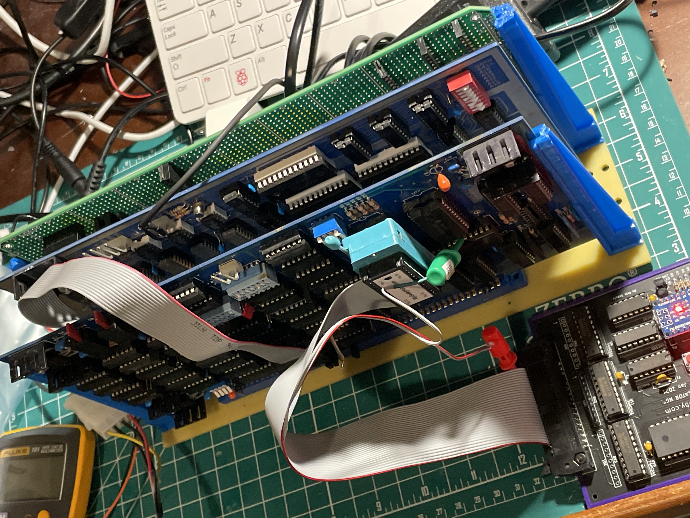

When powered up, the video card generated the random pattern reflecting what was in its RAM beautifully - much clearer than when in the Altair. Cleaner 12v? Better timing? I don't know, but it's lovely.

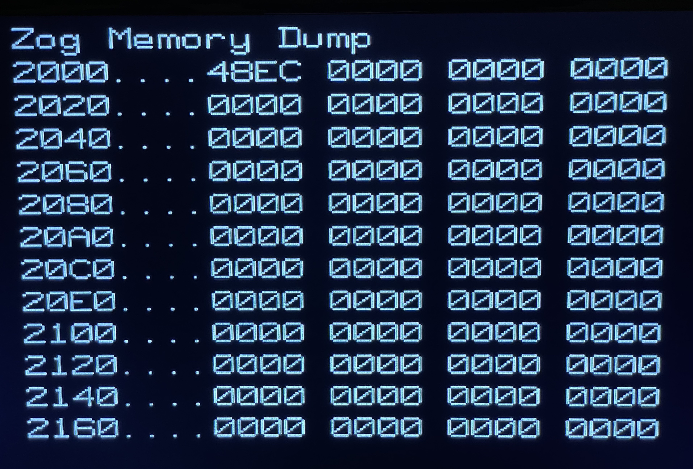

How does it display all those numbers and text? Is there some API to call? Hahaha! No, the card only knows to display what is in memory - and it's up to me to poke those values into memory. So a few evenings trying to remember Z80 later, and that image is what it displayed. Here's the code for posterity:

```
; Zog and the the V1Vb Video card
; Assemble with z88dk-z80asm -b hello.asm
; python3 ../EPROM.py hello.bin //dev/ttyUSB0

; Zog Memory Map
; ROM 			0000 to 1fff
; RAM 			2000 to 27ff
; SCREEN RAM 	EC00 to FFFF

; RAM based values 
RAMTOP = $27ff
cursor = $2000


org 0

	; start

	
	ld sp, RAMTOP				; Must remember to create a stack!
	di							; Not sure this is an issue yet but anyway


	; First fill RAM with 0 	; Mostly for neatness
	ld hl,$2000
	ld bc, $7f0					; Don't mess up the stack dude and accidentally clear it 
	ld a,0
	call FILL

	call CLS					; Clear screen memory and thus display
	call RESET_CURSOR			; Get cursor to top of screen
	call PRINT_HELLO_STRING		; Print message

	ld hl,$2000
	call DUMP					; Dump a page of memory at hl
	


stop: jp stop					; just wait here


; ------------- UTILITIES ------------------------

; Dump a page of memory starting at hl
DUMP:
	; First display the address
	;;ld hl, $2000
	ld b,12
dlop:
	push hl
	call Num2Hex
	; Now display 8 bytes
	ld c,'.'
	call PUTCHAR
	ld c,'.'
	call PUTCHAR
	ld c,'.'
	call PUTCHAR
	ld c,'.'
	call PUTCHAR
	pop de

	push bc
	push hl
	call dumpde
	call SPACE
	call dumpde
	call SPACE
	call dumpde
	call SPACE
	call dumpde
	call CR
	pop hl
	pop bc
	add hl,32
	djnz dlop
	ret

	; Display bytes at DE
dumpde:
	ld a, (de)
	ld h,a
	inc de
	ld a,(de)
	ld l,a

	push de
	call Num2Hex
	pop de
	inc de
	ret
	

FILL:
; a = contents
; HL = start address of block
; BC = length of block in bytes
ld e,l
ld d,h
inc de
ld (hl),a
ldir
ret


RESET_CURSOR:
		ld hl, $ec00
		ld (cursor), hl
ret


CR:
	ld c,13
	call PUTCHAR
	ret

SPACE:
	ld c,32
	call PUTCHAR
	ret


PUTCHAR:
	; Display contents of A in next available screen location
	; CR will take a new line
	; When bottom of screen reached, will start at top again
	
	push af
	push bc
	push hl
	push de
	ld a,c
	ld hl, (cursor) 			; get current cursor position
	inc hl
	ld (cursor),hl		
	dec hl
	cp 13						; CP 'a' with 13 to test for a CR?
	jr nz, no_newline			; no, no CR
	jp newline					; yes, do the CR stuff.
no_newline:						
	ld (hl), a					; write into display
	ld a, h						; test for end of screen memory
	cp $f0
	jr nz, no_end_of_screen
	ld a, l
	cp $ff
	jr nz, no_end_of_screen
	; end of screen
	ld hl, 0
	ld (cursor), hl
no_end_of_screen:
	pop de
	pop hl
	pop bc
	pop af
	ret
newline:						
	add hl, 64
	ld a, l
	and a, $c0
	ld l, a
	ld (cursor), hl
	jp no_end_of_screen


CLS:

	; CLS by filling ec00 to f000  with 0
	ld hl,$ec00
	ld bc, $400	
	ld a,32
	call FILL
	ret


PRINT_HELLO_STRING:

		ld de, message
sloop:	ld a,(de)
		ld c,a
		call PUTCHAR
		cp 13
		jp z, leave
		inc de
		jr sloop
leave: 	ret


PRINT_STRING:

		; de = string address
		; bc = offset from base address
		; bc returns as-is

		ld hl, $ec00
		add hl, bc

tloop:	ld a,(de)
		cp 13
		jp z, leave2
		ld (hl),a
		inc de
		inc hl
		jr tloop
leave2: 	ret
		

RAM_CHECK:
		; used when I wanted to check where the RAM was in the memory map!
		ld hl, $ed00
		ld de, $2000
lp:
		ld a, 42
		ld (de), a
		ld a, (de)
		cp 42
		jp nz, stop
		ld a,65
		ld (hl),a
		inc hl
		inc de
		inc de
		inc de
		inc de
		jp lp


; PRINT 4 DIGIT HEX STRING
	; hl = current value
	
Num2Hex:
	ld	a,h
	call	hNum1
	ld	a,h
	call	hNum2
	ld	a,l
	call	hNum1
	ld	a,l
	jr	hNum2

hNum1:	
	rra
	rra
	rra
	rra
hNum2:	
	or	$F0
	daa
	add	a,$A0
	adc	a,$40
	ld c,a
	call PUTCHAR
	ret


; Say Zog
	ld de, message2
	ld bc, 256
;	call PRINT_STRING
	add bc, 320
	ld de, message2
;	call PRINT_STRING


message: db "Zog Memory Dump",13	

message2: db "Zog!",13

```

## What's next

Well, I still would like to get C code compiled and running on it. And now that I see a video display, it seems that a keyboard for input isn't too much to ask.

## Reboot

OK, back to playing with the Zog. 

The goal is to get a working C compiler, and I was blocked before because I couldn't see what was going on when I tried to configure the various settings to make the compiler work with Zog. Now that I have the JADE Bus Probe, I have a *little* more chance to see what is happening inside the system. Only problem: I've forgotten pretty much everything and the development system I was using has long been repurposed. So back to basics, and this time I AM KEEPING NOTES.

First off, re-installing all the tools. I use a Raspberry Pi to actually assemble the Z80 code and send it to the EPROM emulation system because it's simpler to set up on the Pi than on a Mac or PC. The goal is to get to the stage where I can assemble Z80 and send it to the EPROM emulator.

Here are the steps:

1. Install the tools including the Z80 assembler and C compiler

1.1 Install z88dk and tools

1.1.1 [Install SNAP](https://snapcraft.io/docs/installing-snap-on-raspbian)

1.1.2 ```sudo apt install snapd```

1.1.3 ```sudo reboot```

1.1.4 ```sudo snap install core```

1.2.1 [Install z88dk](https://github.com/z88dk/z88dk/wiki/Snap-usage)

1.2.2 ```sudo snap install --edge z88dk```

1.2.3 ```sudo apt install z80dasm``` (the useful compiler)

1.3.1 [Install Visual Studio Code](https://code.visualstudio.com/docs/setup/raspberry-pi) (can't do any harm - but remoting in from Mac/PC much nicer)

1.3.2 ```sudo apt install code```

The EPROM Emulator code is really a Python script and two libraries.

2. Install the [EPROM Emulator](https://github.com/Kris-Sekula/EPROM-EMU-NG)

2.1 ```pip3 install pyserial``` (don't forget the 3)

2.2  ```pip install pysimplegui``` 

2.3 Copy the ```EPROM_NG_v2.0rc3.py``` file from the GitHub repo.

Now let's try to remember the [syntax](https://github.com/z88dk/z88dk/wiki/Tool-z80asm-syntax) for creating a HEX file from the Z88dk assembler that the EPROM Emulator can work with (not trivial!)


To assemble a file called ```zog.asm`` in the directory ``zog```, use:

```~/../../snap/z88dk/current/bin/z88dk-z80asm -b zog.asm```

The ```-b``` causes the creation of the ```.bin``` file, not just the ```.o``` file.

Clearly this is too much to type, so it's convenient add the path for z88dk to the shell:

```export PATH=~/../../snap/z88dk/current/bin/:$PATH ```

To make this permanent, it would be necessary to edit .bashrc or whatever it's called.

This .bin file can be sent to the EPROM emulator, either from the GUI or from the command line, like this:

```python3 ../EPROM-EMU-NG/Software/EPROM_NG_v2.0rc3.py -mem 27128 -spi y -auto n zog.bin /dev/ttyUSB0```

* -spi = store it in the EPROM emulators flash memory
* -mem = the EPROM type / size
* -auto = perform a reset of the CPU (there's a lead connected from the emulator circuit)


# Detour - Hardware setup for the Altair 8800 System

The Zog has a buddy - an Altair 8800 clone. This is another S-100 bus system, this one housed in a proper case with a proper front panel of LEDs and decent power supplies. It can boot into CP/M, and has 64Kb of RAM and an SD-Card based storage system.

I built it early into the pandemic, and then promptly forgot how it works. As part of getting this Altair 8800 clone back into a known state, I had to remove the Z80 card that was inside it, and revert to the all-in-one JAIR8080 card. Once that was working (the SD card had failed) I could replace the Z80 card. Here's a photo reference mostly for my benefit so I remember all the settings.

First, the way the internal serial port is connected:

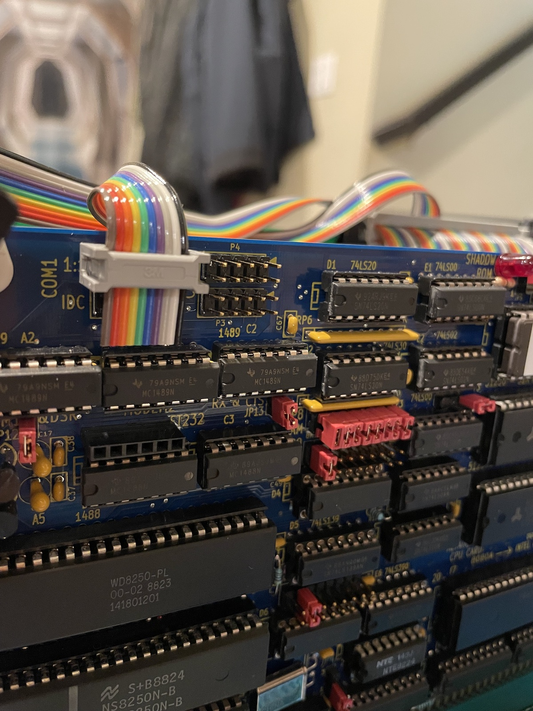
Connected to the left-most upper serial port.


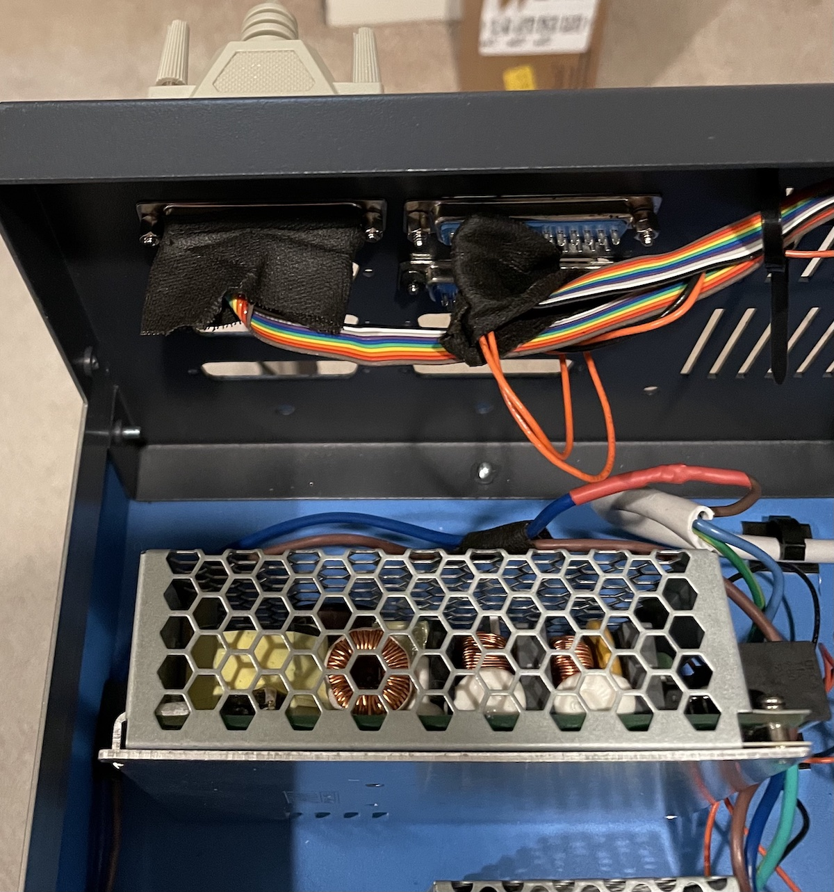
Connected to the left-most 25 way serial port.

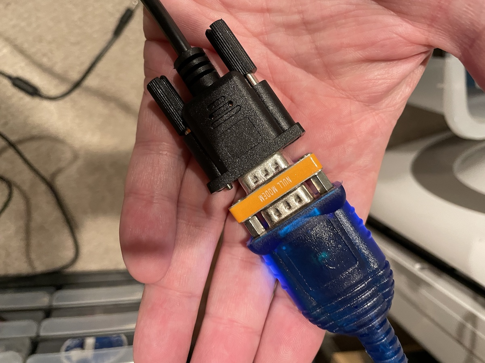


The cable is Male-Female and a Null-Modem adaptor is required.

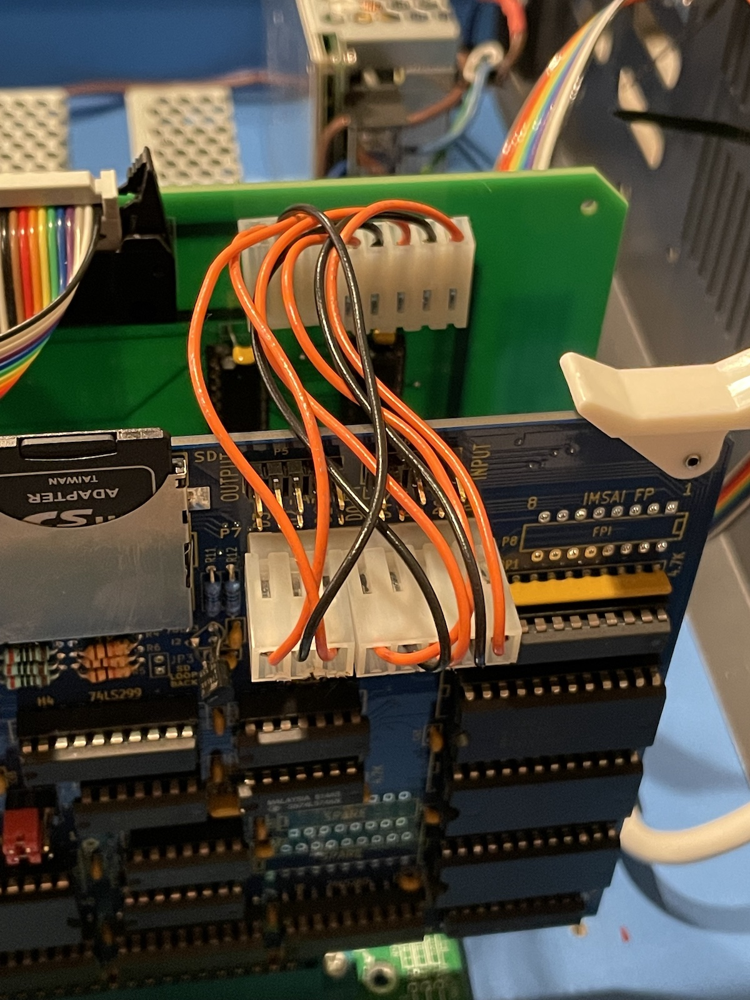

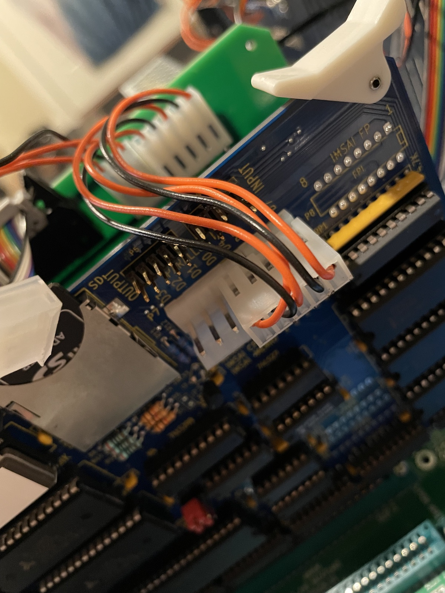

The connector for the front panel. Staight-through.

### Now the jumpers

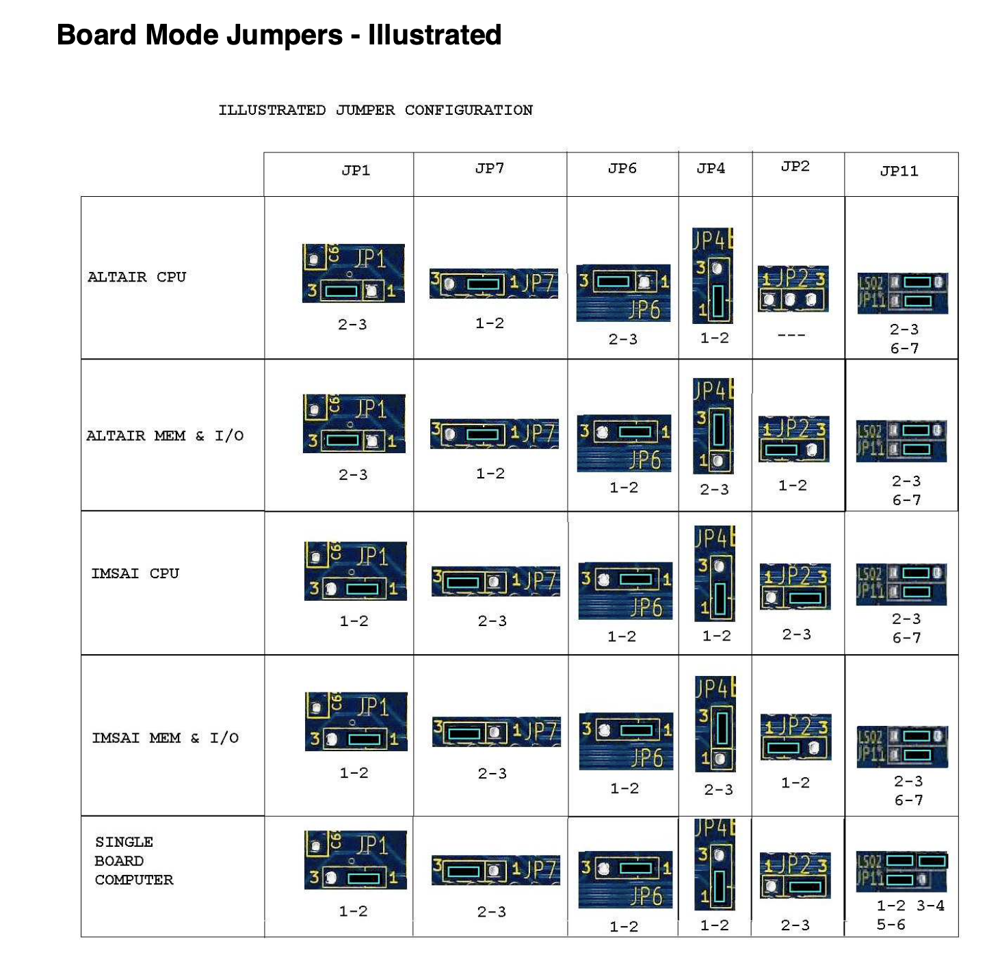

Summary from the manual

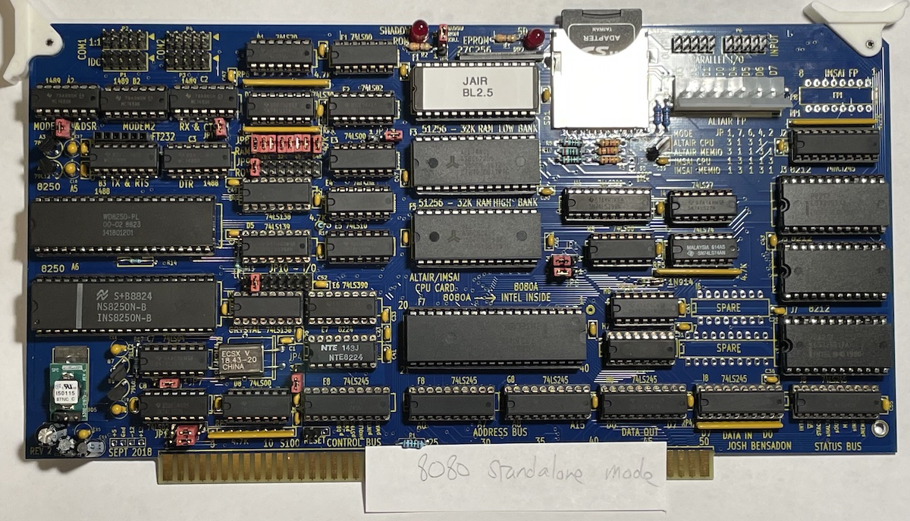

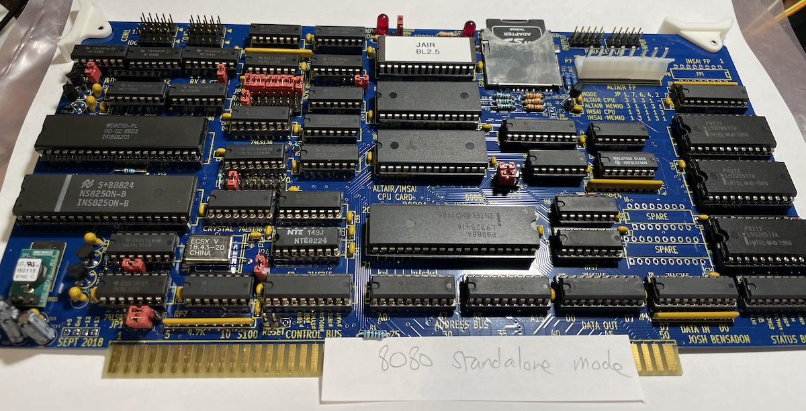

Configured for 8080 all-in-one mode.


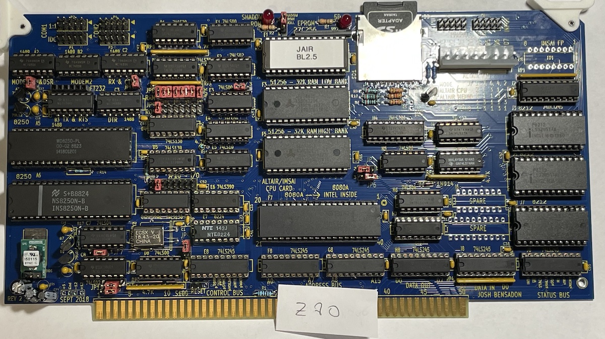


Configured for Z80 on a separate code more. The JAIR8080 is still providing the I/O and memory.

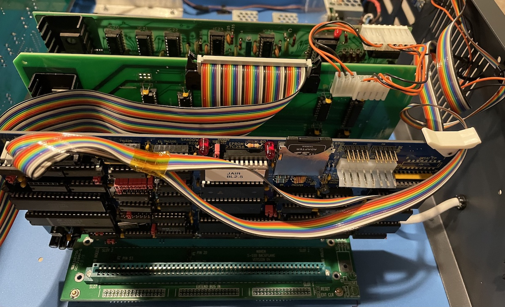

The front-panel cable, again straight-through but flipped over behind.


And all is working!

A reminder from Josh, the creator of the JAIR8080 as to some settings:

```
"All the files for the SD Card, with the manual, etc are on www.s100computers.com

Go to Boards for sale, scroll down to the ~5th from the bottom.
Look for the Rev 1 Link
Then look at the bottom of that for the Rev 2 files
"Here is the Rev 2 Manual and other information about this board (in a .zip file)."
SD Card Image and Manual

J8 is the RAM, yes, all in (for running my ROM) and J9, put the left 1 in for ROM.
Shadow ROM jumper put in the top.

SD Cards are funny, not all work well with the JAIR.  You want no bigger than 2GB and you might need to try a few different ones."
```

## Programming the Zog

I've been tinkering with improving the code that displays the memory dump, making it scroll up when it reachest the bottom of the screen. This isn't working yet, but I'll save it here until I've another chance to update it:

```
 ; Zog and the the V1Vb Video card
; Assemble with z88dk-z80asm -b hello.asm
; python3 ../EPROM.py hello.bin //dev/ttyUSB0

; Zog Memory Map
; ROM 			0000 to 1fff
; RAM 			2000 to 27ff
; SCREEN RAM 	EC00 to FFFF
; screen is 32 columns by 15 characters
; (it's really 16 but my TV only displays 15)

; Scroll routine Not working yet!!

; RAM based values 
RAMTOP = $27ff
cursor = $2000


org 0

	; start

	
	ld sp, RAMTOP				; Must remember to create a stack!
	di							; Not sure this is an issue yet but anyway


	; First fill RAM with 0 	; Mostly for neatness
	ld hl,$2000
	ld bc, $7f0					; Don't mess up the stack dude and accidentally clear it 
	ld a,0
	call FILL


	ld hl,$00
	push hl

	
	call CLS					; Clear screen memory and thus display
	call RESET_CURSOR			; Get cursor to top of screen
	call PRINT_HELLO_STRING		; Print message
	call RESET_CURSOR
	; Just keep printing numbers

	;ld c,65
lop1:
	;push bc
	;call PUTCHARSCROLL
	;call PAUSE
	;pop bc
	;inc c
	;jr lop1


lop0:
	pop hl
	push hl
	call DUMP					; Dump a page of memory at hl
	;call PAUSE

	pop hl
	add hl, $200
	push hl
	jr lop0


stop: jp stop					; just wait here


; ------------- UTILITIES ------------------------

PAUSE:

	push de
	push af

	ld de,$fff
pLop:	dec de
	ld a,d
	or e
	jr nz, pLop

	pop af
	pop de
	ret


; Dump a page of memory starting at hl
DUMP:
	; First display the address
	;;ld hl, $2000
	ld b,14
dlop:
	push hl
	call Num2Hex
	; Now display 8 bytes
	ld c,'.'
	call PUTCHARSCROLL
	ld c,'.'
	call PUTCHARSCROLL
	ld c,'.'
	call PUTCHARSCROLL
	ld c,'.'
	call PUTCHARSCROLL
	pop de

	push bc
	push hl
	call dumpde
	call SPACE
	call dumpde
	call SPACE
	call dumpde
	call SPACE
	call dumpde
	call CR
	call PAUSE
	pop hl
	pop bc
	add hl,32
	djnz dlop
	ret

	; Display bytes at DE
dumpde:
	ld a, (de)
	ld h,a
	inc de
	ld a,(de)
	ld l,a

	push de
	call Num2Hex
	pop de
	inc de
	ret
	

FILL:
; a = contents
; HL = start address of block
; BC = length of block in bytes
ld e,l
ld d,h
inc de
ld (hl),a
ldir
ret


RESET_CURSOR:
		ld hl, $ec00
		ld (cursor), hl
ret


CR:
	ld c,13
	call PUTCHARSCROLL
	ret

SPACE:
	ld c,32
	call PUTCHARSCROLL
	ret


PUTCHAR:
	; Display contents of A in next available screen location
	; CR will take a new line
	; When bottom of screen reached, will start at top again
	; Preserve all regs
	
	
	push af
	push bc
	push hl
	push de
	ld a,c
	ld hl, (cursor) 			; get current cursor position
	inc hl
	ld (cursor),hl		
	dec hl
	cp 13						; CP 'a' with 13 to test for a CR?
	jr nz, no_newline			; no, no CR
	jp newline					; yes, do the CR stuff.
no_newline:						
	ld (hl), a					; write into display
	ld a, h						; test for end of screen memory
	cp $ef
	jr nz, no_end_of_screen
	ld a, l
	cp $8f
	jr nz, no_end_of_screen
	; end of screen is efdf

	ld hl, 0
	ld (cursor), hl
no_end_of_screen:
	pop de
	pop hl
	pop bc
	pop af
	ret
newline:						
	add hl, 64
	ld a, l
	and a, $c0
	ld l, a
	ld (cursor), hl
	jp no_end_of_screen


PUTCHARSCROLL:
	; Display contents of A in next available screen location
	; CR will take a new line
	; When edge of screen reached, take a new line
	; When bottom of screen reached, Scroll up
	; Preserve all regs
	
	push af
	push bc
	push hl
	push de
	
	ld hl, (cursor) 			; get current cursor position -
	inc hl
	ld (cursor),hl		
	dec hl
	; End of line?  if l and bit 5 = true then it's end of the current line
	ld a,l
	and 32
	call nz, move_down_a_line

	ld a,c
	cp 13						; CP 'a' with 13 to test for a CR?
	jr nz, no_newline2			; no, no CR
	jp newline2					; yes, do the CR stuff.
no_newline2:						
	ld (hl), a					; write into display
	ld a, h						; test for end of screen memory
	cp $ef
	jr nz, no_end_of_screen2
	ld a, l
	cp $3f
	jr nz, no_end_of_screen2
	; end of screen scroll everything up move cursor to col 0, line 15

	

	; Shift everything up a line
	; HL = start address of block
	; BC = length of block in bytes
	ld hl, $EC40 ; from
	ld de, $EC00 ; to
	ld bc, 991 ; count
	ldir

	; clear last line

	ld hl,$ef80
	ld bc, $80	
	ld a,32
	call FILL
	
	; move cursor to col 0, line 15
	ld hl, $ef00
	ld (cursor), hl


no_end_of_screen2:
	pop de
	pop hl
	pop bc
	pop af
	ret
newline2:						
	call move_down_a_line
	jp no_end_of_screen2


move_down_a_line:
	add hl, 64
	ld a, l
	and a, $c0
	ld l, a
	ld (cursor), hl
	ret

CLS:

	; CLS by filling ec00 to f000  with 0
	ld hl,$ec00
	ld bc, $400	
	ld a,32
	call FILL
	ret


PRINT_HELLO_STRING:

		ld de, message
sloop:	ld a,(de)
		ld c,a
		call PUTCHAR
		cp 13
		jp z, leave
		inc de
		jr sloop
leave: 	ret


PRINT_STRING:

		; de = string address
		; bc = offset from base address
		; bc returns as-is

		ld hl, $ec00
		add hl, bc

tloop:	ld a,(de)
		cp 13
		jp z, leave2
		ld (hl),a
		inc de
		inc hl
		jr tloop
leave2: 	ret
		

RAM_CHECK:
		; used when I wanted to check where the RAM was in the memory map!
		ld hl, $ed00
		ld de, $2000
lp:
		ld a, 42
		ld (de), a
		ld a, (de)
		cp 42
		jp nz, stop
		ld a,65
		ld (hl),a
		inc hl
		inc de
		inc de
		inc de
		inc de
		jp lp


; PRINT 4 DIGIT HEX STRING
	; hl = current value
	
Num2Hex:
	ld	a,h
	call	hNum1
	ld	a,h
	call	hNum2
	ld	a,l
	call	hNum1
	ld	a,l
	jr	hNum2

hNum1:	
	rra
	rra
	rra
	rra
hNum2:	
	or	$F0
	daa
	add	a,$A0
	adc	a,$40
	ld c,a
	call PUTCHAR
	ret


; Say Zog
	ld de, message2
	ld bc, 256
;	call PRINT_STRING
	add bc, 320
	ld de, message2
;	call PRINT_STRING


message: db "Zog Memory Dumpication",13	
;message: db "0123456789012345678901234567890123",13	

message2: db "Zog!",13


```
